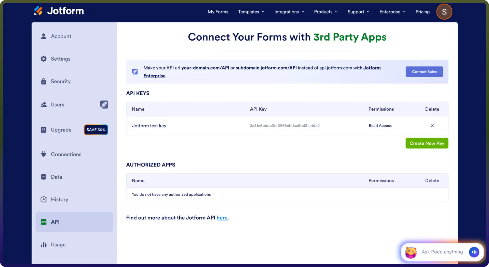

# Jotform Integration

Source: https://www.unifyapps.com/docs/unify-integrations/jotform
Section: integrations

---

Jotform is a powerful online form builder that allows users to create forms, collect data, and automate workflows. It provides APIs to manage forms, submissions, and integrations. By integrating the Jotform connector, applications can automate data collection, trigger workflows, and manage form responses efficiently.

## Authentication

Integrating your application with Jotform enables seamless form management and data handling. Before starting, ensure you have the following information ready:

`Connection Name:`   Choose a descriptive name for your connection. This helps you easily identify the connection within your application or integration settings, such as *"MyAppJotformIntegration"*. 
`Authentication Type:` Jotform supports the **API Key Authentication** method:

### API Key Authentication:

1. Login in to your Jotform Account
2. Click on your profile icon (top-right corner).
3. Navigate to Settings.
4. Go to the API section. 
 5. Click on Create New Key (or copy an existing API Key).
6. Copy your API Key.
7. Paste the API Key into the connector configuration field.

## Actions

| **Action Name** | **Description** |
|---|---|
| `Create Forms` | Creates a new form in Jotform |
| `Delete form question` | Deletes a single form question in Jotform |
| `Get form questions` | Returns list of all questions in a form in Jotform |
| `Get forms details` | Returns basic information about a form in Jotform |
| `Get form questions` | Returns list of all questions in a form in Jotform |
| `Get form submissions` | Returns a list of form responses in Jotform |
| `Get user details` | Returns account details for a user in Jotform |
| `Get user forms` | Get a list of forms for this account in Jotform |
