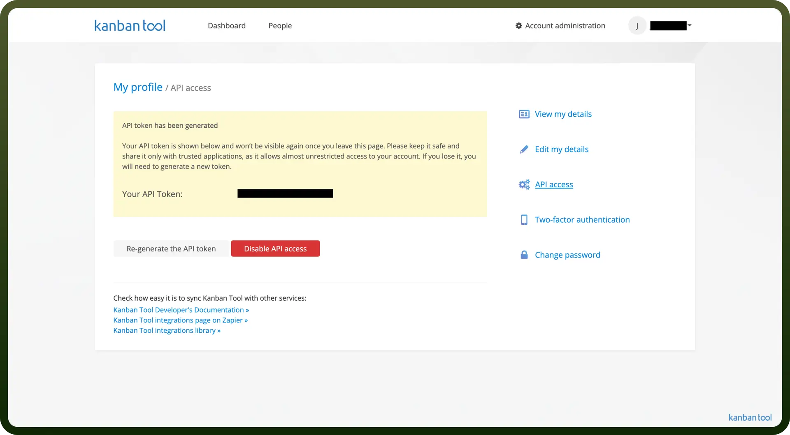

# Kanban tool connector

Source: https://www.unifyapps.com/docs/unify-integrations/kanban-tool
Section: integrations

---

Kanban Tool is a visual project management platform that uses boards, cards, and swimlanes to help teams track tasks and workflows in real time. It supports time tracking, automation, and collaboration for increased productivity.

Integrating Kanban Tool enables seamless task automation, centralized updates, and enhanced visibility across project workflows.

## Authentication

Before you begin, make sure you have the following information:

- `Connection Name`: Select a descriptive name for your connection, like "MyAppKanbanToolIntegration". This helps in easily identifying the connection within your application or integration settings.
- `Authentication Type`**:** Kanban Tool supports API tokens for authentication.

### API Key Based Authentication

1. Log in to your Kanban Tool account.
2. From the top navigation bar, select `My profile`.
3. Click on `API access`.
4. Enable your API access if it isn't.
5. Copy the generated API key and store it securely to prevent unauthorized access.

## Actions

| Actions | Description |
|---|---|
| `Archive task` | Archives a task from Kanban Tool |
| `Create Attachment` | Creates an attachment for Kanban Tool |
| `Create comment` | Creates a comment for a specific task |
| `Create subtask` | Creates a subtask |
| `Create task` | Creates a task |
| `Create time tracker` | Creates a time tracker |
| `Delete comment` | Deletes a comment from a specific task |
| `Delete subtask` | Deletes a subtask |
| `Delete task` | Deletes a task |
| `Delete time tracker` | Deletes a time tracker |
| `Detach Attachment` | Detaches an attachment from an object |
| `Get board information` | Gets information about a board |
| `Get detailed board information` | Gets detailed board information |
| `Get detailed task information` | Gets detailed task information |
| `Get task information` | Gets information about a task |
| `Get user` | Gets information about a user |
| `List board changelogs` | Lists board changelogs |
| `Reorder subtasks` | Reorders subtasks |
| `Restore task` | Restores a task |
| `Search task` | Searches a task |
| `Set mode attribute` | Sets a mode attribute of an attachment for Kanban Tool |
| `Unarchive task` | Unarchives a task from Kanban Tool |
| `Update subtask` | Updates subtask on Kanban Tool |
| `Update task` | Updates a task in Kanban Tool |
| `Update time tracker` | Updates a time tracker in Kanban Tool |
