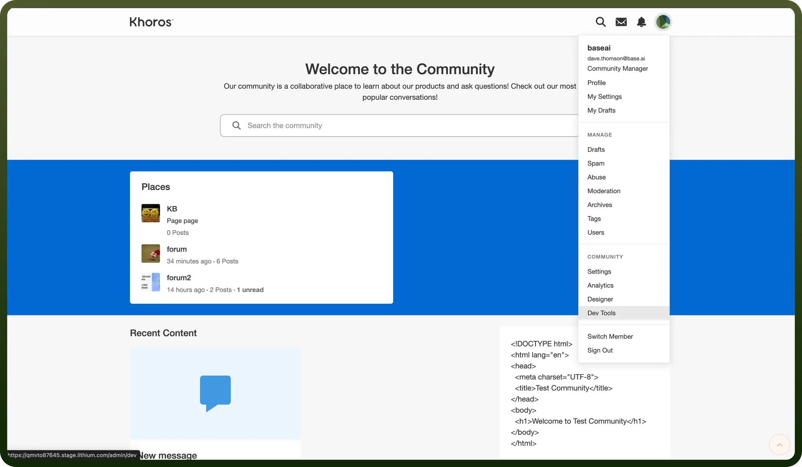
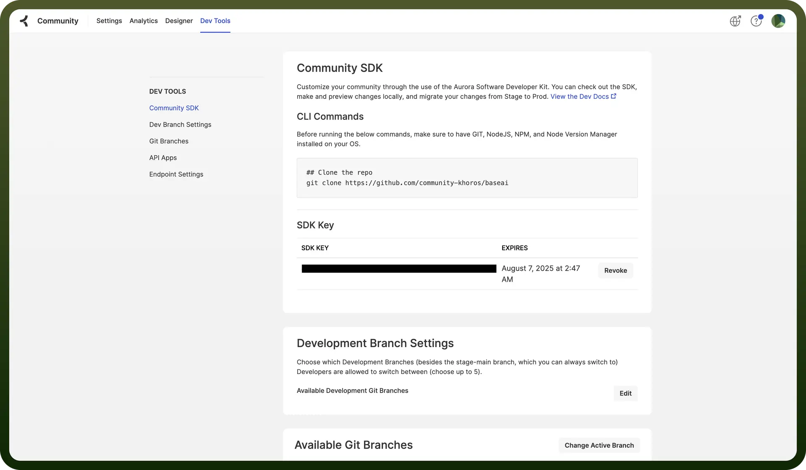

# Khoros Communities

Source: https://www.unifyapps.com/docs/unify-integrations/khoros-communities
Section: integrations

---

Khoros Communities is a digital community platform that helps brands build and manage online customer communities for peer-to-peer support, engagement, and knowledge sharing. It enables businesses to enhance customer experience, reduce support costs, and drive brand loyalty through collaborative interactions.

Khoros Communities stands out by offering deep customization, robust moderation tools, and seamless integration with CRM and support platforms.

## Authentication

Before you begin, make sure you have the following information:

- `Connection Name`: Choose a meaningful name for your connection. This name helps you identify the connection within your application or integration settings. It could be something descriptive like 'MyKhorosCommunties’.
- `Authentication Type`: Khoros Communities uses SDK Key for authentication.

### **SDK Key Based**

- Log in to your Khoros Communities account as the admin.
- Go to the `Profile Icon` and navigate to `Dev Tools`.
- Click on the `Community SDK` option under the Dev Tools Section .
- Copy and securely store the SDK Key under the Community SDK section.

  

  

## Actions

| **Actions** | **Description** |
|---|---|
| `List messages` | Lists messages in Khoros Communities |
| `List Users` | Lists users in Khoros Communities |

## Triggers

| **Triggers** | **Description** |
|---|---|
| `New Message` | Triggers when a new message is received in Khoros Communities |
