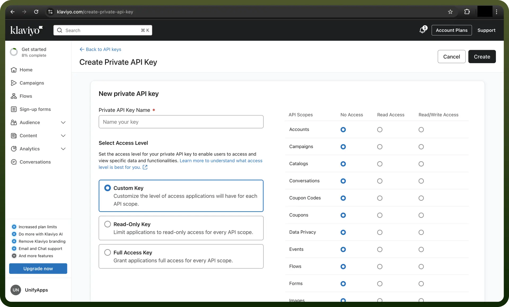
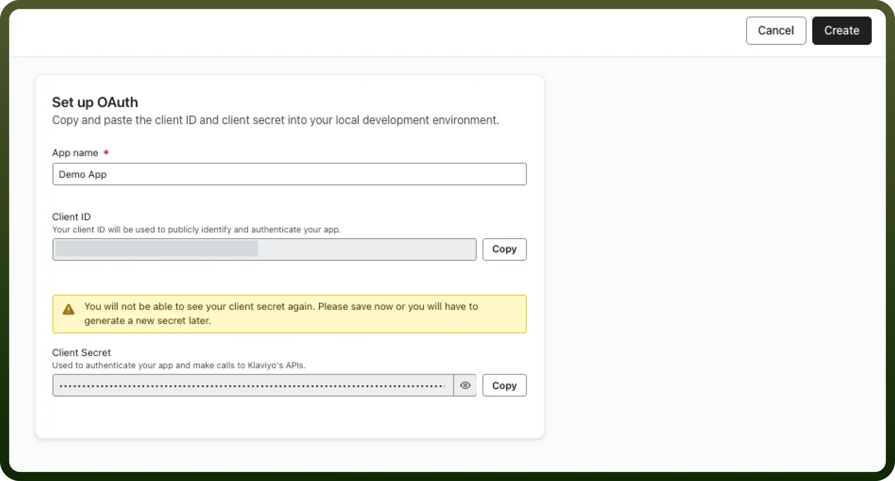
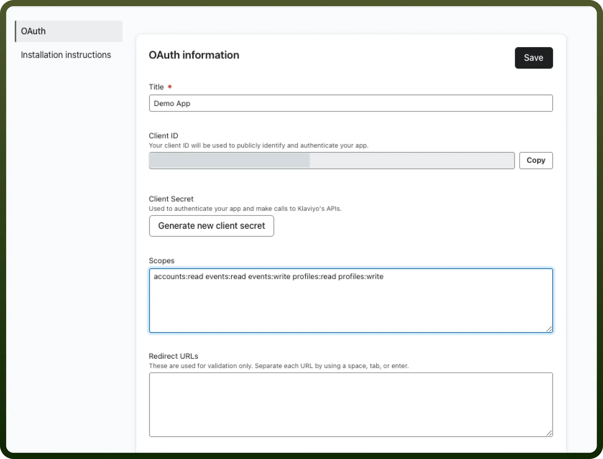

# Klaviyo connector

Source: https://www.unifyapps.com/docs/unify-integrations/klaviyo
Section: integrations

---

Klaviyo is an e-commerce marketing automation platform that helps businesses personalize email and SMS campaigns using customer data. It integrates with various platforms like Shopify and WooCommerce to drive targeted engagement and sales.

Integrating your application with Klaviyo enhances your marketing capabilities by enabling data-driven strategies, personalized customer interactions, and automated email campaigns.

### Authentication

Before you begin, make sure you have the following information:

- `Connection Name`**:** Choose a meaningful name for your connection. This name helps you identify the connection within your application or integration settings. It could be something descriptive like "MyAppKlaviyoIntegration".
- `Authentication Type`**:** Select the type of authentication for connecting to your Klaviyo account:
  - Private Key
  - OAuth

### Private Key Based

1. Log in to your Klaviyo account.
2. Navigate to your profile name in the top right corner and select Account.
3. In the Settings tab, click on `API Keys` and then click `Create Private API Key`.
4. Enter a descriptive name for the API key and Click `Create Key`.
5. Copy the generated API key immediately, as it won't be fully visible again after you leave the page.
6. Store the API key securely, treating it like a password.

  

### OAuth Based

1. Navigate to the [Manage apps](https://www.klaviyo.com/manage-apps) page.
2. Select `Create app` to create your new application.
3. Name your application. Then, securely save your client secret and client ID. You won’t be able to view your client secret again, although you can generate a new one later. When you're done, click `Create`.

  

4. After creating your app, you should get a confirmation page with help guides for submitting your app to be listed on Klaviyo's integrations directory. Click Continue to continue setting up your OAuth app.
5. Pinpoint which scopes your app uses and set them using a space-separated list. To find out which scopes your app uses, visit the API reference documentation. Include all scopes that you will need for your OAuth authorization requests. [You can consult the full list of available scopes](https://developers.klaviyo.com/en/docs/authenticate_#set-custom-scopes), if needed.
6. Your list of scopes should be formatted like the following example:

  

7. Edit your Redirect URLs/Callback URLs (known as Redirect URIs in OAuth). These are the URLs that you have allowlisted Klaviyo to redirect users to after authorizing your app. For more than one redirect URL, separate each with a space, tab, or enter.

## Actions

| Actions | Description |
|---|---|
| `Add profile` | Adds a profile to a list in Klaviyo |
| `Create list` | Creates a new list in Klaviyo |
| `Create profile` | Creates a new profile in Klaviyo |
| `Get campaign` | Gets a campaign in Klaviyo |
| `Get event` | Gets an event in Klaviyo |
| `Get list` | Gets a list from Klaviyo |
| `Get profile` | Gets a profile from Klaviyo |
| `Update list` | Updates a list in Klaviyo |
| `Update profile` | Updates a profile in Klaviyo |
