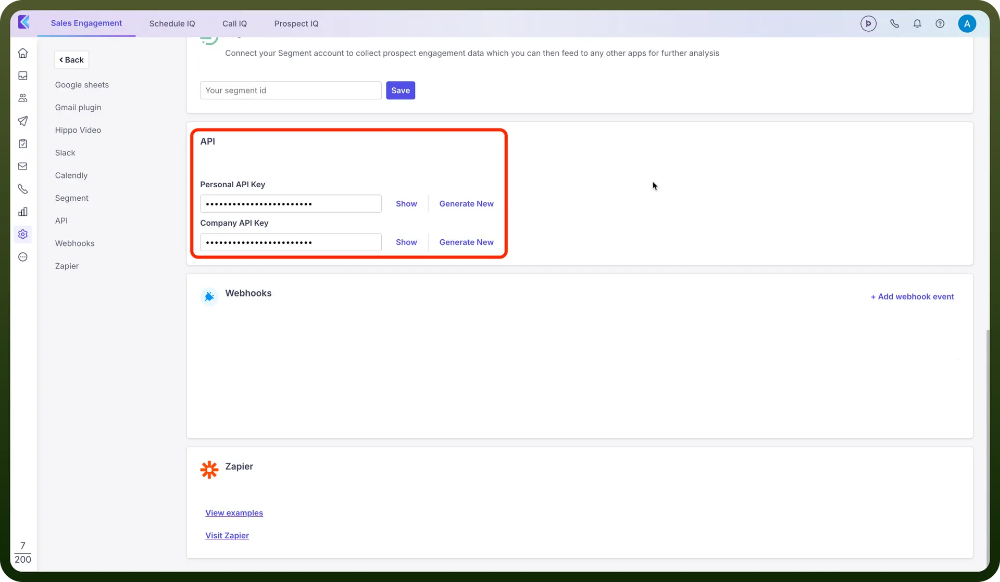

# Klenty

Source: https://www.unifyapps.com/docs/unify-integrations/klenty
Section: integrations

---

Klenty is a sales engagement platform that automates outreach workflows for sales teams, enabling personalized communication at scale. It helps teams manage cadences, track engagement, and improve prospecting efficiency through data-driven insights.

Integrating Klenty streamlines your outbound sales process, boosts productivity, and ensures faster, data-backed conversions.

## Authentication

Before you begin, make sure you have the following information:

- `Connection Name`: Select a descriptive name for your connection, like "MyAppKlentyIntegration". This helps in easily identifying the connection within your application or integration settings.
- `Authentication Type`**:** Kently supports API tokens for authentication.

### API Key Based Authentication

1. Open the Klenty dashboard and go to "`Settings`" -> "`Integrations`" -> "`API`".
2. Copy your Personal or Company API key based on your requirement, or generate them if needed by clicking on the "`Generate New`" button.

  

3. Copy and securely store these credentials to prevent unauthorized access.

## Actions

| Actions | Description |
|---|---|
| `Change status to do not contact` | Changes the status of a prospect to "do not contact" in Klenty |
| `Create prospect` | Creates a prospect in Klenty |
| `Resume cadence` | Resumes all paused cadences for a prospect in Klenty |
| `Revert status from do not contact` | Reverts the status of a prospect from "do not contact" in Klenty |
| `Start cadence` | Adds a prospect to a cadence in Klenty |
| `Stop cadence` | Removes a prospect from a cadence in Klenty |
| `Stop mails` | Stops any scheduled emails from being sent to the prospect in Klenty |
| `Unsubscribe prospect` | Unsubscribes a prospect in Klenty |
| `Update prospect` | Updates a prospect in Klenty |

## Triggers

| Triggers | Description |
|---|---|
| `On bounce` | Triggers when a mail sent by Klenty bounces |
| `On cadence completed` | Triggers when a cadence is completed with no replies received in Klenty |
| `On cadence first reply` | Triggers when a cadence receives its first reply from any prospect in Klenty |
| `On link click` | Triggers when a link is clicked in an email sent via Klenty |
| `On mail open` | Triggers when a mail sent by Klenty is opened by the prospect |
| `On reply` | Triggers when a prospect replies to a cadence in Klenty |
| `On send prospect` | Triggers when you send a prospect from Klenty to the webhook |
| `On start cadence` | Triggers when a cadence is started in Klenty |
| `On unsubscribe` | Triggers when a prospect unsubscribes in Klenty |
