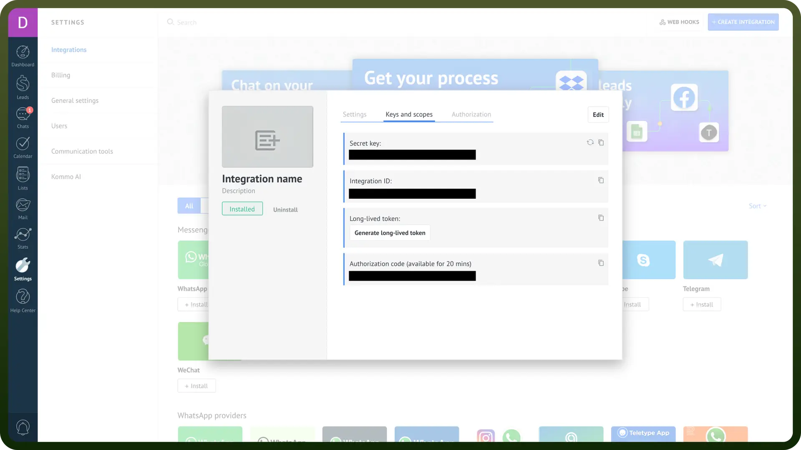

# Kommo connector

Source: https://www.unifyapps.com/docs/unify-integrations/kommo
Section: integrations

---

Kommo is a CRM platform designed to automate sales and communication with multichannel messaging, pipeline management, and AI-powered chatbots. It helps businesses streamline customer interactions and improve workflow efficiency.

By integrating your application with Kommo, you can capture leads, automate workflows, and optimize your team's efficiency.

## Authentication

Before you begin, make sure you have the following information:

- `Connection Name`**:** Provide a descriptive name for your connection, such as "MyAppKommoIntegration," to easily identify it within your application or the UnifyApps platform.
- `Authentication Type`**:** Kommo supports two authentication types:
  - OAuth2
  - Token

### OAuth2 Based Authentication

- Log in to your Kommo account and navigate to Settings, Integrations and then Create Integration.
- Provide the necessary details, including the Redirect URI that matches your application's requirements.
- Select the appropriate access scopes for your integration, specifying the permissions your app requires.
- Save the integration. In the newly opened window, go to the Key and Scopes section.
- Here, you will find:
  - `Client ID`: Labeled as the Integration ID.
  - `Client Secret`: A secure key generated for your integration.
- Keep these secure as they provide access to your kommo account.

### Token Based Authentication

- Log in to your Kommo account and go to Settings, Integrations and then Create Integration.
- Define the required access scopes and save the integration.
- In the Key and Scopes section, generate a long-lived token for token-based authentication.
- Keep this token secure, as it grants access to your Kommo account.

  

## Scopes

| Scope | Description |
|---|---|
| `Access to account data` | Allows the integration to access and manage account-related information, including user details, company settings, and subscription data. This scope is essential for synchronizing account configurations and ensuring seamless integration. |
| `Notification center` | Grants the integration access to the notification center, enabling it to read, create, and manage notifications within Kommo. This is useful for keeping users informed about important events or updates related to the integration. |
| `Access to files` | Permits the integration to upload, download, and manage files within the Kommo system. This includes attaching files to leads, contacts, or other entities, facilitating better documentation and resource sharing. |
| `Deleting files` | Allows the integration to delete files from the Kommo system. This scope should be used with caution to prevent accidental loss of important data. |

## Actions

| Actions | Description |
|---|---|
| `Create company` | Creates a company in Kommo |
| `Create contact` | Creates a contact in Kommo |
| `Create lead` | Creates a lead in Kommo |
| `Create lead with contact` | Creates a lead with contact in Kommo |
| `Create note` | Creates a note in Kommo |
| `Create task` | Creates a task in Kommo |
| `Find company` | Finds a company by its ID in Kommo |
| `Find contact` | Finds a contact by its ID in Kommo |
| `Find lead` | Finds a lead by its ID in Kommo |
| `Find linked data` | Finds a list of entities linked to a lead/contact/company by the ID of the lead, contact, or company in Kommo |
| `Find note` | Finds notes by entity type in Kommo |
| `Find task` | Finds a task by its ID in Kommo |
| `Link entities` | Creates a link between entities in Kommo |
| `Update company` | Updates a company in Kommo |
| `Update contact` | Updates a contact in Kommo |
| `Update lead` | Updates a lead in Kommo |
| `Update note` | Updates a note in Kommo |
| `Update task` | Updates a task in Kommo |

## Triggers

| Triggers | Description |
|---|---|
| `Company created` | Triggers when a new company is created in Kommo |
| `Company updated` | Triggers when a company is updated in Kommo |
| `Contact created` | Triggers when a new contact is created in Kommo |
| `Contact updated` | Triggers when a contact is updated in Kommo |
| `Lead created` | Triggers when a new lead is created in Kommo |
| `Lead responsible user updated` | Triggers when a lead responsible user is updated in Kommo |
| `Lead status updated` | Triggers when a lead status is updated in Kommo |
| `Lead updated` | Triggers when a lead is updated in Kommo |
| `Task created` | Triggers when a new task is created in Kommo |
| `Task deleted` | Triggers when a task is deleted in Kommo |
| `Task updated` | Triggers when a task is updated in Kommo |
