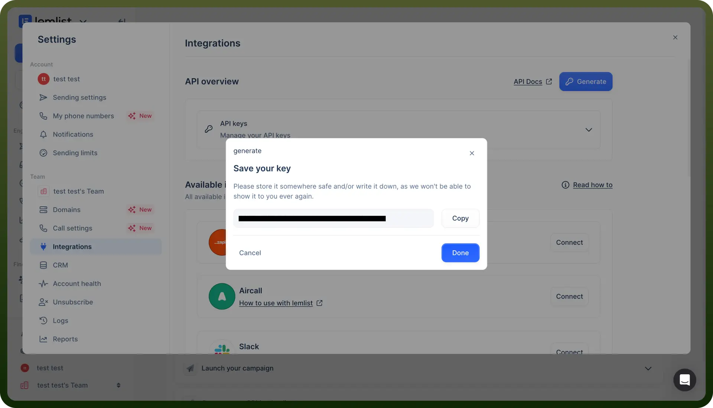
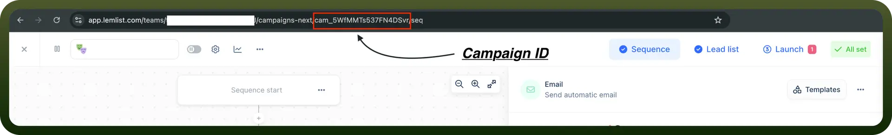

# Lemlist connector

Source: https://www.unifyapps.com/docs/unify-integrations/lemlist
Section: integrations

---

Lemlist is an outreach automation platform that helps businesses personalize cold emails, automate follow-ups, and boost engagement. It offers AI-driven email generation, multichannel outreach, and tracking to improve sales and marketing efforts.

Integrating your application with Lemlist elevates your email outreach by enabling personalized, automated, and highly effective campaigns.

## Authentication

Before you begin, make sure you have the following information:

- `Connection Name`**:** Choose a meaningful name for your connection. This name helps you identify the integration within your application settings. It could be something descriptive like "MyAppLemlistIntegration".
- `Authentication Method`**:** Lemlist supports API key for secure authentication.

### API Key Based

1. Log in to your Lemlist account at [https://app.lemlist.com](https://app.lemlist.com/).
2. Navigate to the "`Settings`" section from the sidebar.
3. Go to the "`Integrations`" tab.
4. Go to the "`API`" section to generate an API key.
5. Click "`Generate API Key`" and copy the key to your clipboard.
6. Store the API key securely, as it allows access to your Lemlist account and data.

  

### Retrieve Campaign or Workspace ID

1. Log in to your Lemlist account.
2. Navigate to the "`Campaigns`" section and select the campaign you wish to integrate.
3. Copy the Campaign ID or Workspace ID from the URL for use in your application integration.

  

## Actions

| Actions | Description |
|---|---|
| `Add to unsubscribe list` | Adds an email or a domain to the unsubscribe list in Lemlist |
| `Create lead` | Creates a lead in a particular campaign in Lemlist |
| `Delete lead` | Deletes a lead from a specific campaign in Lemlist |
| `Enrich lead` | Enriches lead with email, phone number, and LinkedIn data in Lemlist |
| `Find email` | Finds email using lead's information in Lemlist |
| `Find phone` | Finds phone number using lead's information in Lemlist |
| `Get enriched data` | Retrieves enriched data from Lemlist |
| `Mark lead as interested in all campaigns` | Marks a specific lead as interested in all campaigns in Lemlist |
| `Mark lead as interested in one campaign` | Marks a specific lead as interested in a specific campaign in Lemlist |
| `Mark lead as not interested in all campaigns` | Marks a specific lead as not interested in all campaigns in Lemlist |
| `Mark lead as not interested in one campaign` | Marks a specific lead as not interested in a specific campaign in Lemlist |
| `Pause lead` | Pauses a specific lead in all campaigns or a specific campaign using lead ID or email in Lemlist |
| `Remove from unsubscribe list` | Removes an email or domain from the unsubscribe list in Lemlist |
| `Resume lead` | Resumes a specific lead using its email or lead ID in all campaigns or a specific campaign in Lemlist |
| `Search lead` | Searches for a lead using their email in Lemlist |
| `Unsubscribe lead from campaign` | Unsubscribes a lead from all campaigns if they belong to the specified campaign in Lemlist |
| `Update lead` | Updates information about a lead in a specific campaign in Lemlist |
| `Verify email` | Verifies an existing email in Lemlist |

## Triggers

| Triggers | Description |
|---|---|
| `New activity` | Triggers when an activity occurs in Lemlist |
| `On unsubscribe polling` | Triggers when a recipient unsubscribes from an email subscription list in Lemlist |
