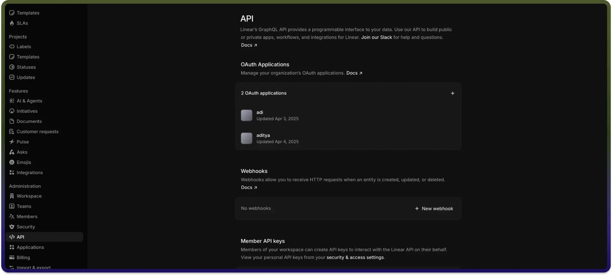

# Linear connector

Source: https://www.unifyapps.com/docs/unify-integrations/linear
Section: integrations

---

Linear streamlines your issue tracking and project management by providing fast, modern, and developer-friendly workflows. This integration allows for efficient management of issues, teams, projects, and workflows with real-time updates and automation. 
 For a smooth integration process, ensure you have the following information ready:

## Authentication:

Connecting your application to Linear enables seamless issue tracking, team collaboration, and workflow automation.

Before starting, ensure you have the following information:

- `Connection Name`**:** Choose a meaningful name for your connection. This name helps you identify the connection within your application or integration settings. It could be something descriptive like "MyAppLinearIntegration".
- `Authentication Type`**:** Linear supports OAuth authentication.

## OAuth Based :

1. Go to [https://linear.app/settings/api](https://linear.app/settings/api).
2. Click on `Create new OAuth application.`
3. Fill in the required details such as application name and redirect URI.
4. Complete the registration process.
5. Upon successful creation, you will receive your OAuth 2.0 credentials: `Client ID` and `Client Secret`.

## Actions **:**

| **Action name** | **Description** |
|---|---|
| `Get issue details` | Gets issue details of a particular issue from Linear |
| `Get issues for team` | Gets all issues for a particular team from Linear |
| `Get project details` | Gets project details of a particular project from Linear |
| `Get projects for team` | Gets all projects for a particular team from Linear |
| `Get teams` | Gets all teams from Linear |
| `Get teams for a project` | Gets all teams for a particular project from Linear |
| `Get teams for a user` | Gets all teams for a particular user from Linear |
