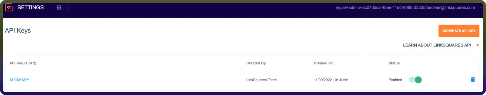

# LinkSquares connector

Source: https://www.unifyapps.com/docs/unify-integrations/linksquares
Section: integrations

---

LinkSquares streamlines contract lifecycle management by providing tools for contract analysis, repository management, and legal workflow automation. This integration allows you to manage agreements, extract insights, and automate legal processes efficiently with secure API access. 
 For a smooth integration process, ensure you have the following information ready:

## Authentication

Connecting your application to LinkSquares enables seamless contract data access, analysis, and workflow automation.

Before starting, ensure you have the following information:

`Connection Name:` Choose a meaningful name for your connection. This name helps you identify the connection within your application or integration settings. It could be something descriptive like "MyAppLinkSquaresIntegration".

`Authentication Type:` LinkSquares supports API key-based authentication.

### **API key Based****:**

1. LinkSquares Administrators can create API keys in the LinkSquares web app settings.
2. Navigate to **Settings** from the app selector.
3. Select API Keys.
4. Click on generate API key.
5. Copy the generated key and store it securely.

## Actions

| **Action Name** | **Description** |
|---|---|
| `Get agreement` | Gets an agreement by ID from LinkSquares Finalize |
| `Create agreement` | Creates an agreement in LinkSquares |
| `Get analyze agreement` | Retrieves metadata for an agreement in LinkSquares Analyze |
| `List agreement types` | Lists agreement types from LinkSquares Analyze |
| `List agreements (Analyze)` | Lists agreements from LinkSquares Analyze |
| `List agreements (Finalize)` | Lists agreements from LinkSquares Finalize |
| `Update agreement` | Updates an agreement in LinkSquares Finalize |
| `Update agreement metadata` | Updates metadata for an agreement in LinkSquares |
