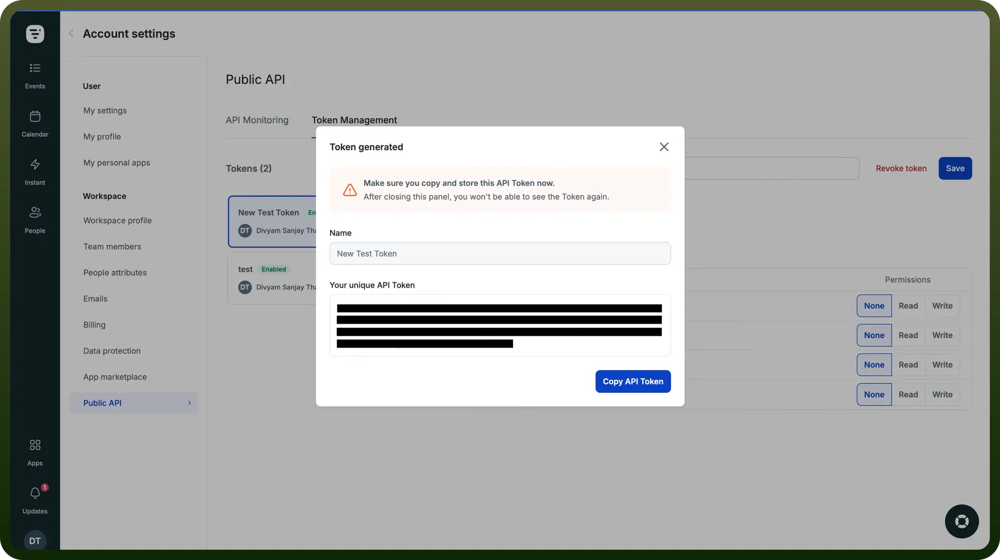

# Livestorm connector

Source: https://www.unifyapps.com/docs/unify-integrations/livestorm
Section: integrations

---

Livestorm is a browser-based webinar and video conferencing platform designed for businesses to host live, on-demand, and automated events. It offers engagement tools, analytics, and integrations to enhance audience interaction and marketing efforts.

Integrating Livestorm with your application enhances webinar management, audience engagement, and overall event effectiveness.

### Authentication

Before integrating Livestorm, ensure you have the following information:

- `Connection Name`**:** Choose a descriptive name for your Livestorm connection to help identify it within your application or integration settings. A meaningful name, like "MyAppLivestormIntegration," helps maintain organization, especially when managing multiple integrations.
- `Authentication Type`**:** Livestorm provides you with only API key type of authentication.

### API Key Based Authentication

1. Log in to your Livestorm account.
2. Navigate to the "`Account Settings`" section in your account dashboard.
3. Now, navigate to the "`Public API`" tab.
4. Generate a new API key if one does not already exist.
5. Copy the API key and store it securely as it provides access to your Livestorm account.

## Actions

| Actions | Description |
|---|---|
| `Create event` | Creates a new event in Livestorm |
| `Create registrant` | Registers someone for a specific event session in Livestorm |
| `Create session` | Schedules a new session to the event in Livestorm |
| `Find people` | Find participants or team members in Livestorm |
| `Find session` | Finds an existing session in Livestorm |
| `Remove event` | Removes an event along with all its sessions in Livestorm |
| `Remove session` | Cancels or removes an event session from Livestorm |
| `Remove session registrant` | Removes a session registrant in Livestorm |
| `Update event` | Updates an existing event in Livestorm |
| `Update session` | Updates an event session in Livestorm |

## Triggers

| Triggers | Description |
|---|---|
| `Registrant attended` | Triggers when a registrant attended an event session that just ended (Livestorm) |
| `Registrant created` | Triggers when a new participant registers for an event session (Livestorm) |
| `Registrant not attended` | Triggers when a registrant didn't attend an event session that just ended (Livestorm) |
| `Registrant watched replay` | Triggers when a registrant has watched a replay of an event session (Livestorm) |
| `Session created` | Triggers when a session is created (Livestorm) |
| `Session ended` | Triggers when an event session ends (Livestorm) |
| `Session started` | Triggers when an event session starts (Livestorm) |
