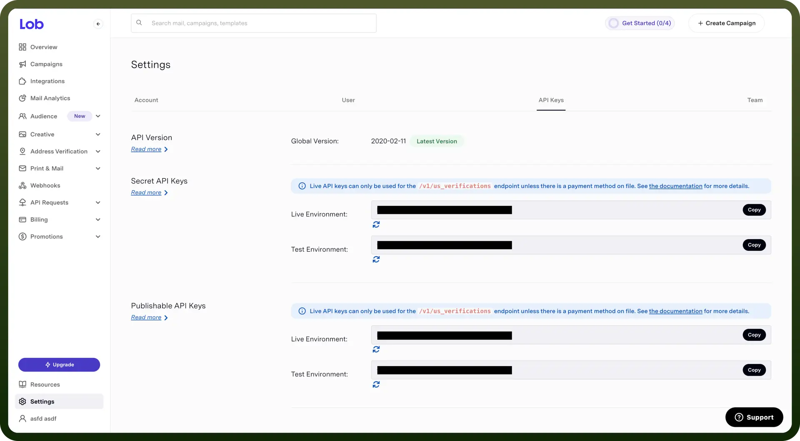

# Lob connector

Source: https://www.unifyapps.com/docs/unify-integrations/lob
Section: integrations

---

Lob.com is an API-driven platform for automating direct mail and address verification. It enables businesses to send postcards, letters, and checks with tracking and scalability.

Integrating your application with Lob enables you to automate direct mail, verify addresses, and optimize your mailing workflows with ease.

## Authentication

Ensure you have the following information ready for a seamless integration process:

- `Connection Name`**:** Select a descriptive name for your connection, like "MyAppLobIntegration". This helps in easily identifying the connection within your application or integration settings.
- `Authentication Type`**:** Lob supports Basic authentication. This method ensures secure access to Lob's functionalities and data.

### Basic Authentication

- Log into your Lob account and navigate to the "`Settings`" section from the sidebar.
- Go to the "`API Keys`" tab then in "`Secret API Keys`" and then "`Test Environment`", you will find your API Key.
- You can also regenerate API keys by refreshing.
- Copy the API Key and keep it secure, as it grants access to your Lob account.

  

## Actions

| Actions | Description |
|---|---|
| `Create letter` | Creates a new letter in Lob |
| `Create postcard` | Creates a new postcard in Lob |
| `Retrieve all letters` | Retrieves a list of letters in Lob |
| `Retrieve all postcards` | Retrieves a list of postcards in Lob |
| `Retrieve letter` | Retrieves a letter in Lob |
| `Retrieve postcard` | Retrieves a postcard in Lob |
