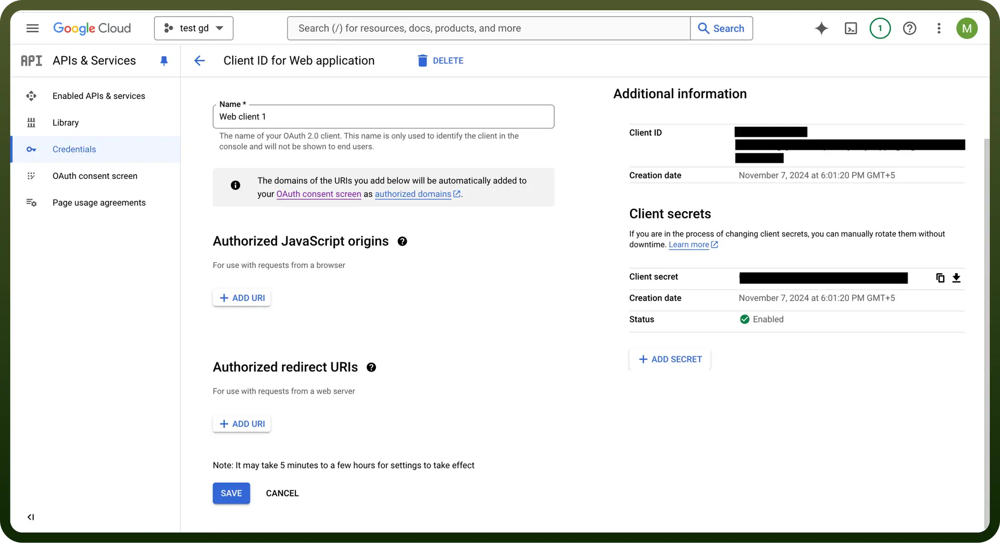
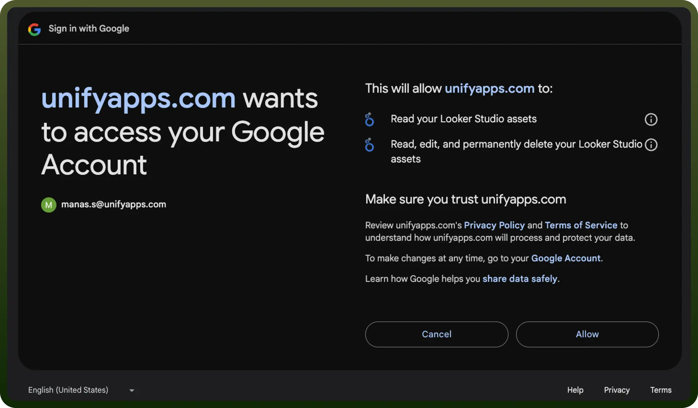

# Looker Studio integration | connect with UnifyApps

Source: https://www.unifyapps.com/docs/unify-integrations/looker-studio
Section: integrations

---

Looker Studio (formerly Google Data Studio) is a data visualization and business intelligence tool that helps users create interactive reports and dashboards. It integrates with multiple data sources, enabling real-time analytics and data-driven decision-making.

Integrating Looker Studio enables dynamic data visualization, real-time insights, and seamless reporting by connecting multiple data sources in one platform.

## Authentication

Before you begin, make sure you have the following information:

- `Connection Name`: Select a descriptive name for your connection, like "MyAppLookerStudioIntegration". This helps in easily identifying the connection within your application or integration settings.
- `Authentication Type`**:** Looker Studio supports Service Account based authentication, OAuth based authentication.

### Service Account Based Authentication

- Create a service account by following these [steps](https://apps.google.com/supportwidget/articlehome?hl=en&article_url=https%3A%2F%2Fsupport.google.com%2Fa%2Fanswer%2F7378726%3Fhl%3Den&assistant_id=generic-unu&product_context=7378726&product_name=UnuFlow&trigger_context=a).
- Add domain-level access to the service account (based on client ID) by following these [steps](https://developers.google.com/cloud-search/docs/guides/delegation#delegate_domain-wide_authority_to_your_service_account).
- Ensure that the following scopes are added to your service account and domain-level access:
  - https://www.googleapis.com/auth/datastudio
  - https://www.googleapis.com/auth/userinfo.profile
  - https://www.googleapis.com/auth/datastudio.readonly
- Use the service account email, private key, and a sample user email to authenticate the connection

  

### OAuth Based Authentication (With Credentials)

The OAuth method involves signing in with your Google account credentials on Google's Single Sign-On page, and granting the necessary permissions to UnifyWorkflows, For **OAuth**-based authentication, you'll need to perform the following steps to generate access credentials:

- Turn on the API services for Looker Studio API from `APIs & Services` -> `Enable APIs and services`**.**
- Create an OAuth Client Credentials by following these [steps](https://support.google.com/cloud/answer/6158849?hl=en#).
- Set up an OAuth consent screen to configure OAuth consent for your application by the following [steps](https://support.google.com/cloud/answer/10311615?hl=en&ref_topic=3473162&sjid=10952494557109160158-AP) **.**
- After adding a new secret, the console displays the `Client Identifier` as “`Client ID`**”** and `Client Secret` as **“**`Client secret`**”**. Copy this and treat it with high confidentiality, as it allows access to your Looker studio account.

  

- Use the `Client ID` and `Client secret`, press the Authorise button. You’ll be redirected to a Google sign-in page.
- If you're not already logged into Google, enter your Google account credentials and Sign in.
- Google will display a permissions request screen, showing the app name and the specific Google services we are requesting access to (e.g.,Looker studio).
- Carefully review the permissions being requested. If you’re comfortable with them, click the "`Allow`" or "`Grant Access`" button.
- After granting access, you will be automatically redirected back to our platform, where you should see a confirmation message indicating that your Google account is now connected and authorized.
- Ensure that the following permissions are granted for **OAuth authentication**.
  - https://www.googleapis.com/auth/datastudio
  - https://www.googleapis.com/auth/userinfo.profile
  - https://www.googleapis.com/auth/datastudio.readonly

### OAuth Based Authentication

- Press the `Authorize` button. You'll be redirected to a Google sign-in page.
- If you're not already logged into Google, enter your Google account credentials.
- Google will display a permissions request screen. You'll see our app name and the specific Google services we request access to.
- Carefully review the permissions we're asking for. If you're comfortable with the permissions, click the "`Allow`" or "`Grant Access`" button.
- After granting access, you'll be automatically redirected back to our platform. You should see a confirmation message that your Google account is now connected.

  

## Actions

| Actions | Description |
|---|---|
| `Add members` | This action adds members to a Looker Studio asset |
| `Get permissions` | Gets the permissions for a Looker Studio asset |
| `Revoke all permissions` | Revokes permissions from a Looker Studio asset |
| `Search assets` | This action helps users search Looker Studio assets |
