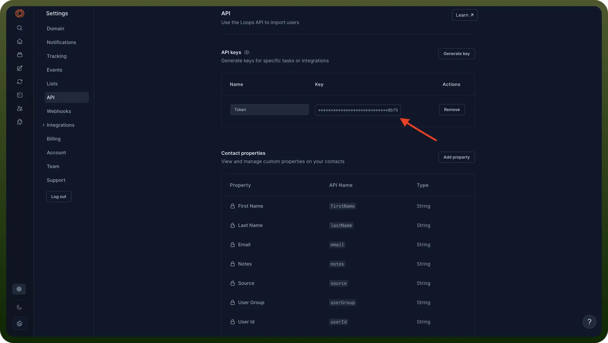

# Loops

Source: https://www.unifyapps.com/docs/unify-integrations/loops
Section: integrations

---

Loops is a unified email platform for modern software companies, combining product, marketing, and transactional messaging into one simple API and dashboard. It offers prebuilt templates, audience segmentation, and real-time analytics to optimize deliverability and engagement.

Integrating Loops centralizes and automates your email workflow, cutting development overhead, ensuring consistent branding, and providing deep insights into sends, opens, and clicks.

## Authentication

Before you begin, make sure you have the following information:

- `Connection Name`: Select a descriptive name for your connection, like "MyAppLoopsIntegration". This helps in easily identifying the connection within your application or integration settings.
- `Authentication Type`**:** Loops supports the API Key authentication method.

### API Key Based Authentication

1. Log in to your Loops account.
2. Navigate to the API settings page.
3. Click on "`Generate key`" to create a new API key.
4. Store this securely as it provides access to your Loops account.

  

## Actions

| Actions | Description |
|---|---|
| `Create contact` | Creates a contact in Loops |
| `Delete contact` | Deletes a contact in Loops |
| `Find contact` | Finds a contact in Loops |
| `Send event` | Sends an event to trigger emails in Loops |
| `Send transactional email` | Sends a transactional email to a contact in Loops |
| `Update contact` | Updates a contact in Loops |
