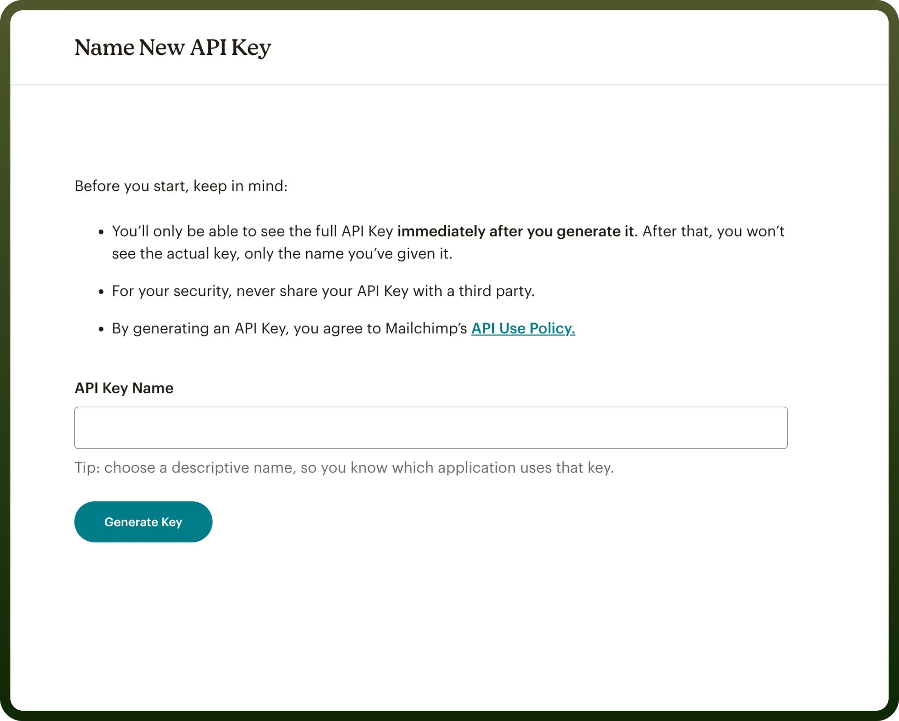
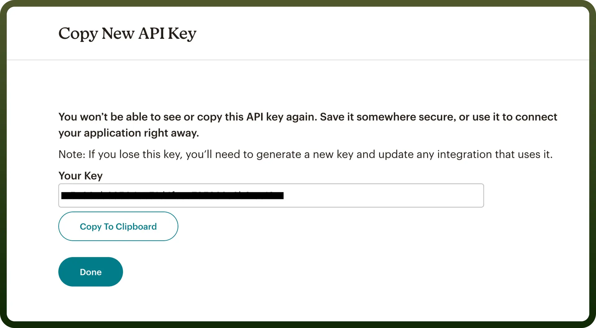
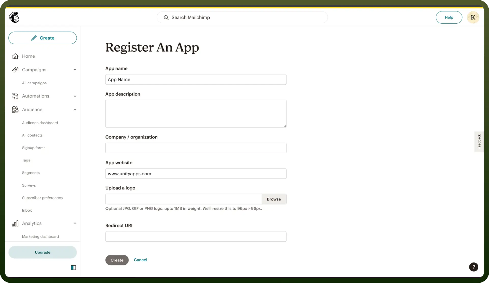
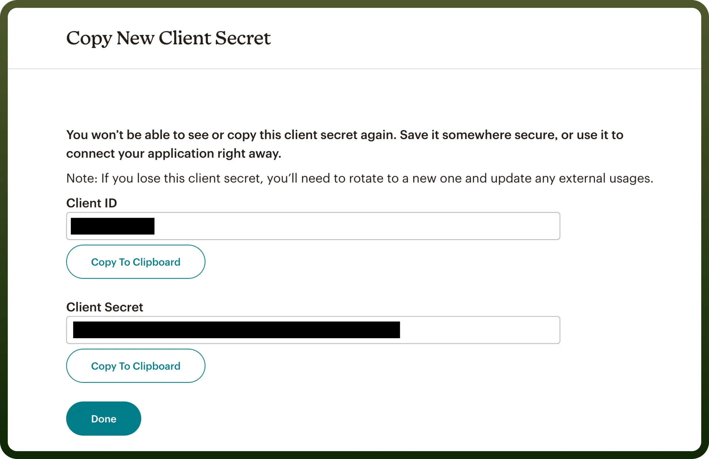

# Mailchimp connector

Source: https://www.unifyapps.com/docs/unify-integrations/mailchimp
Section: integrations

---

With Mailchimp, you can automate email campaigns, manage subscriber data, and integrate with other tools for seamless marketing operations.

Integrating it with your application enhances marketing efforts through automated email workflows and seamless tool integration for efficient operations.

## Authentication

Before you begin, ensure you have the following information:

- `Connection Name`: Choose a meaningful name for your connection. This name helps you identify the connection within your application or integration settings. It could be something descriptive like "MyAppMailchimpIntegration".
- `Authentication Type`: Select the type of authentication for connecting to your Mailchimp account:

### API Token-Based Authentication

Before you begin, make sure you have the following information from your Mailchimp account:

- **Data Center**: Your Data Center can be identified by looking at the last part of your Mailchimp API endpoint URL. For example, if your API endpoint is [https://us19.api.mailchimp.com/3.0/](https://us19.api.mailchimp.com/3.0/), the Data Center is us19. **Note:** For more information on the Data Center for your Mailchimp account, you can look up the [Mailchimp documentation](https://mailchimp.com/developer/marketing/docs/fundamentals/).
- **Auth Token (API Token)**: To obtain this, log in to your Mailchimp account, and navigate to the API Keys section by typing "`API Keys`" in the search bar and selecting the appropriate option. Once there, create a new API token. **Note:** For more information on API Tokens, you can look up the [Mailchimp documentation](https://mailchimp.com/developer/marketing/docs/fundamentals/).

  

- Click on `Generate key`, copy the new API key. Ensure to keep this key secure as it grants access to Mailchimps's services

  

### OAuth Based Authentication

If you prefer OAuth authentication, follow the steps below:

**Register Your Application:**

- Navigate to the Registered Apps page in your Mailchimp account.
- Click `Register An App`.
- Complete the Register An App form, which requires filling in fields like `App Name`, `App Description`, `Company Website`, etc.
- In the Redirect URI box, add the following exactly:[https://webhooks-global.ext-alb.qa.unifyapps.com/api/connector-auth-callback/oauth](https://webhooks-global.ext-alb.qa.unifyapps.com/api/connector-auth-callback/oauth).
- After filling in all the fields, click `Create`.

  

Click on `create`, copy the Client ID and Client Secret. Ensure to keep these secure as it grants access to Mailchimps's services

**Obtain Client ID and Client Secret:**

- Once the app is registered, you will receive the Client ID and Client Secret. These are essential for setting up OAuth 2 on your server.
- Ensure you copy and store the Client Secret securely, as this is the only time you will be able to view it.

## Actions

| **Action Name** | **Description** |
|---|---|
| `Update subscriber` | Updates a subscriber in Mailchimp |
| `Add subscriber` | Adds a subscriber in Mailchimp |
| `Add subscriber tags` | Adds subscriber tags in Mailchimp |
| `Delete user permanently` | Permanently deletes a user |
| `Get subscriber activity` | Gets subscriber activity from Mailchimp |
| `Get subscriber tags` | Gets subscriber tags in Mailchimp |
| `Search campaigns` | Searches for a campaign in Mailchimp |
| `Search subscriber` | Searches for a subscriber in Mailchimp |
| `Search tags` | Searches for a tag in Mailchimp |
| `Unsubscribe member` | Unsubscribes a member from a specific list |

## Triggers

| **Trigger** | **Description** |
|---|---|
| `New subscriber` | Triggers when a new subscriber is added in Mailchimp. |
| `Campaign sent` | Triggers when a campaign is sent in Mailchimp. |
| `New campaign` | Triggers when a new campaign is created in Mailchimp. |
| `New list` | Triggers when a new list is created in Mailchimp. |
