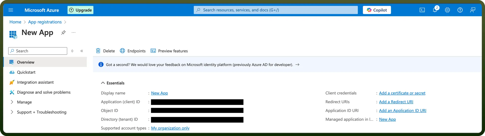

# Microsoft Business Central

Source: https://www.unifyapps.com/docs/unify-integrations/microsoft-business-central
Section: integrations

---

**Microsoft Business Central** is an all-in-one business management solution that helps small and medium-sized businesses manage finance, operations, sales, and customer service. It offers real-time data visibility and integrates seamlessly with other Microsoft tools.

Integrating Microsoft Business Central streamlines business processes and improves decision-making by unifying operations, data, and workflows across departments.

## Authentication

Before you begin, make sure you have the following information:

- `Connection Name`: Select a descriptive name for your connection, like "MyAppMicrosoftBusinessCentralIntegration". This helps in easily identifying the connection within your application or integration settings.
- `Authentication Type`**:** Microsoft Business Central supports OAuth for authentication.
- `Environment name`**:** If your url is [https://businesscentral.dynamics.com/abc12345-xyz67890/Production](https://businesscentral.dynamics.com/abc12345-xyz67890/Production) then Production is your Environment Name.

### OAuth Based Authentication

- Login into the Microsoft Azure Portal by clicking [here](https://portal.azure.com/).
- In the search Bar, search for `App Registratio`n and then Click on `new Registration`.
- Provide the Name and supported account types and register your app.
- The Client ID refers to the Application(client) ID.
- Click on **“**`Add a credential or scope`**”** to generate the client secret.
- Copy and store these securely to prevent unauthorised access.
- Enter your Tenant ID (Directory tenant ID).
- Enter your Environment name.

## Granular Permissions

| **Scope Code** | **Description** |
|---|---|
| [https://businesscentral.dynamics.com/.default](https://businesscentral.dynamics.com/.default) | Allows the app to access Dynamics 365 Business Central APIs using the permissions granted to it. |

## Actions

| **Actions** | **Description** |
|---|---|
| `Create a new bank account` | Creates a new bank account in Dynamics 365 Business Central |
| `Create a new contact` | Creates a new contact in Dynamics 365 Business Central |
| `Create a new country/region` | Creates a new country/region in Dynamics 365 Business Central |
| `Create a new currency` | Creates a new currency in Dynamics 365 Business Central |
| `Create a new customer` | Creates a new customer in Dynamics 365 Business Central |
| `Create a new employee` | Creates a new employee in Dynamics 365 Business Central |
| `Create a new item` | Creates a new item in Dynamics 365 Business Central |
| `Create a new item category` | Creates a new item category in Dynamics 365 Business Central |
| `Create a new item variant` | Creates a new item variant in Dynamics 365 Business Central |
| `Create a new journal` | Creates a new journal in Dynamics 365 Business Central |
| `Create a new journal line` | Creates a new journal line in Dynamics 365 Business Central |
| `Create a new location` | Creates a new location in Dynamics 365 Business Central |
| `Create a new opportunity` | Creates a new opportunity in Dynamics 365 Business Central |
| `Create a new payment method` | Creates a new payment method in Dynamics 365 Business Central |
| `Create a new payment term` | Creates a new payment term in Dynamics 365 Business Central |
| `Create a new project` | Creates a new project in Dynamics 365 Business Central |
| `Create a new purchase credit memo` | Creates a new purchase credit memo in Dynamics 365 Business Central |
| `Create a new purchase invoice` | Creates a new purchase invoice in Dynamics 365 Business Central |
| `Create a new purchase order` | Creates a new purchase order in Dynamics 365 Business Central |
| `Create a new sales credit memo` | Creates a new sales credit memo in Dynamics 365 Business Central |
| `Create a new sales invoice` | Creates a new sales invoice in Dynamics 365 Business Central |
| `Create a new sales order` | Creates a new sales order in Dynamics 365 Business Central |
| `Create a new sales quote` | Creates a new sales quote in Dynamics 365 Business Central |
| `Create a new shipment method` | Creates a new shipment method in Dynamics 365 Business Central |
| `Create a new tax area` | Creates a new tax area in Dynamics 365 Business Central |
| `Create a new tax group` | Creates a new tax group in Dynamics 365 Business Central |
| `Create a new time registration entry of employee` | Creates a new time registration entry of an employee in Dynamics 365 Business Central |
| `Create a new unit of measure` | Creates a new unit of measure in Dynamics 365 Business Central |
| `Create a new vendor` | Creates a new vendor in Dynamics 365 Business Central |
| `Create a new vendor payment journal` | Creates a new vendor payment journal in Dynamics 365 Business Central |
| `Get a purchase credit memo` | Get a purchase credit memo in Dynamics 365 Business Central |
| `Get a purchase invoice` | Get a purchase invoice in Dynamics 365 Business Central |
| `Get account` | Gets an account from Dynamics 365 Business Central |
| `Get an item` | Get an item in Dynamics 365 Business Central |
| `Get an item variant` | Get an item variant in Dynamics 365 Business Central |
| `Get balance sheet` | Gets a balance sheet from Dynamics 365 Business Central |
| `Get bank account` | Gets a bank account from Dynamics 365 Business Central |
| `Get cash flow statement` | Gets a cash flow statement from Dynamics 365 Business Central |
| `Get company` | Gets a company from Dynamics 365 Business Central |
| `Get company information` | Gets company information from Dynamics 365 Business Central |
| `Get contact` | Gets a contact from Dynamics 365 Business Central |
| `Get contact information of customer` | Gets contact information of a customer from Dynamics 365 Business Central |
| `Get contact information of vendor` | Gets contact information of a vendor from Dynamics 365 Business Central |
| `Get country/region` | Gets a country/region from Dynamics 365 Business Central |
| `Get currency` | Gets a currency from Dynamics 365 Business Central |
| `Get currency exchange rate` | Gets a currency exchange rate from Dynamics 365 Business Central |
| `Get customer` | Gets a customer from Dynamics 365 Business Central |
| `Get customer financial detail` | Gets a customer financial detail from Dynamics 365 Business Central |
| `Get employee` | Gets an employee from Dynamics 365 Business Central |
| `Get income statement` | Gets an income statement in Dynamics 365 Business Central |
| `Get item category` | Gets an item category from Dynamics 365 Business Central |
| `Get journal` | Gets a journal from Dynamics 365 Business Central |
| `Get journal line` | Gets a journal line from Dynamics 365 Business Central |
| `Get location` | Gets a location from Dynamics 365 Business Central |
| `Get opportunity` | Gets an opportunity in Dynamics 365 Business Central |
| `Get payment method` | Gets a payment method from Dynamics 365 Business Central |
| `Get payment term` | Gets a payment term from Dynamics 365 Business Central |
| `Get project` | Gets a project from Dynamics 365 Business Central |
| `Get purchase order` | Gets a purchase order in Dynamics 365 Business Central |
| `Get purchase receipt` | Gets a purchase receipt in Dynamics 365 Business Central |
| `Get sales credit memo` | Gets a sales credit memo from Dynamics 365 Business Central |
| `Get sales invoice` | Gets a sales invoice from Dynamics 365 Business Central |
| `Get sales order` | Gets a sales order from Dynamics 365 Business Central |
| `Get sales quote` | Gets a sales quote from Dynamics 365 Business Central |
| `Get sales shipment` | Gets a sales shipment in Dynamics 365 Business Central |
| `Get shipment method` | Gets a shipment method in Dynamics 365 Business Central |
| `Get tax area` | Gets a tax area from Dynamics 365 Business Central |
| `Get tax group` | Gets a tax group in Dynamics 365 Business Central |
| `Get time registration entry of employee` | Gets a time registration entry of an employee in Dynamics 365 Business Central |
| `Get unit of measure` | Gets a unit of measure in Dynamics 365 Business Central |
| `Get vendor` | Gets a vendor from Dynamics 365 Business Central |
| `Get vendor payment journal` | Gets a vendor payment journal in Dynamics 365 Business Central |
| `Get vendor purchase` | Gets a vendor purchase in Dynamics 365 Business Central |
| `Gets an accounting period` | Gets an accounting period from Dynamics 365 Business Central |
| `List accounting periods` | Lists accounting periods in Dynamics 365 Business Central |
| `List accounts` | Lists all accounts in Dynamics 365 Business Central |
| `List all item variants` | Lists all item variants in Dynamics 365 Business Central |
| `List all items` | Lists all items in Dynamics 365 Business Central |
| `List all opportunities` | Lists all opportunities in Dynamics 365 Business Central |
| `List all purchase credit memos` | Lists all purchase credit memos in Dynamics 365 Business Central |
| `List all purchase invoices` | Lists all purchase invoices in Dynamics 365 Business Central |
| `List all purchase orders` | Lists all purchase orders in Dynamics 365 Business Central |
| `List all purchase receipts` | Lists all purchase receipts in Dynamics 365 Business Central |
| `List all sales shipments` | Lists all sales shipments in Dynamics 365 Business Central |
| `List all tax groups` | Lists all tax groups in Dynamics 365 Business Central |
| `List balance sheets` | Lists all balance sheets in Dynamics 365 Business Central |
| `List bank accounts` | Lists all bank accounts in Dynamics 365 Business Central |
| `List cash flow statements` | Lists all cash flow statements in Dynamics 365 Business Central |
| `List companies` | Lists all companies in Dynamics 365 Business Central |
| `List company informations` | Lists all company information in Dynamics 365 Business Central |
| `List contact information of customers` | Lists all contact information of customers in Dynamics 365 Business Central |
| `List contact information of vendors` | Lists all contact information of vendors in Dynamics 365 Business Central |
| `List contacts` | Lists contacts in Dynamics 365 Business Central |
| `List country/region` | Lists all countries/regions in Dynamics 365 Business Central |
| `List currencies` | Lists all currencies in Dynamics 365 Business Central |
| `List currency exchange rates` | Lists all currency exchange rates in Dynamics 365 Business Central |
| `List customer financial details` | Lists all customer financial details in Dynamics 365 Business Central |
| `List customers` | Lists all customers in Dynamics 365 Business Central |
| `List employees` | Lists all employees in Dynamics 365 Business Central |
| `List income statements` | Lists all income statements in Dynamics 365 Business Central |
| `List item categories` | Lists all item categories in Dynamics 365 Business Central |
| `List journal lines` | Lists all journal lines in Dynamics 365 Business Central |
| `List journals` | Lists all journals in Dynamics 365 Business Central |
| `List locations` | Lists all locations in Dynamics 365 Business Central |
| `List payment methods` | Lists all payment methods in Dynamics 365 Business Central |
| `List payment terms` | Lists all payment terms in Dynamics 365 Business Central |
| `List projects` | Lists all projects in Dynamics 365 Business Central |
| `List sales credit memos` | Lists all sales credit memos in Dynamics 365 Business Central |
| `List sales invoices` | Lists all sales invoices in Dynamics 365 Business Central |
| `List sales orders` | Lists all sales orders in Dynamics 365 Business Central |
| `List sales quotes` | Lists all sales quotes in Dynamics 365 Business Central |
| `List shipment methods` | Lists all shipment methods in Dynamics 365 Business Central |
| `List tax areas` | Lists all tax areas in Dynamics 365 Business Central |
| `List time registration entries of employee` | Lists all time registration entries of employee in Dynamics 365 Business Central |
| `List unit of measures` | Lists all unit of measures in Dynamics 365 Business Central |
| `List vendor payment journals` | Lists all vendor payment journals in Dynamics 365 Business Central |
| `List vendors` | Lists all vendors in Dynamics 365 Business Central |
| `List vendors purchase` | Lists all vendors purchases in Dynamics 365 Business Central |
| `Update a item variant` | Update a item variant in Dynamics 365 Business Central |
| `Update a new item` | Update a item in Dynamics 365 Business Central |
| `Update a purchase credit memo` | Updates a purchase credit memo in Dynamics 365 Business Central |
| `Update a purchase invoice` | Updates a purchase invoice in Dynamics 365 Business Central |
| `Update bank account` | Updates a bank account in Dynamics 365 Business Central |
| `Update company information` | Updates company information in Dynamics 365 Business Central |
| `Update contact` | Updates a contact in Dynamics 365 Business Central |
| `Update country/region` | Updates a country/region in Dynamics 365 Business Central |
| `Update currency` | Updates a currency in Dynamics 365 Business Central |
| `Update customer` | Updates a customer in Dynamics 365 Business Central |
| `Update employee` | Updates an employee in Dynamics 365 Business Central |
| `Update item category` | Updates an item category in Dynamics 365 Business Central |
| `Update journal` | Updates a journal in Dynamics 365 Business Central |
| `Update journal line` | Updates a journal line in Dynamics 365 Business Central |
| `Update location` | Updates a location in Dynamics 365 Business Central |
| `Update opportunity` | Updates an opportunity in Dynamics 365 Business Central |
| `Update payment method` | Updates a payment method in Dynamics 365 Business Central |
| `Update payment term` | Updates a payment term in Dynamics 365 Business Central |
| `Update project` | Updates a project in Dynamics 365 Business Central |
| `Update purchase order` | Updates a purchase order in Dynamics 365 Business Central |
| `Update sales credit memo` | Updates a sales credit memo in Dynamics 365 Business Central |
| `Update sales invoice` | Updates a sales invoice in Dynamics 365 Business Central |
| `Update sales order` | Updates a sales order in Dynamics 365 Business Central |
| `Update sales quote` | Updates a sales quote in Dynamics 365 Business Central |
| `Update shipment method` | Updates a shipment method in Dynamics 365 Business Central |
| `Update tax area` | Updates a tax area in Dynamics 365 Business Central |
| `Update tax group` | Updates a tax group in Dynamics 365 Business Central |
| `Update time registration entry of employee` | Updates a time registration entry of an employee in Dynamics 365 Business Central |
| `Update unit of measure` | Updates a unit of measure in Dynamics 365 Business Central |
| `Update vendor` | Updates a vendor in Dynamics 365 Business Central |
| `Update vendor payment journal` | Updates a vendor payment journal in Dynamics 365 Business Central |
