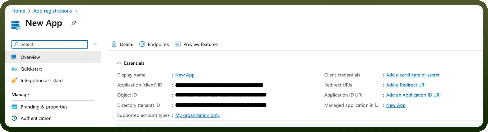

# Microsoft Dynamics 365 CRM

Source: https://www.unifyapps.com/docs/unify-integrations/microsoft-dynamics-365-crm
Section: integrations

---

Microsoft Dynamics 365 is a **cloud-based suite** of business applications that integrates sales, customer service, and field service management.

Integrating your application with Microsoft Dynamics 365 streamlines business processes and customer engagement, offering a comprehensive suite of tools for sales, customer service, field service, and more.

## Authentication

Before you begin, make sure you have the following information:

1. `Connection Name`**:** Choose a meaningful name for your connection. This name helps you identify the connection within your application or integration settings. It could be something descriptive like "MyAppdynamics365Integration".
2. `Authentication Type`**:** Microsoft Dynamics 365 supports the following types of authentication.
  - OAuth
  - OAuth 2.0
  - Basic Auth
3. `Dynamics domain`**:** Enter your dynamics 365 domain. For example, if your domain is https://example.crm8.dynamics.com, enter example.crm8.dynamics.com

### OAuth (One step) Based Authentication

- Login into the Microsoft Azure Portal by clicking [here](https://portal.azure.com/).
- In the search Bar, search for `App Registration` and then Click on `new Registration`.
- Provide the Name and supported account types and register your app.
- The Client ID refers to the `Application(client) ID`.
- Click on **“**`Add a credential or scope`**”** to generate the client secret.
- Copy and store these securely to prevent unauthorised access.
- Enter your Tenant ID (Directory tenant ID).

### OAuth 2.0-based Authentication

- Use the above mentioned steps to generate Client ID and Secret
- Enter your Client ID **(Application(client) ID)**
- Enter your Client Secret

### Resource owner password credentials (Basic Auth)-based Authentication

- Enter your Client ID (`Application(client) ID`)
- Click “`Add a credential or scope`” to generate the **client secret.**
- Enter your username of Microsoft Dynamics 365 account.
- Enter your password for the Microsoft Dynamics 365 account.
- Enter your Tenant ID; the **Tenant ID** refers to the **Directory**(**tenant) ID**..

## Granular Permissions

| **Scope Key** | **Description** |
|---|---|
| `User_impersonation` | Access Common Data Service as organization users |
| `READ` | Read Forecast data |

## Actions

| **Action Name** | **Description** |
|---|---|
| `Create object` | Creates a standard or custom object in Microsoft Dynamics 365 |
| `Create object in batch` | Creates a standard or custom object in Microsoft Dynamics 365 (batch) |
| `Update object` | Update a standard or custom object in Dynamics 365 |
| `Update object in batch` | Update a standard or custom object in Dynamics 365 (batch) |
| `Get object by ID` | Gets object by ID from Microsoft Dynamics 365 |
| `Get object schema` | Gets object schema from Microsoft Dynamics 365 |
| `Create Account` | Creates a new account in Microsoft Dynamics 365 |
| `Close Case` | Closes a case in Microsoft Dynamics 365 |
| `Search object in batch` | Search object in batch from Microsoft Dynamics 365 |
| `List objects` | Lists objects from Microsoft Dynamics 365 |

## Triggers

| **Trigger Name** | **Description** |
|---|---|
| `Delete object` | Triggers when an object is deleted in Microsoft Dynamics 365 |
| `Export New objects` | Periodically exports new objects created since the last trigger |
| `Export New or updated objects` | Periodically exports new or updated objects created since the last trigger |
| `Monitor changes in entities` | Monitors changes in entities (one per run) |
| `Monitor changes in entities (Batch)` | Monitors changes in entities in batch |
| `New / updated object` | Triggers immediately when an object is created or updated |
| `New object` | Triggers when an object is created (appears twice in list) |
| `New object (Immediate)` | Triggers immediately when an object is created |
| `New/updated object` | Triggers when an object is created or updated |
| `Scheduled object search` | Searches objects on a specified schedule |
