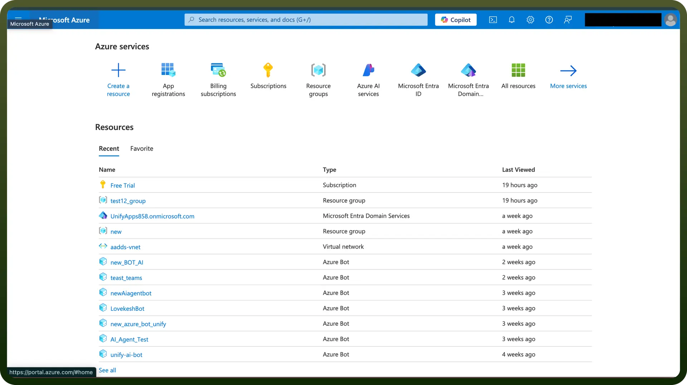
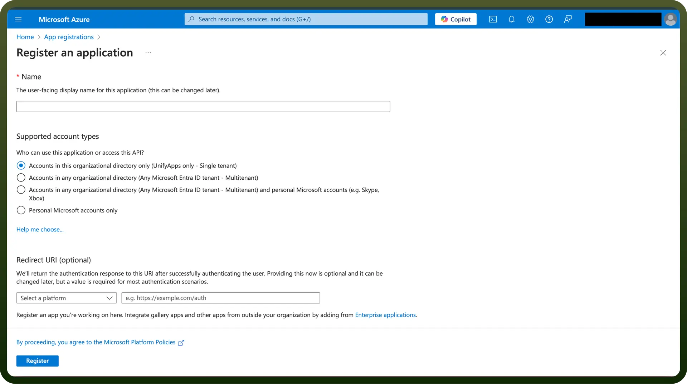
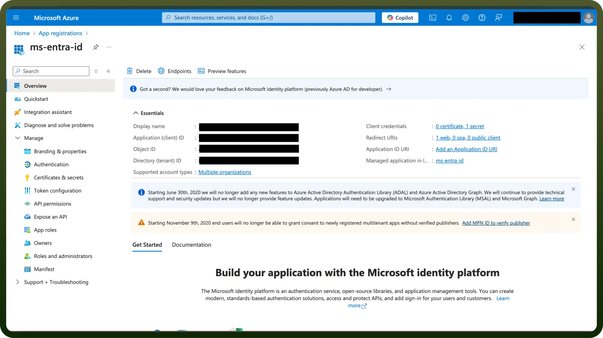
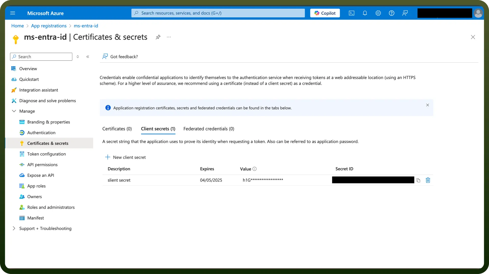

# Microsoft Entra ID

Source: https://www.unifyapps.com/docs/unify-integrations/microsoft-entra-id
Section: integrations

---

Microsoft Entra ID, formerly known as Azure Active Directory (AAD), is a cloud-based identity and access management service. It helps secure access to applications and resources by providing authentication, single sign-on (SSO), and multi-factor authentication (MFA). Entra ID enables centralized identity management for users, devices, and apps across cloud and on-premises environments.

Integrating your application with Microsoft Entra ID streamlines user authentication and authorization, providing secure single sign-on and centralized identity management across your organization.

## Authentication

Ensure you have the following information ready for a seamless integration process:

- `Connection Name`: Select a descriptive name for your connection, like "MyAppMicrosoftEntraIDIntegration". This helps in easily identifying the connection within your application or integration settings.
- `Authentication Type`: Microsoft Entra ID supports OAuth authentication for integrations

### OAuth Based Authentication

To get your OAuth credentials, follow the steps given below:

- Login into the Microsoft Azure Portal by clicking [here](https://portal.azure.com/).
- In the search Bar, search for `App Registration` and then click on `New registration`.

  

- Provide the name, supported account types, Redirect URIs and register your app.

  

- In the Overview tab, you can find the Client ID and Tenant ID. Required permissions can be granted in the API Permissions tab

  

- To create a client secret, click on the `Certificates and Secrets` tab and click on New client secret. Copy the “`Value`” as the Client secret

  

## Permissions

| **Scope Code** | Description |
|---|---|
| `offline_access` | Maintain access to data you have given it access to |

## Sensitive Permissions

Admin permissions are required for the following scopes:

| **Scope Code** | Description |
|---|---|
| `group.readwrite.all` | Read and write all groups. Allows the app to create, update, and delete groups without a signed-in user. |
| `people.read.all` | Read the profiles of all users in your organization. Allows the app to read user profiles on behalf of the signed-in user. |
| `user.readwrite.all` | Read and write all users' full profiles. Allows the app to create, read, update, and delete users without a signed-in user. |

## Actions

| **Action Name** | **Description** |
|---|---|
| `Add or remove user license` | Adds or removes a user license in Microsoft Entra ID |
| `Add user to group` | Adds the selected user to a group in Microsoft Entra ID |
| `Create group` | Creates a group in Microsoft Entra ID |
| `Create user` | Creates a new user in Microsoft Entra ID |
| `Delete group` | Deletes a group in Microsoft Entra ID |
| `Delete user` | Deletes an existing user in Microsoft Entra ID |
| `Disable user` | Disables an existing user in Microsoft Entra ID |
| `Get group details` | Retrieves the details of any group in Microsoft Entra ID |
| `Get user details` | Retrieves the details of any user in Microsoft Entra ID |
| `Get user license` | Gets user license for a user in Microsoft Entra ID |
| `Remove user from group` | Removes a user from a group in Microsoft Entra ID |
| `Search users` | Searches users in Microsoft Entra ID |
| `Update group` | Updates a group in Microsoft Entra ID |
| `Search group members` | Search group members in Microsoft Entra ID |
| `Search transitive group members` | Search transitive group members in Microsoft Entra ID |
| `Update user` | Update user in Microsoft Entra ID |

## Triggers

| **Trigger Name** | **Description** |
|---|---|
| `New deleted user` | Triggers when a Microsoft Entra ID user is deleted |
| `New/updated group` | Triggers when a Microsoft Entra ID group is created/updated |
| `New/updated user` | Triggers when a Microsoft Entra ID user is created/updated |
| `New group` | Triggers when a new group is created on Microsoft Entra ID |
| `New user` | Triggers when a Microsoft Entra ID user is created |
