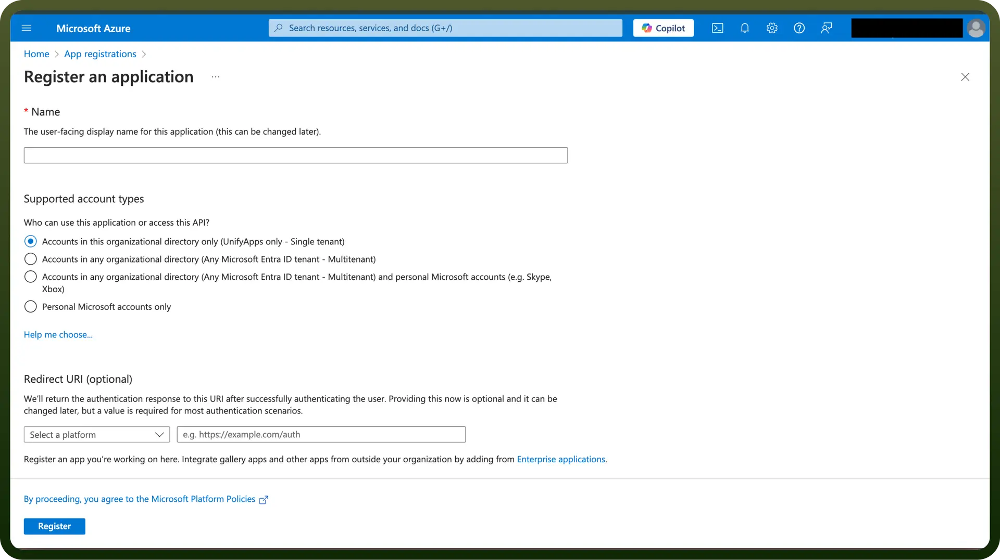
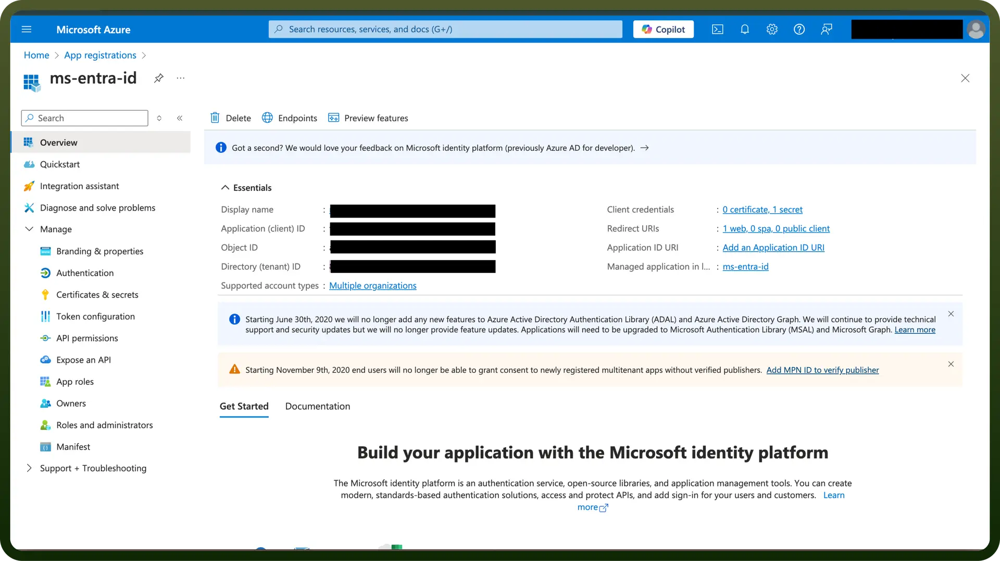
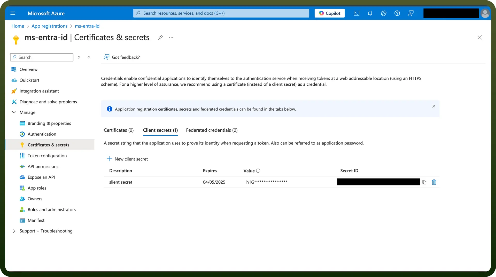

# Microsoft Graph API

Source: https://www.unifyapps.com/docs/unify-integrations/microsoft-graph-api
Section: integrations

---

Microsoft Graph API is a unified RESTful endpoint that allows developers to access data and intelligence across Microsoft 365 services like Outlook, Teams, OneDrive, and Azure Active Directory. It enables secure, granular, and real-time interactions with user and organizational data.

Integrating Microsoft Graph API provides a single access point to build powerful, cross-platform Microsoft 365 applications with real-time insights and seamless data flow.

## Authentication

Ensure you have the following information ready for a seamless integration process:

- `Connection Name`: Select a descriptive name for your connection, like "MyAppMicrosoftGraphAPIIntegration". This helps in easily identifying the connection within your application or integration settings.
- `Authentication Type`: Microsoft Graph API supports OAuth authentication for integrations.

### OAuth Based Authentication

- Login into the Microsoft Azure Portal by clicking [here](https://portal.azure.com/).
- In the search Bar, search for `App Registration` and then click on `New registration`.
- Provide the name, supported account types, Redirect URIs and register your app.

- In the Overview tab, you can find the Client ID and Tenant ID. Required permissions can be granted in the API Permissions tab

- To create a client secret, click on the **Certificates and Secrets** tab and click on New client secret. Copy the “`Value`” as the Client secret and store it securely to prevent unauthorized access.

## Permissions

| Scope Code | Description |
|---|---|
| `offline_access` | Maintain access to data you have given it access to, even when you are offline. |
| `files.readwrite` | Read and write user files and files shared with the user. |
| `files.readwrite.all` | Read and write all files that the signed-in user can access. |
| `Sites.ReadWrite.All` | Grants an application broad access to SharePoint and OneDrive resources |

## Sensitive Permissions

Admin permissions are required for the following scopes:

| Scope Code | Description |
|---|---|
| `group.readwrite.all` | Read and write all groups. Allows creating, updating, and deleting groups without user consent. |
| `people.read.all` | Read the profiles of all users in the directory. |
| `user.readwrite.all` | Read and write all users' full profiles. Allows creating, updating, and deleting user accounts. |

## Actions

| **Action Name** | **Description** |
|---|---|
| `Create list` | Creates a new list via Microsoft Graph API |
| `Create mail` | Creates a new message via Microsoft Graph API |
| `Create user` | Creates a new user via Microsoft Graph API |
| `Delete list` | Deletes a list via Microsoft Graph API |
| `Delete mail` | Deletes a mail via Microsoft Graph API |
| `Delete mail attachment` | Deletes a mail attachment via Microsoft Graph API |
| `Delete user` | Deletes a user via Microsoft Graph API |
| `Get list` | Gets a list via Microsoft Graph API |
| `Get mail` | Gets a mail via Microsoft Graph API |
| `Get mail attachment` | Gets mail attachment via Microsoft Graph API |
| `Get user` | Gets a user via Microsoft Graph API |
| `List license` | Lists license details of a user via Microsoft Graph API |
| `List lists` | Lists lists via Microsoft Graph API |
| `List mail` | Lists mails via Microsoft Graph API |
| `List user` | Lists users via Microsoft Graph API |
| `Move mail` | Moves mail via Microsoft Graph API |
| `Send mail` | Sends a mail message via Microsoft Graph API |
| `Update license` | Updates license via Microsoft Graph API |
| `Update mail` | Updates a mail via Microsoft Graph API |
| `Update user` | Updates a user via Microsoft Graph API |
