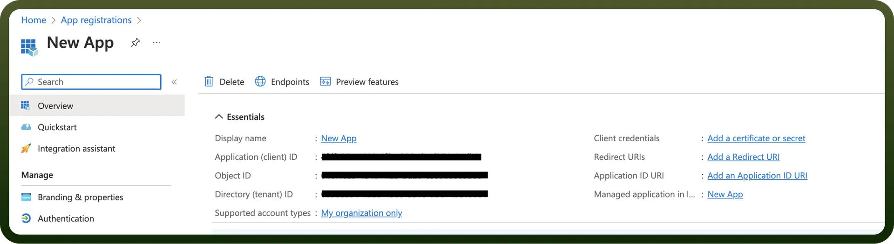

# Microsoft OneDrive

Source: https://www.unifyapps.com/docs/unify-integrations/microsoft-onedrive
Section: integrations

---

Microsoft OneDrive is a cloud storage service that allows users to store, sync, and share files across multiple devices with seamless integration into Microsoft Office applications. It provides secure backup, real-time collaboration features, and accessible file management through web browsers, desktop apps, and mobile devices.

Integrating your application with Microsoft OneDrive revolutionizes file management, facilitating seamless collaboration, version control, and secure cloud storage.

## Authentication

Before you begin, make sure you have the following information:

- `Connection Name`**:** Select a descriptive name for your connection, like "MyAppOneDriveIntegration". This helps in easily identifying the connection within your application or integration settings.
- `Authentication Type`**:** Microsoft OneDrive supports OAuth authentication for integrations.

### OAuth based Authentication

- Login into the Microsoft Azure Portal by clicking [here](https://portal.azure.com/).
- In the search Bar, search for `App Registration` and then Click on `New Registration`.
- Provide the Name and supported account types and register your app.
- The Client ID refers to the Application(client) ID
- Click on “`Add a credential or scope`” to generate the client secret. Permissions

  

| Scope Code | Description |
|---|---|
| `offline_access` | Allows the app to access user data even when the user is not actively using the application by maintaining refresh tokens. |
| `Files.Read` | Grants read-only access to files in the user's OneDrive and SharePoint sites that the user can access. |
| `Files.Read.All` | Provides read access to all files that the user can access, including files shared with them across the organization. |
| `Files.ReadWrite` | Allows reading and writing files in the user's OneDrive and SharePoint sites that the user has access to. |
| `Files.ReadWrite.All` | Grants full read and write access to all files the user can access, including organization-wide shared files. |
| `Sites.Read.All` | Provides read-only access to all SharePoint sites and lists that the user can access within the organization. |
| `Sites.ReadWrite.All` | Allows full read and write access to all SharePoint sites, lists, and content that the user can access. |
| `Team.ReadBasic.All` | Grants read access to basic information about all Microsoft Teams that the user is a member of, including team names and descriptions. |

## Triggers

| Trigger | Description |
|---|---|
| `New File` | Triggers when a new file is created in the selected folder in Microsoft OneDrive |
| `New Folder` | Triggers when a new folder is created in the selected folder in Microsoft OneDrive |
| `New/updated file` | Triggers when a file is uploaded or updated in the selected folder in Microsoft OneDrive |

## Actions

| Actions | Description |
|---|---|
| `Add permission` | Adds permission to a file or folder in Microsoft OneDrive |
| `Create folder` | Creates a folder in Microsoft OneDrive |
| `Delete file or folder` | Deletes a file or folder in Microsoft OneDrive |
| `Download file` | Downloads the contents of a file in Microsoft OneDrive |
| `Fetch permissions` | Fetches permissions for files and folders in Microsoft OneDrive |
| `Fetch teams for a user` | Fetches teams for a user by user ID |
| `Get file` | Retrieves a file in Microsoft OneDrive |
| `Get file metadata` | Retrieves file metadata in Microsoft OneDrive |
| `Get user details from email` | Fetches details of a user by their email |
| `List files and folders` | Lists files and folders in Microsoft OneDrive |
| `Remove permission` | Removes permission for a file or folder in Microsoft OneDrive |
| `Search files` | Searches files in Microsoft OneDrive |
| `Search drive items` | Searches items in Microsoft OneDrive |
| `Upload file from URL` | Uploads a file from a URL to Microsoft OneDrive |
| `Upload file via file content` | Uploads a file via file content to Microsoft OneDrive |
