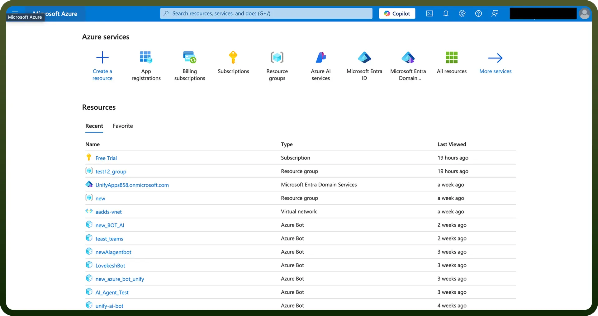
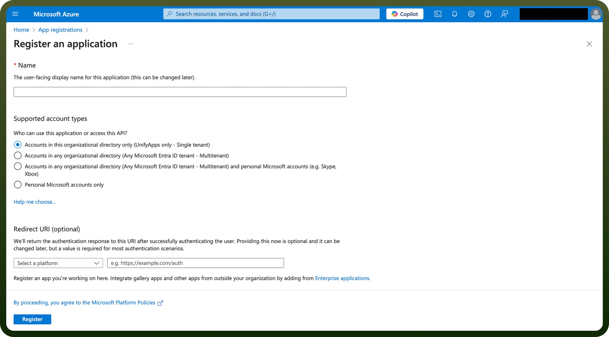
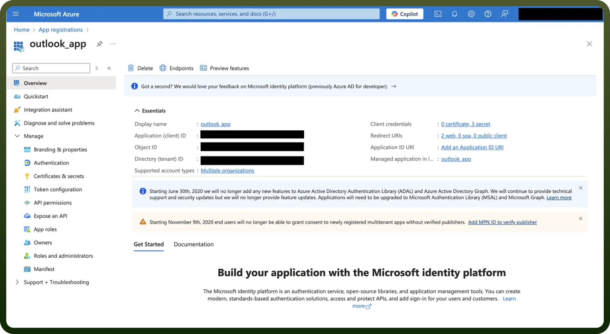
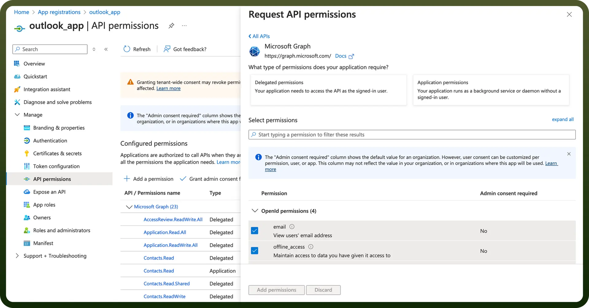
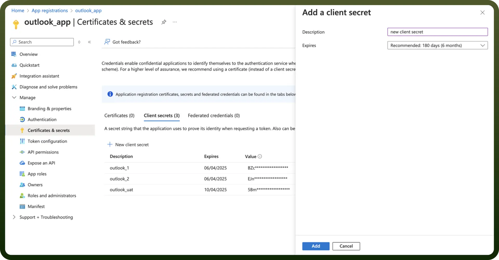
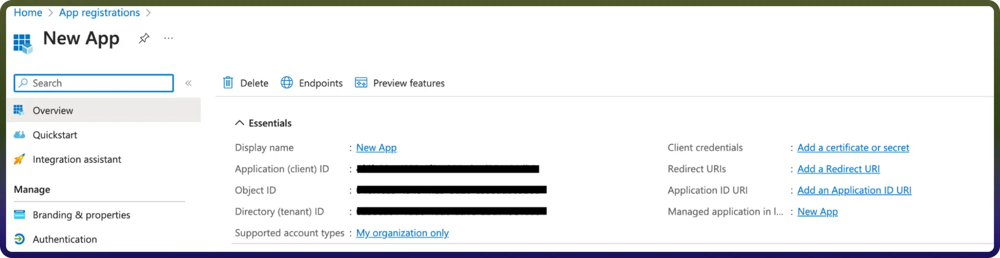
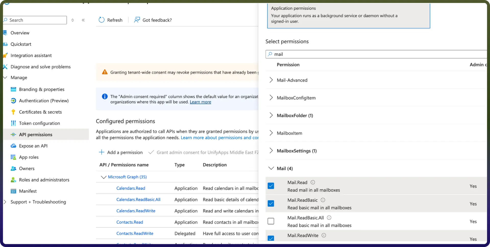

# Microsoft Outlook integration | connect with UnifyApps

Source: https://www.unifyapps.com/docs/unify-integrations/microsoft-outlook
Section: integrations

---

Microsoft Outlook is a personal information manager from Microsoft that is part of the Microsoft Office suite. It includes email, calendaring, contacts, and task services. The Outlook connector uses the Microsoft Graph API v1.0.

Integrating Outlook enhances productivity by centralizing emails, calendars, and tasks, streamlining communication, and improving scheduling efficiency.

## Authentication

Before you begin, make sure you have the following information:

- `Connection Name`**:** Choose a descriptive name for your connection. This helps you easily identify the connection within your application or integration settings, such as "MyAppOutlookIntegration".
- `Authentication Type`**:** Select the type of authentication for connecting to your Outlook account:
  - OAuth with Client Credentials Based Authentication (Only available for tenant-specific connections)
  - OAuth
  - Client Credentials

### OAuth with Client Credentials Based Authentication

- **Register the App in Azure Portal:**
  - Log in to the [**Azure portal**](https://portal.azure.com/#home).
  - Navigate to `App Registrations` and click on `New registration`**.**

    

  - Add the name of your application, redirect URI and ‘Accounts in any organizational directory (Any Microsoft Entra ID tenant - Multitenant)’ as the Supported account types. Click Register to register your application.

    

- **Obtain the Client ID and Tenant ID:**
  - Navigate to the `Overview` tab of your App.
  - Here you will find the Client ID and the Tenant ID.

    

- **Assign the necessary permissions:**
  - Go to `API Permissions` on the side navigation bar. Click on `Add a permission` and go to Microsoft Graph.
  - Under `Delegated Permissions` select offline_access, Mail.Read. These scopes are mandatory to create a connection.

    

- **Obtain the Client secret:**
  - Navigate to the `Certificates & secrets` tab in the navigation pane and click on `New client secret`**.** Click on Add to create a new client secret.
  - Copy the `Value` of your newly created client secret and store it safely.

### OAuth based

1. Click on the Authorise button. You’ll be redirected to a Microsoft sign-in page.
2. If you're not already logged into Microsoft Outlook, enter your Microsoft Outlook account credentials and Sign in.
3. Microsoft will display a permissions request screen, showing the app name and the specific Microsoft Outlook permissions we are requesting access to.
4. Carefully review the permissions being requested. If you’re comfortable with them, click the "Allow" button.
5. After granting access, you will be automatically redirected back to our platform, where you should see a confirmation message indicating that your account is now connected.

### Client Credentials

This flow is similar to the OAuth Client Credentials flow but is used in scenarios where access to a specific user mailbox or data is not required. It allows app-level access to organizational resources without requiring individual user consent.

Log in to the Microsoft Azure Portal.

1. Search for App Registrations and click New Registration.
2. Provide a name and supported account types and register your app.
3. The Client ID refers to the Application (client) ID.
4. Click on "Add a credential or scope" to generate the Client Secret.
5. Copy and store these credentials securely to prevent unauthorized access.
6. Select the required ( Application scopes )
7. Make sure the system user should be part of that tenant.
8. Now enter clientId, clientSecret, tenantId and make delegated check box unchecked and authorize the connection.

## Actions

| **Actions** | **Description** | **Scopes Required** |
|---|---|---|
| `Create Contact` | Add a contact to the root Contacts folder in Microsoft Outlook. | Contacts.ReadWrite |
| `Delete Contact` | Delete a contact in Microsoft Outlook. | Contacts.ReadWrite |
| `Download attachment` | Download attachment from Microsoft Outlook. | Mail.Read |
| `Fetch Messages using mailbox path` | Fetch all messages from mailbox in Microsoft Outlook. | Mail.ReadBasic, Mail.Read |
| `Fetch all tasks` | Fetch all tasks from Microsoft Outlook. | Tasks.Read |
| `Fetch all user groups` | Fetch all user groups from Microsoft Outlook. | Group.Read.All |
| `Fetch contacts` | Fetch all contacts in Microsoft Outlook. | Contacts.Read |
| `Fetch message by id` | Fetch the message by ID in Microsoft Outlook. | Mail.ReadBasic, Mail.Read, Mail.ReadWrite.Shared |
| `Fetch messages` | Fetch all messages in Microsoft Outlook. | Mail.ReadBasic, Mail.Read |
| `Fetch messages for mailbox` | Fetch messages of a mailbox in Microsoft Outlook. | Mail.ReadBasic, Mail.Read, Mail.ReadWrite.Shared |
| `Fetch task lists` | Fetch all task lists from Microsoft Outlook. | Tasks.Read |
| `Fetch tasks` | Fetch all tasks from Microsoft Outlook. | Tasks.Read |
| `Fetch user details` | Retrieve user details from Microsoft Outlook. | User.Read |
| `Get contact` | Retrieve the properties and relationships of a contact in Microsoft Outlook. | Contacts.Read |
| `List Categories` | Get all the categories that have been defined for a user in Microsoft Outlook. | Mail.Read |
| `List Folders` | Get all the mail folders in Microsoft Outlook. | Mail.Read |
| `List contacts` | Retrieve the list of contacts in Microsoft Outlook. | Contacts.Read |
| `Retrieve Attachment` | Retrieve an attachment attached to a message in Microsoft Outlook. | Mail.Read |
| `Retrieves list of attachements` | Retrieve list of attachments attached to a message in Microsoft Outlook. | Mail.Read |
| `Search contacts` | Fetches the list of contacts based on query in Microsoft Outlook. | Contacts.Read |
| `Search emails` | Searches emails in Microsoft Outlook. | Mail.ReadBasic, Mail.Read |
| `Send email` | Send an email from Microsoft Outlook. | Mail.Send |
| `Update contact` | Updates a contact in Microsoft Outlook. | Contacts.ReadWrite |

## Triggers

| **Trigger** | **Description** | **Scopes Required** |
|---|---|---|
| `New Contact` | Triggers when a new contact is created. | Contacts.Read |
| `New Contact Created or Updated` | Triggers when a new contact is created or updated. | Contacts.Read |
| `New Starred Email` | Triggers when an email is starred in Microsoft Outlook. | Mail.Read |
| `New email` | Triggers when a new mail is sent in Microsoft Outlook. | Mail.Read |
| `New mail` | Triggers when a new mail is sent in Microsoft Outlook. | Mail.Read |
