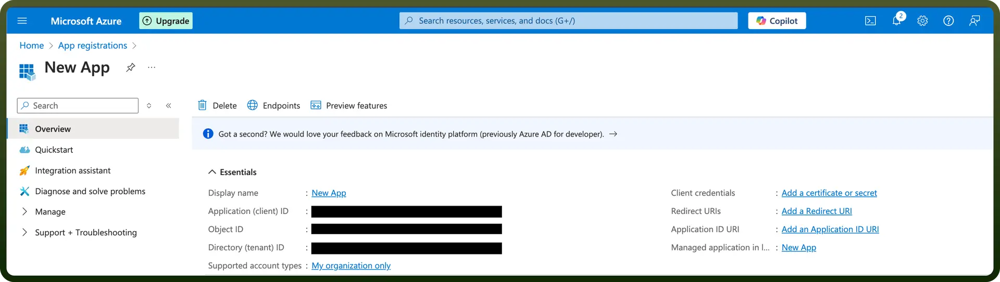

# Microsoft Planner integration | connect with UnifyApps

Source: https://www.unifyapps.com/docs/unify-integrations/microsoft-planner
Section: integrations

---

Microsoft Planner is a task management tool within the Microsoft 365 suite that helps teams create, assign, and track work visually using boards, buckets, and cards—ideal for organizing projects and collaborating in real time.
Choose Microsoft Planner over other tools because it offers seamless integration with Microsoft 365 apps, making it easy for teams to manage tasks, collaborate in real-time.

## Authentication

Before you begin, make sure you have the following information.

- `Connection Name`**:** Choose a meaningful name for your connection. This name helps you identify the connection within your application or integration settings. It could be something descriptive like "MyMicrosoftPlanner".
- `Authentication Type`**:** Microsoft Planner supports the following types of authentication.
  - OAuth
  - OAuth with Client Credentials
  - Credentials

> **Note:** In the Redirect URL section paste the following link [https://webhooks-global.ext-alb.qa.unifyapps.com/api/connector-auth-callback/oauth](https://webhooks-global.ext-alb.qa.unifyapps.com/api/connector-auth-callback/oauth).

### OAuth Based Authentication

- Enter your Tenant ID (Directory tenant ID).
- Select the scopes required.
- Click on Authorize.
- After you are redirected, login to your Microsoft account and approve the scopes needed.

  

### OAuth with Client Credentials

To authenticate using the Client Credentials flow, you need a Client ID and Client Secret. This flow is used when accessing user data (like mailboxes) without direct user login. It requires admin consent to access organizational resources.

- Login into the Microsoft Azure Portal by clicking [here](https://portal.azure.com/).
- In the search Bar, search for App Registration and then Click on new Registration.
- Provide the Name and supported account types and register your app.
- The Client ID refers to the Application(client) ID.
- Click on **“**`Add a credential or scope`**”** to generate the client secret.
- Copy and store these securely to prevent unauthorised access.
- Enter your Tenant ID (Directory tenant ID).
- Select the scopes required.
- You need user consent to access the mailbox

## Credentials

This flow is similar to the OAuth Client Credentials flow but is used in scenarios where access to a specific user mailbox or data is not required. It allows app-level access to organizational resources without requiring individual user consent.

- Enter your Client ID (**Application(client) ID)**
- Click “`Add a credential or scope`” to generate the **client secret.**
- Enter your username of Microsoft Planner account
- Enter your password for the Microsoft Planner account.
- Enter your Tenant ID (Directory tenant ID).
- You don’t need user consent to access the mailbox.

## Permissions

| **Scope Code** | **Description** |
|---|---|
| `Group.ReadWrite.All` | Read/write all groups data |
| `offline_access` | Have full access to all files user can access |
| `Tasks.ReadWrite` | Manage user's tasks and lists |
| `Group.Read.All` | Read all groups' basic info |

## Sensitive Permissions

| **Scope Code** | **Description** |
|---|---|
| `Group.Read.All` | Read all groups' basic info |
| `Group.ReadWrite.All` | Read/write all groups data |

## Triggers

| **Trigger** | **Description** |
|---|---|
| `New Task` | Triggers when a new task is added to the planner |

## Actions

| **Action** | **Description** |
|---|---|
| `Create Plan` | Create a plan in Microsoft Planner |
| `Create Task` | Create a task in Microsoft Planner |
| `Delete Plan` | Delete a plan in Microsoft Planner |
| `Delete Task` | Delete a task in Microsoft Planner |
| `Get Plan` | Get a plan in Microsoft Planner |
| `Get Task` | Get task details in Microsoft Planner |
| `List Plans` | List all plan in Microsoft Planner |
| `List plan tasks` | List all plan tasks in Microsoft Planner |
| `Update Plan` | Update a plan in Microsoft Planner |
| `Update Task` | Update a task in Microsoft Planner |
