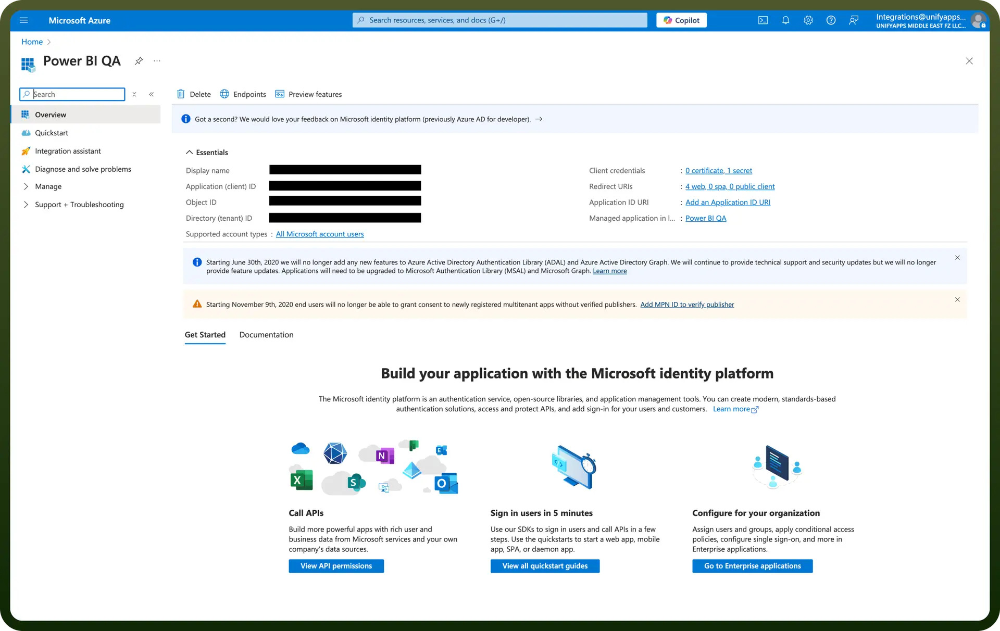

# Microsoft PowerBI integration | connect with UnifyApps

Source: https://www.unifyapps.com/docs/unify-integrations/microsoft-powerbi
Section: integrations

---

Power BI is a business analytics tool by Microsoft that enables users to visualize data and share insights across an organization. It connects to multiple data sources and transforms raw data into interactive dashboards and reports.

Integrating your application with Microsoft Power BI optimizes data visualization and analytics, facilitating efficient reporting and decision-making.

## Authentication

Before you begin, make sure you have the following information:

- `Connection Name`: Select a descriptive name for your connection, like "MyAppPowerBIIntegration". This helps in easily identifying the connection within your application or integration settings.
- `Authentication Type`**:** Microsoft Power BI supports OAuth authentication for integrations.

### OAuth Based Authentication

- Login into the Microsoft Azure Portal by clicking [here](https://portal.azure.com/).
- In the search Bar, search for `App Registration` and then Click on `new Registration`.
- Provide the Name and supported account types and register your app.
- The Client ID refers to the Application(client) ID.
- Click on "`Add a credential or scope`" to generate the client secret.
- Copy and store it securely as it provides access to your Power BI account.

> **Note:** In the Redirect URL section paste the following link [https://webhooks-global.ext-alb.qa.unifyapps.com/api/connector-auth-callback/oauth](https://webhooks-global.ext-alb.qa.unifyapps.com/api/connector-auth-callback/oauth).

## Actions

| Actions | Description |
|---|---|
| `Add rows` | Adds rows in Power BI |
| `Add user to a workspace` | Adds user to a specific workspace in Power BI |
| `Create dataset` | Creates a new dataset in Power BI |
| `Create workspace` | Creates a new workspace in Power BI |
| `Download report` | Downloads a report from Power BI |
| `Execute query` | Executes query in Power BI |
| `Get dataset details` | Gets dataset details from Power BI |
| `Get metadata of a table` | Gets metadata of a table in Power BI |
| `Get report details` | Gets report details from Power BI |
| `Get rows` | Gets rows of a table in Power BI |
| `List datasets` | Lists datasets from Power BI |
| `List tables` | Lists tables in Power BI |
| `Search report` | Searches a report |
| `Update report` | Updates a report in Power BI |
| `Update workspace user` | Updates workspace user in Power BI |
