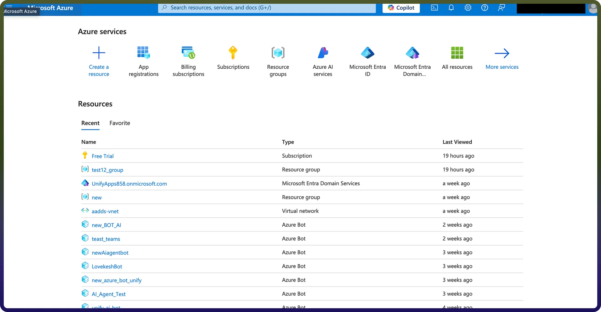
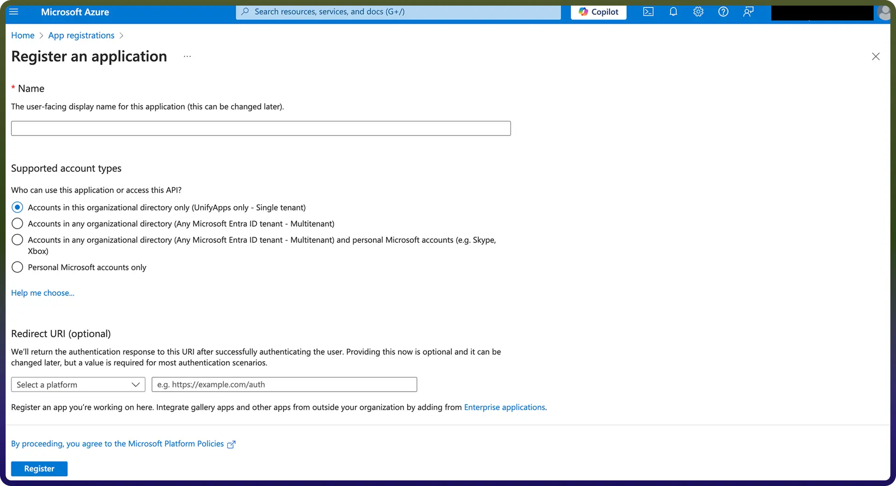
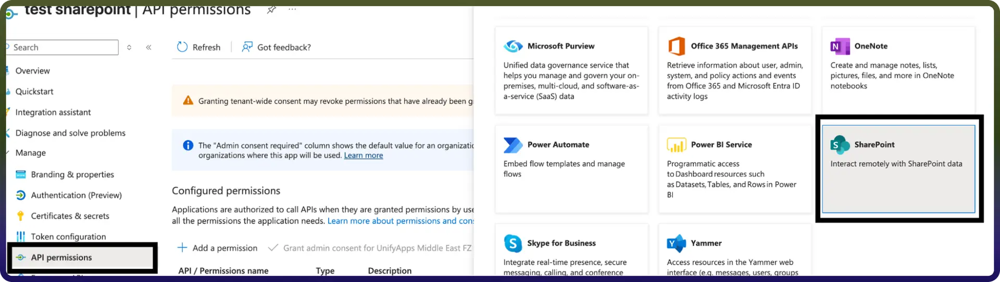
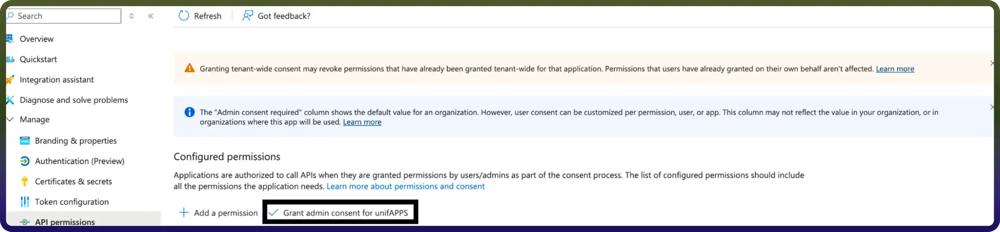
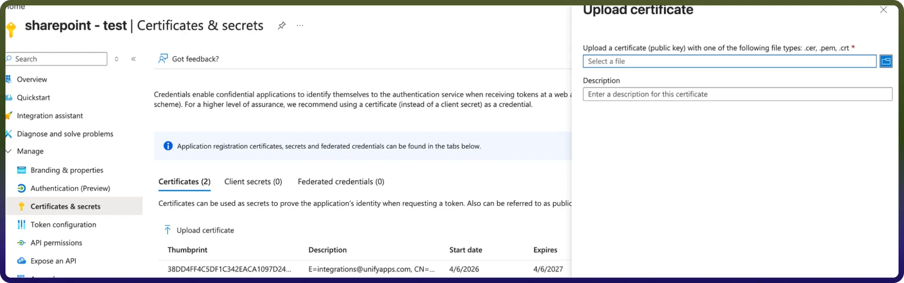

# Microsoft Sharepoint

Source: https://www.unifyapps.com/docs/unify-integrations/microsoft-sharepoint
Section: integrations

---

Microsoft SharePoint is a collaborative platform for managing, sharing, and organizing documents, data, and workflows within organizations. It integrates with Microsoft 365, enabling team collaboration, intranet solutions, and secure content management.

Integrating Microsoft SharePoint streamlines collaboration, enhances document management, and improves organizational productivity with seamless Microsoft 365 integration.

## **Authentication**

Before you begin, make sure you have the following information:

`Connection Name`**:** Select a descriptive name for your connection, like "MyAppSharepointIntegration". This helps easily identify the connection within your application or integration settings.

`Domain` : Enter the domain of your Microsoft Sharepoint account. For example, if your site url is https://unifyapps.sharepoint.com, then the domain is unifyapps

`Authentication Type`**:** Select the type of authentication for connecting to your Sharepoint account:

- **OAuth with Client Credentials Based Authentication**
- **OAuth**
- **Client certificate credentials**

### **OAuth with Client Credentials Based Authentication**

- **Register the App in Azure Portal:**

- Add the name of your application, redirect URI and ‘Accounts in any organizational directory (Any Microsoft Entra ID tenant - Multitenant)’ as the Supported account types. Click Register to register your application.

- **Obtain the Client ID and Tenant ID:**
- **Assign the necessary permissions:**

**AllSites.Manage** - Allows the app to manage items and lists across all SharePoint site collections

- **Now grant that added permissions**

- **Obtain the Client secret:**
- Now enter required details like Domain, Client ID, Client Secret, Tenant ID.
- Click on the Authorise button. You’ll be redirected to a Microsoft sign-in page.
- If you're not already logged into Microsoft Sharepoint, enter your Microsoft Sharepoint account credentials and Sign in.
- Connection will be created successfully.

### **OAuth based**

- Now enter required details like Domain, Tenant ID.
- Click on the Authorise button. You’ll be redirected to a Microsoft sign-in page.
- If you're not already logged into Microsoft Outlook, enter your Microsoft Outlook account credentials and Sign in.
- Microsoft will display a permissions request screen, showing the app name and the specific Microsoft Outlook permissions we are requesting access to.
- Carefully review the permissions being requested. If you’re comfortable with them, click the "Allow" button.
- After granting access, you will be automatically redirected back to our platform, where you should see a confirmation message indicating that your account is now connected.

### **Client certificate credentials**

- This flow we use for making connection without a user login
- Here we will need Domain, Client ID, Tenant ID, publicKeyX5t, Private key.
- To get Domain, Client ID, tenant ID will be same flow as mentioned above
- Public and private key can generated using terminal with the below commands - openssl genrsa -out private.key 2048 - openssl req -new -x509 -key private.key -out certificate.crt -days 365
- Once you have **private.key** and **certificate.crt** now need to upload this **certificate.crt** In **Certificates & Secrets** section in Azure app.

- Now we have publicKeyX5t that is Thumbprint getting after uploading the **certificate.crt** and we have Private Key as well.
- **Assign the necessary permissions:**

**Sites.Manage.All** - Allows the app to manage items and lists across all SharePoint site collections

- Now you can Enter all the required details and Click on the Authorise button.
- Connection will be created successfully.

## **Actions:**

| **Actions** | **Description** |
|---|---|
| `Create folder` | Creates a folder in Microsoft SharePoint |
| `Create list` | Creates a list in Microsoft SharePoint |
| `Delete file or folder` | Deletes a file or folder in Microsoft SharePoint |
| `Download file` | Downloads a file from SharePoint library |
| `Fetch groups for a user` | Fetch groups for a user in Microsoft SharePoint |
| `Get File / Folder details` | Gets file or folder details from Microsoft SharePoint |
| `Get file details` | Gets file details from Microsoft SharePoint |
| `Get folder / file permissions` | Gets file or folder permissions from Microsoft SharePoint |
| `Get folder details` | Gets folder details from Microsoft SharePoint |
| `List files` | Lists files in Microsoft SharePoint |
| `List folders` | Lists folders in Microsoft SharePoint |
| `Rename file / folder` | Renames a file or folder in Microsoft SharePoint |
| `Update file` | Updates a file in Microsoft SharePoint |
| `Upload file` | Uploads a file in Microsoft SharePoint |
| `Create folder` | Creates a folder in Microsoft SharePoint |
| `Create list` | Creates a list in Microsoft SharePoint |
| `Delete file or folder` | Deletes a file or folder in Microsoft SharePoint |
| `Download file` | Downloads a file from SharePoint library |
| `Fetch groups for a user` | Fetch groups for a user in Microsoft SharePoint |
| `Get File / Folder details` | Gets file or folder details from Microsoft SharePoint |
| `Get file details` | Gets file details from Microsoft SharePoint |
| `Get folder / file permissions` | Gets file or folder permissions from Microsoft SharePoint |
| `Get folder details` | Gets folder details from Microsoft SharePoint |

## **Triggers :**

| **Actions** | **Description** |
|---|---|
| `New or Updated file` | Triggers when a file is created or updated in the selected folder in Microsoft Sharepoint |
| `New or updated list items` | Triggers when a new or updated item is added to a SharePoint list |
| `New or Updated file recursive` | Triggers when a file is created or updated in the selected folder/sub-folder in Microsoft Sharepoint |
