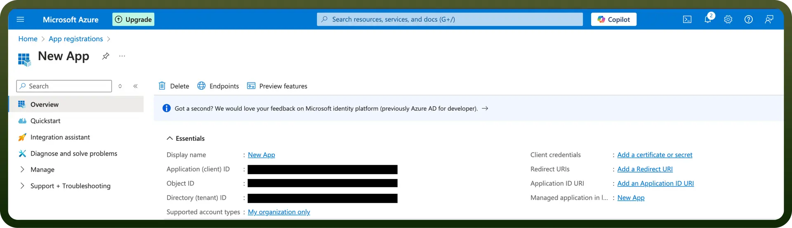
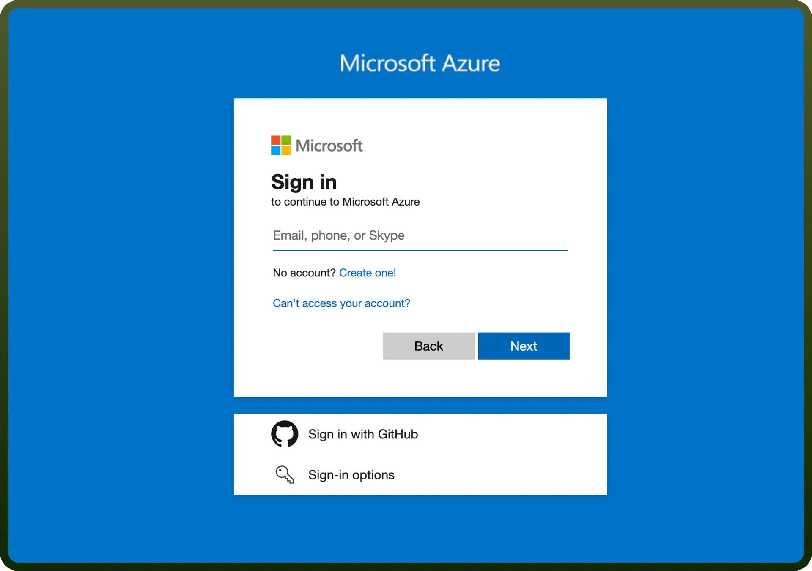

# Microsoft Teams integration | connect with UnifyApps

Source: https://www.unifyapps.com/docs/unify-integrations/microsoft-teams
Section: integrations

---

Microsoft Teams is a collaboration platform that supports communication, file sharing, and workflow management.

Integrating it with your application enhances team connectivity and productivity through real-time communication and streamlined collaboration.

## Authentication

Before you begin, ensure you have the following information:

- `Connection Name`: Select a descriptive name for your connection, like "MyAppTeamsIntegration". This helps easily identify the connection within your application or integration settings.
- `Authentication Type`: Microsoft Teams supports Credentials and OAuth authentication for integrations.

### Credentials

- Log in to the Microsoft Azure Portal by clicking [here](https://portal.azure.com/).
- In the search Bar, search for `App Registration` and then Click on `New Registration`.
- Provide the `Name` and `supported account types` and register your app.
- The `Client ID` refers to the Application(client) ID
- The `Tenant ID` refers to the Directory (Tenant) ID
- Click “`Add a credential or scope`” to generate the **client secret.**

  

**API Permissions**

| **Api permissions** | **Description** |
|---|---|
| `Channel.Create` | To create channels within any team. |
| `Channel.Delete.All` | To delete any channel in any team. |
| `ChannelMember.ReadWrite.All` | To read and manage members in all channels. |
| `ChannelMessage.Read.All` | To read messages in any team channel. |
| `ChannelMessage.Send` | To send messages to any team channel |
| `Chat.Create` | To create new chat threads. |
| `Chat.Read` | To read user-accessible chat threads. |
| `Chat.ReadBasic` | To view basic chat metadata. |
| `Chat.ReadWrite` | To read and send messages in chats. |
| `TeamMember.Read.All` | To view members of any team. |
| `TeamMember.ReadWrite.All` | To add or remove members from any team. |
| `User.Read.All` | To read all user profiles in an organization. |
| `User.ReadWrite.All` | To read, update, and manage user profiles. |
| `Group.Read.All` | To read all groups in the organization. |
| `Group.ReadWrite.All` | To manage all groups, including creating and deleting. |

### OAuth

- Click on the Authorise button to authenticate your connection.
- You’ll be redirected to the Microsoft Azure login page.
- Enter email address and password of your account to which you want to integrate UnifyApps with and click on “`Next`” button to authenticate.
- Microsoft Teams will display a permissions request screen. You'll see the specific permissions we request access to (e.g.,Create channels, Read user chat messages).
- Carefully review the permissions we're asking for. If you're comfortable with the permissions, click the “`Allow`” or “`Grant Access`” button.
- After granting access, you'll be automatically redirected back to our platform. You should see a confirmation message that your Microsoft Teams account is now connected.

  

## Actions

| Action | Description |
|---|---|
| `Create channel` | Creates a new channel in Microsoft Teams |
| `Create private channel` | Creates a new private channel in Microsoft Teams |
| `Reply to channel message` | Creates a reply to a channel message in Microsoft Teams |
| `Send channel message` | Sends a message to a channel in Microsoft Teams |
| `Send chat message` | Sends a message to a chat in Microsoft Teams |

## Triggers

| Action | Description |
|---|---|
| `New Channel` | Triggers when a new channel is created within a team. |
| `New Channel Mention` | Triggers when a member or highlight word is mentioned in a channel. |
| `New Channel Message` | Triggers when a new message is posted in a channel. |
| `New Chat` | Triggers when a new chat is created |
| `New Chat Message` | Triggers when a new message is received in a chat. |
| `New Reply to Message` | Triggers when a new reply is added to a message in a channel. |
| `New Team Member` | Triggers when a new member is added to a team. |
