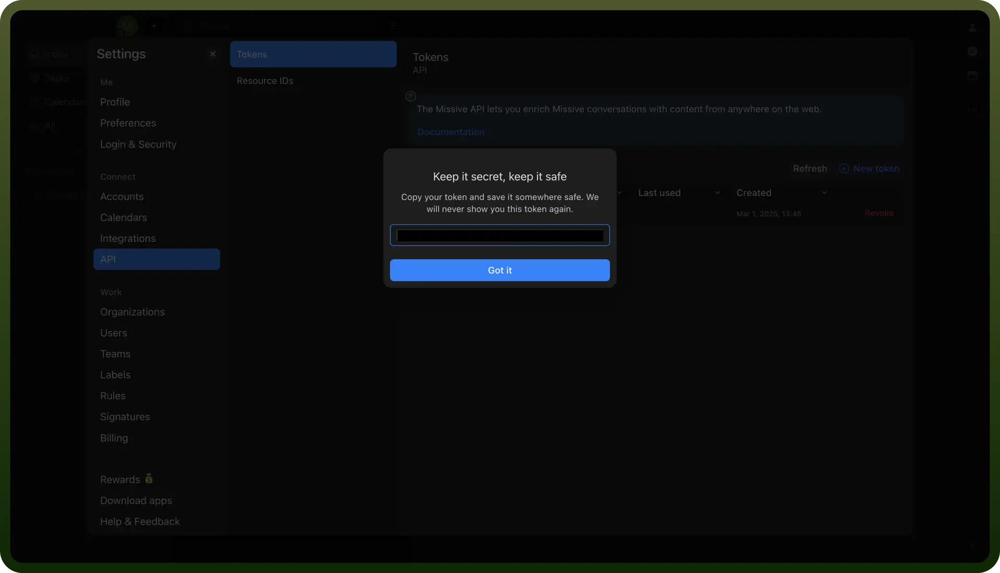

# Missive Integration

Source: https://www.unifyapps.com/docs/unify-integrations/missive
Section: integrations

---

Missive is a team collaboration and shared inbox tool that combines email, chat, and task management in one platform. It helps teams streamline communication and manage workflows efficiently.

Integrating Missive with your application enhances communication, collaboration, and overall productivity.

## Authentication

Before integrating Missive, ensure you have the following information:

- `Connection Name`**:** Choose a descriptive name for your Missive connection to help identify it within your application or integration settings. A meaningful name, like "*MyAppMissiveIntegration*," helps maintain organization, especially when managing multiple integrations.
- `Authentication Type`**:** Missive supports API tokens for authentication.

### API Token Based Authentication

1. Go to mail.missiveapp.com, click your avatar in the bottom left.
2. Click "`Settings`".
3. Click "`API (Connect)`".
4. Click on "`New Token`".
5. Enter description and click "`Create`".
6. Copy the API Token and store it securely as it provides access to your missive account.

  

## Actions

| Actions | Description |
|---|---|
| `Create contacts` | Creates new contacts in Missive. |
| `Create draft` | Creates a new draft message in Missive. |
| `Create post` | Creates a new post in Missive. |
| `Create task` | Creates a new task in Missive. |
| `Find contact` | Retrieves an existing contact in Missive. |
| `Update contact` | Updates existing contacts in Missive. |
