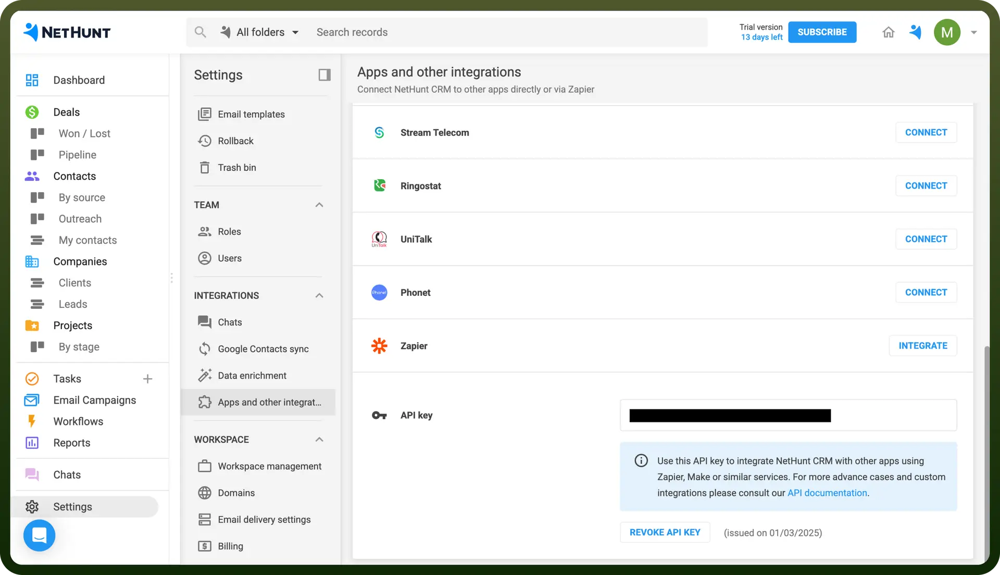

# NetHunt CRM connector

Source: https://www.unifyapps.com/docs/unify-integrations/nethunt-crm
Section: integrations

---

NetHunt CRM is a Gmail-integrated customer relationship management tool that helps businesses track leads, automate workflows, and manage sales directly from their inbox. It streamlines customer interactions by turning emails into actionable CRM data.

Integrating your application with NetHunt CRM enhances customer relationship management, offering seamless automation, email tracking, and workflow optimization.

## Authentication

Ensure you have the following information ready for a smooth integration process:

- `Connection Name`**:** Choose a meaningful name for your connection, such as "MyAppNetHuntIntegration".
- `Authentication Type`**:** NetHunt supports the API Key authentication method.

### API Key Based Authentication

1. Log in to your NetHunt CRM account.
2. Navigate to API settings and then click on “`Apps and Other Integrations`”.
3. Click on “`Generate API key`”.
4. Copy and securely store the API key as it provides access to your NetHunt CRM Account.

  

## Actions Supported

| Actions | Description |
|---|---|
| `Add Gmail thread` | Adds a Gmail thread to a record in Nethunt. |
| `Create record` | Creates a record in Nethunt. |
| `Create record comment` | Creates a new record comment in Nethunt. |
| `Delete record` | Deletes a record in Nethunt. |
| `Find record` | Finds a record in Nethunt. |
