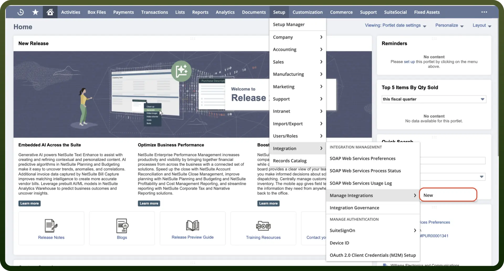
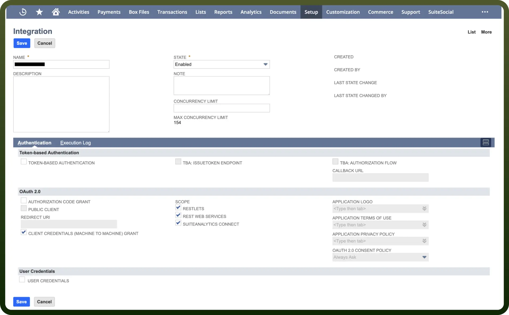

# NetSuite connector

Source: https://www.unifyapps.com/docs/unify-integrations/netsuite
Section: integrations

---

NetSuite is a cloud-based ERP platform that provides businesses with integrated financial, CRM, and e-commerce solutions. It streamlines operations, automates processes, and enhances real-time visibility across departments.

Integrating NetSuite enhances efficiency, automates workflows, and provides real-time business insights.

## Authentication

Before you begin, make sure you have the following information:

- `Connection Name`: Select a descriptive name for your connection, like "MyAppNetSuiteIntegration". This helps in easily identifying the connection within your application or integration settings.
- `Authentication Type`**:** NetSuite supports OAuth 2.0 Authentication for authentication.

### OAuth 2.0 Based Authentication

To set up OAuth 2.0 authentication for NetSuite, follow these steps**:**

1. Obtain your NetSuite account ID from the `Setup` **>** `Company` **>** `Company Information` page.
2. Navigate to `Setup` **>** `Integration` **>** `Manage Integrations` and then `New`.

  

3. Enter a meaningful `Integration Name`, such as 'MyApp NetSuite Integration'.
4. Under `Authentication`, select `OAuth 2.0`.
5. Select the `Client Credentials (Machine to Machine) Grant` checkbox.
6. Check the required scopes: `RESTlets`, `REST Web Services`, and `SuiteAnalytics Connect`.
7. Save the record and copy the generated `Client ID` and `Client Secret`.

  

8. For more details, refer to the [NetSuite REST API documentation](https://www.netsuite.com/portal/developers/resources/apis/rest-api.shtml).

## Actions

| Actions | Description |
|---|---|
| `Create Account` | Creates a new account in NetSuite |
| `Create Contact` | Creates a new contact in NetSuite |
| `Create Job` | Creates a new job in NetSuite |
| `Create Task` | Creates a new task in NetSuite |
| `Create a inventory adjustment` | Creates a inventory adjustment in NetSuite |
| `Create a inventory item` | Creates a inventory item in NetSuite |
| `Create a inventory transfer` | Creates a inventory transfer in NetSuite |
| `Create a item fulfillment` | Creates a item fulfillment in NetSuite |
| `Create a item receipt` | Creates a item receipt in NetSuite |
| `Create opportunity` | Creates a new opportunity in NetSuite |
| `Delete Account` | Delete an account from NetSuite |
| `Delete Contact` | Delete a contact from NetSuite |
| `Delete Job` | Delete a job from NetSuite |
| `Delete Task` | Delete a task from NetSuite |
| `Delete opportunity` | Delete an opportunity in NetSuite |
| `Get Account` | Gets an account from NetSuite |
| `Get Contact` | Gets a contact from NetSuite |
| `Get Job` | Gets a job from NetSuite |
| `Get Task` | Gets a task by ID from NetSuite |
| `Get a inventory adjustment` | Gets the inventory adjustment by its ID in NetSuite |
| `Get a inventory item` | Gets the inventory item by its ID in NetSuite |
| `Get a inventory transfer` | Gets the inventory transfer by its ID in NetSuite |
| `Get a item fulfillment` | Gets the item fulfillment by its ID in NetSuite |
| `Get a item receipt` | Gets the item receipt by its ID in NetSuite |
| `Get a resource details` | Gets the resource details by its reference in NetSuite |
| `Get opportunity` | Gets an opportunity in NetSuite |
| `List inventory transfers` | Lists inventory transfers in NetSuite |
| `List inventory adjustments` | Lists inventory adjustments in NetSuite |
| `List item fulfillment` | Lists item fulfillment in NetSuite |
| `List inventory items` | Lists inventory items in NetSuite |
| `List item receipts` | Lists item receipts in NetSuite |
| `Update Account` | Updates an account in NetSuite |
| `Update Contact` | Updates a contact in NetSuite |
| `Update Job` | Updates a job in NetSuite |
| `Update Task` | Updates a task in NetSuite |
| `Update a inventory adjustment` | Updates the inventory adjustment by its ID in NetSuite |
| `Update a inventory item` | Updates the inventory item by its ID in NetSuite |
| `Update a inventory transfer` | Updates the inventory transfer by its ID in NetSuite |
| `Update a item fulfillment` | Updates the item fulfillment by its ID in NetSuite |
| `Update a item receipt` | Updates the item receipt by its ID in NetSuite |
| `Update opportunity` | Updates an opportunity in NetSuite |
