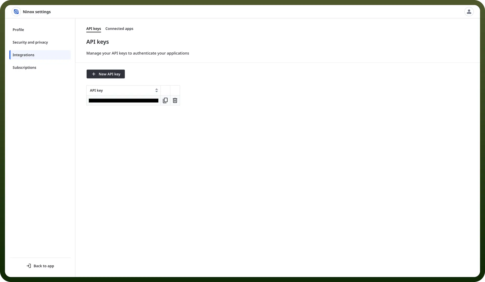

# Ninox

Source: https://www.unifyapps.com/docs/unify-integrations/ninox
Section: integrations

---

Ninox is a customizable database platform that lets users build and manage relational databases, forms, and workflows without writing code. It supports collaboration, automation, and integration across teams and systems.

Integrating Nixon automates data capture and record updates, streamlining database-driven workflows.

## Authentication

Before you begin, make sure you have the following information:

- `Connection Name`: Select a descriptive name for your connection, like "MyAppNinoxIntegration". This helps in easily identifying the connection within your application or integration settings.
- `Authentication Type`**:** Ninox supports API Token authentication for secure access.

### API Token Authentication

- Log in to your Ninox account.
- Click on your profile icon at the top right corner.
- Go to "`Profile`" and then select "`Integrations`".
- Click "`New API Key`" to generate a new token.
- Ensure to keep this API token secure, as it grants access to Ninox's services.

  

## Actions

| Actions | Description |
|---|---|
| `Create record` | Creates a record in Ninox |
| `Download file` | Downloads a file in Ninox |
| `Find record` | Finds a record in Ninox |
| `Update record` | Updates a record in Ninox |
| `Upload file` | Uploads a file in Ninox |

## Triggers

| Triggers | Description |
|---|---|
| `New record` | Triggers when a new record is added to a table in Ninox |
| `Update record` | Triggers when a record is updated in a table in Ninox |
