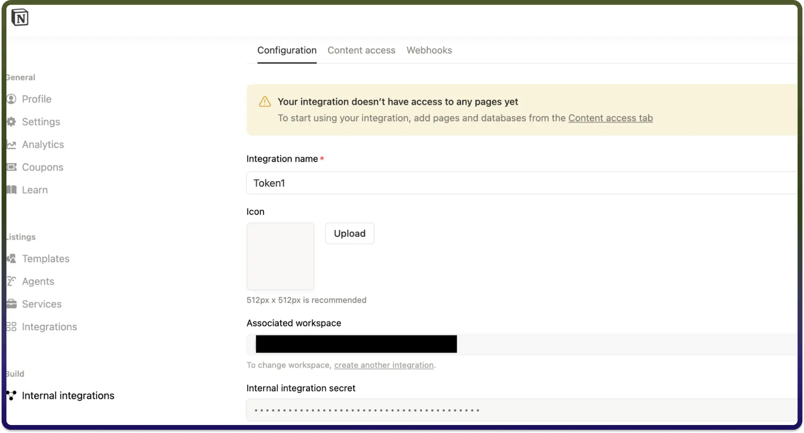

# Notion connector

Source: https://www.unifyapps.com/docs/unify-integrations/notion
Section: integrations

---

Integrating your application with Notion enables seamless collaboration and centralized knowledge management by connecting your workflows, databases, and documentation in one flexible workspace. Notion helps teams organize projects, automate processes, sync structured data, and maintain real-time visibility across tasks and resources, improving productivity and operational alignment.

### **Authentication:**

Integrating your application with Notion allows you to connect structured data, pages, and databases into a unified workspace, enabling dynamic content management, workflow coordination, and efficient information sharing across teams. Before you begin, ensure you have the following information:

`Connection Name` : Choose a meaningful name for your connection. This name helps you identify the connection within your application or integration settings. It could be something descriptive like "MyAppNotionIntegration".

`Token Based:`

1. Log into your Notion account.
2. Navigate to Settings & Members from the sidebar.
3. Click on Connections and then select Develop or Manage Integrations. You will be redirected to the Integrations page.
4. Click on Internal Integrations.
5. Click + New Integration, enter a unique name and click submit.
6. Once created, you will receive an Internal Integration Secret. Click Show, then copy the Auth Token to use it.

## Actions :

| **Action Name** | **Description** |
|---|---|
| `Create database item` | Creates a database item in Notion |
| `Create page` | Creates a page in Notion |
| `Get blocks in a page by ID` | Gets blocks in a page  by ID in Notion |
| `Get database item details` | Gets database items details in Notion |
| `Fetch databases` | Fetches databases in a workspace in Notion |
| `Get page details by ID` | Gets page details by ID in Notion |
| `Fetch pages` | Fetches pages in a workspace in Notion |
| `Get users` | Gets users in a workspace in Notion |
| `Query database` | Queries a database in Notion |
| `Update database item` | Updates a database item in Notion |
| `Update a page` | Updates a new page in Notion |

## Triggers :

| **Trigger Name** | **Description** |
|---|---|
| `New or updated database record` | Triggers when a new or updated database record is created in Notion |
| `New or updated page` | Triggers when a page is created or updated in Notion |
