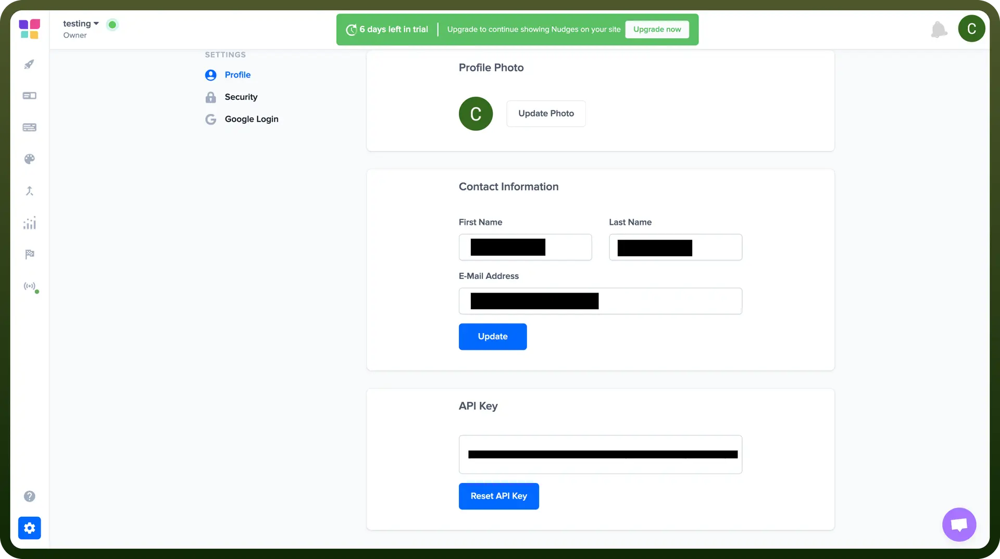

# Nudgify connector

Source: https://www.unifyapps.com/docs/unify-integrations/nudgify
Section: integrations

---

Nudgify is a social proof platform that helps boost conversions by displaying real-time notifications on your website. It nudges visitors to take action using behavioral science-based cues.

Integrating Nudgify increases sign-ups and sales by automatically showing relevant nudges based on user behavior.

## Authentication

Before you begin, make sure you have the following information:

- `Connection Name`: Select a descriptive name for your connection, like "MyAppNudgifyIntegration". This helps in easily identifying the connection within your application or integration settings.
- `Authentication Type`**:** Nudgify supports API keys for authentication.

### API Key Based Authentication

1. Log in to your Nudgify account.
2. Once logged in, navigate to your Account Settings.
3. In the profile section, you will find the API Key.
4. Store the API key securely, treating it like a password.

  

## Actions

| Actions | Description |
|---|---|
| `Create purchase nudge` | Creates purchase nudge in Nudgify |
| `Create sign up nudge` | Creates sign up nudge in Nudgify |
