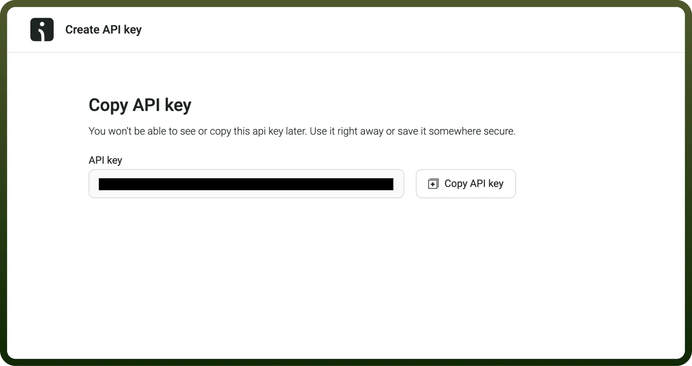

# Omnisend connector

Source: https://www.unifyapps.com/docs/unify-integrations/omnisend
Section: integrations

---

Omnisend is an all-in-one eCommerce marketing platform designed to streamline email, SMS, and automation campaigns, helping businesses drive sales and enhance customer engagement. It offers intuitive tools for segmentation, personalization, and analytics to optimize marketing efforts.

Integrating Omnisend boosts sales and customer engagement through seamless, automated, and personalized marketing across email and SMS.

## Authentication

Before you begin, make sure you have the following information:

- `Connection Name`: Select a descriptive name for your connection, like "MyAppOnmisendIntegration". This helps in easily identifying the connection within your application or integration settings.
- `Authentication Type`**:** Omnisend supports Api key based authentication

### How to get API key?

1. Visit the following link [https://app.omnisend.com/integrations/api-keys](https://app.omnisend.com/integrations/api-keys)
2. Click on Create API key.
3. Define a name for the key, assign the appropriate scopes and permissions, and then proceed to create the key.

  

4. Copy the key and store it securely as its provides access to your omnisend account

## Required Scopes

| **Scope** | **Description** |
|---|---|
| `Campaigns` | Allows to download reports, lists of recipients |
| `Contacts` | Allows to create, edit, download, delete subscribers |
| `Orders` | Allows to create, edit, download, delete orders |
| `Products` | Allows to create, edit, download, delete products |
| `Carts` | Allows to create, edit, download, delete carts |
| `Events` | Allows to get and trigger custom events |
| `Brands` | Allows to get brand information, connect and update store connection |

## Actions

| Actions | Description |
|---|---|
| `List Contacts` | List contacts in Omnisend |
| `List Orders` | List orders in Omnisend |
