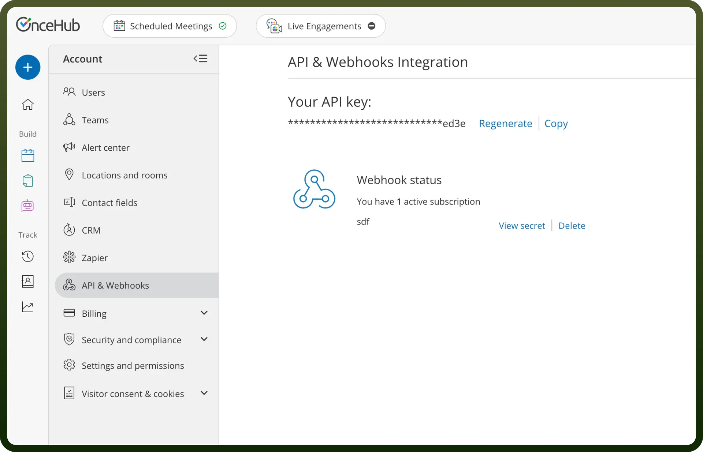

# OnceHub connector

Source: https://www.unifyapps.com/docs/unify-integrations/oncehub
Section: integrations

---

OnceHub is a scheduling and engagement platform that automates meeting bookings, lead qualification, and customer interactions. It helps businesses streamline appointment scheduling and optimize workflow efficiency.

Integrating your application with OnceHub simplifies scheduling and workflow automation, ensuring efficient time management and seamless integration.

## Authentication

Ensure you have the following information ready before proceeding:

- `Connection Name`: Select a descriptive name for your connection, like "MyAppOnceHubIntegration". This helps in easily identifying the connection within your application or integration settings.
- `Authentication Type`**:** OnceHub provides API key based authentication.

### API Key Based Authentication

1. Log in to your OnceHub account.
2. Navigate to ScheduleOnce and then click on "`Setup`".
3. Navigate to Integrations and then click on "`API Integration`".
4. Copy your API key and store it securely as it provides access to your OnceHub account

  

## Actions

| Actions | Description |
|---|---|
| `Book a time slot` | Book a time slot on a calendar on OnceHub |
| `Cancel booking in OnceHub` | Cancels a booking in OnceHub using the booking ID |
| `Create one-time booking link from master page` | Creates a one-time booking link for a specified master page |
| `Create one-time link` | Creates a one-time link for a booking calendar |
| `Create one-time link for a booking calendar` | Creates a one-time link for a booking calendar |
| `Delete contact in OnceHub` | Deletes a contact in OnceHub using the contact ID |
| `Get available time slot for booking calendar` | Retrieves an available time slot for a booking calendar |
| `Get booking by ID` | Fetches details of a specific booking from OnceHub using the booking ID |
| `Get booking calendar` | Fetches details of a booking calendar in OnceHub using the calendar ID |
| `Get booking calendar by ID` | Fetches details of a specific booking calendar from OnceHub using the booking calendar ID |
| `Get booking page` | Retrieves a booking page in OnceHub using the booking page ID |
| `Get contact by ID` | Fetches details of a specific contact from OnceHub using the contact ID |
| `Get event type` | Retrieves an event type in OnceHub using the event type ID |
| `Get master page by ID` | Fetches a single master page from OnceHub by its ID |
| `Get team by ID` | Fetches details of a specific team from OnceHub by its ID |
| `Get user by ID` | Fetches details of a specific user from OnceHub by their ID |
| `List all bookings` | Fetches a list of all bookings from OnceHub |
| `List all contacts` | Fetches a list of all contacts from OnceHub |
| `List all event types` | Fetches a list of all event types from OnceHub |
| `List all teams` | Fetches a list of all teams from OnceHub |
| `List all users` | Fetches a list of users from OnceHub |
| `List booking calendars` | Fetches a list of booking calendars from OnceHub |
| `List booking pages` | Fetches a list of all booking pages from OnceHub |
| `List master pages` | Fetches a list of all master pages from OnceHub |
| `Mark booking as no-show` | Marks a booking as a no-show in OnceHub using the booking ID |
| `Request reschedule booking` | Requests a reschedule for a booking in OnceHub using the booking ID |
| `Schedule booking` | Schedules a booking on OnceHub |

## Triggers

| Triggers | Description |
|---|---|
| `Booking lifecycle events` | Triggers on any booking events |
| `Conversation lifecycle event` | Triggers on conversation events |
| `On booking canceled` | Triggers when a booking is canceled on OnceHub |
| `On booking canceled rescheduled request` | Triggers when a user cancels and sends a request to the customer to reschedule on OnceHub |
| `On booking canceled then rescheduled` | Triggers when a customer cancels a booking and then reschedules on a different booking page on OnceHub |
| `On booking completed` | Triggers when the booking end time has passed on OnceHub |
| `On booking created` | Triggers when a new booking is created on OnceHub |
| `On booking rescheduled` | Triggers when a customer reschedules a booking on the same booking page on OnceHub |
| `On booking scheduled` | Triggers when a new booking is scheduled on OnceHub |
| `On conversation abandoned` | Triggers when a conversation is abandoned on OnceHub |
| `On conversation closed` | Triggers when a conversation is closed on OnceHub |
| `On conversation started` | Triggers when a new conversation is started on OnceHub |
| `On marking booking as no-show` | Triggers when a user sets a completed booking to no-show on OnceHub |
