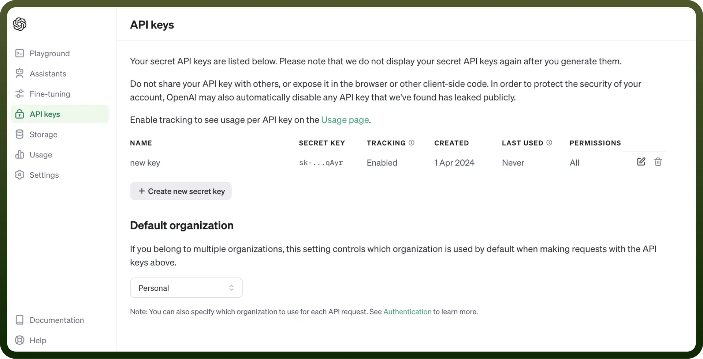

# OpenAI connector

Source: https://www.unifyapps.com/docs/unify-integrations/openai
Section: integrations

---

OpenAI is a leading AI research and deployment company that develops advanced artificial intelligence models, including GPT and DALL·E. It aims to create safe and beneficial AI to solve real-world problems and enhance human productivity.

Connecting your application to OpenAI allows for the integration of advanced AI models like GPT for text generation, DALL·E for image creation, and Codex for coding assistance.

## Authentication

Before you begin, make sure you have the following information:

- `Connection Name`**:** Choose a name that easily identifies the connection within your settings, such as "MyAppOpenAIIntegration". This is crucial for managing multiple connections or integrations.
- `Authentication Type`**:** OpenAI utilizes API keys for authentication, providing a secure method to access its AI models and services.
- `Access Token`**:**
  - Visit the OpenAI platform at [https://platform.openai.com/api-keys](https://platform.openai.com/api-keys).
  - Log in with your OpenAI account details. If you don’t have an account, you will need to create one.
  - Navigate to the API keys section.
  - Generate a new API key or use an existing one if available. Ensure to keep this key secure as it grants access to OpenAI's services and is billed based on usage.

    

## **Actions**

| Actions | Description |
|---|---|
| `Analyze text` | Performs contextual analysis of text to answer user-provided questions with OpenAI |
| `Categorize text` | Categorizes and classifies text using OpenAI |
| `Chat completion` | Creates chat completions with OpenAI |
| `Create image variation` | Creates variations of a given image using OpenAI |
| `Create transcription` | Creates a new transcription using Whisper with OpenAI |
| `Create translation` | Translates an audio file into English using Whisper with OpenAI |
| `Generate draft an email` | Drafts and generates emails using OpenAI |
| `Generate image` | Generates images using prompts with OpenAI |
| `Generate text embedding` | Generates text embeddings with OpenAI |
| `Moderate text` | Moderates text with OpenAI |
| `Modify image` | Modifies a given image using prompts in OpenAI |
| `Parse text` | Extracts structured data from freeform text using OpenAI |
| `Send message to OpenAI models` | Converses with ChatGPT models supported by OpenAI |
| `Summarize text` | Gets a summary of the input text in configurable length with OpenAI |
| `Transcribe recordings` | Transcribes an audio recording into text using OpenAI |
| `Translate text` | Translates text between languages using OpenAI |
