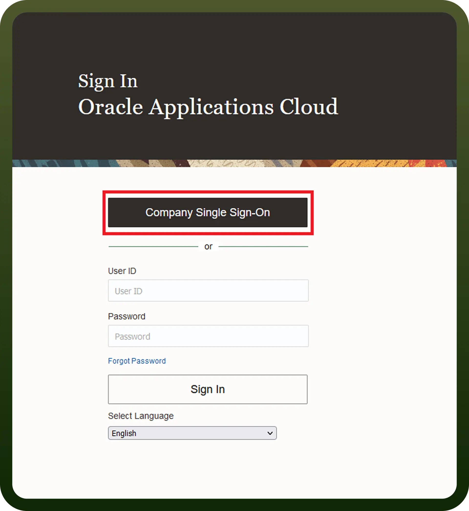
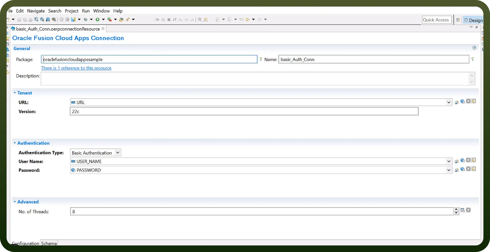

# Oracle Fusion integration | connect with UnifyApps

Source: https://www.unifyapps.com/docs/unify-integrations/oracle-fusion
Section: integrations

---

## Oracle Fusion

Oracle Fusion Cloud is a comprehensive suite of enterprise applications covering Finance, HR, Procurement, and Supply Chain. It enables businesses to streamline operations, automate workflows, and ensure compliance through integrated cloud-based services.

Integrating your application with Oracle Fusion allows you to manage accounts, invoices, expenses, bank records, and jobs directly from your workflows, ensuring seamless financial and operational automation.

## Authentication

Oracle Fusion Cloud supports **Basic Authentication** for integrations.

### Connection Details

You’ll need the following information:

- **Connection Name** A descriptive name for your connection (e.g., `MyAppOracleFusionCloudIntegration`).
- **Authentication Type** Oracle Fusion Cloud uses **Basic Authentication**.

### Domain

Your Oracle Fusion Cloud site domain, for example:

 `https://servername.fa.us2.oraclecloud.com`

- **Username** Your Oracle Fusion Cloud username.
- **Password** Your Oracle Fusion Cloud password.

⚠️ The connector encodes the username and password using **Base64** and sends it as:

Authorization: Basic <`encoded credentials`>

REST-Framework-Version: 9

### Actions

| **Action** | **Description** |
|---|---|
| `Cancel an invoice` | Cancels an existing invoice, marking it void/inactive |
| `Create a debit authorization` | Initiates a debit authorization transaction |
| `Create account` | Adds a new account record |
| `Create action` | Creates a workflow/process action |
| `Create an invoice` | Generates a new invoice |
| `Create bank account` | Adds a new bank account |
| `Create bank account transfer` | Initiates a transfer between bank accounts |
| `Create expense record` | Creates a new expense record |
| `Create inbound or outbound data` | Records imports/exports of data |
| `Create record` | Adds a generic record |
| `Delete account` | Deletes an account record |
| `Delete action` | Deletes a workflow or process action |
| `Delete an invoice` | Deletes an invoice record |
| `Delete record` | Deletes a generic record |
| `Get Expenses by Unique ID` | Retrieves expense details by unique ID |
| `Get a bank account transfer` | Gets details of a bank transfer |
| `Get a debit authorization` | Retrieves debit authorization details |
| `Get a journal batch by ID` | Fetches a batch of journal entries |
| `Get account` | Retrieves full account details |
| `Get action` | Retrieves details of a process action |
| `Get all bank account` | Lists all bank accounts |
| `Get all debit authorization` | Lists all debit authorizations |
| `Get all expense records` | Lists all expense records |
| `Get all invoice` | Lists all invoices |
| `Get all job details` | Retrieves all job details |
| `Get all journal batches` | Lists all journal batch records |
| `Get an invoice by ID` | Retrieves details of a specific invoice |
| `Get bank account` | Gets details of a bank account |
| `Get job details` | Retrieves a specific job’s details |
| `Get job request information` | Retrieves job execution request data |
| `Get record` | Retrieves a generic record |
| `Search records` | Searches for records based on criteria |
| `Submit job request` | Submits a job for execution |
| `Update account` | Updates an account record |
| `Update action` | Updates a workflow/process action |
| `Update an invoice` | Updates invoice details |
| `Update bank account` | Updates a bank account record |
| `Update bank account transfer` | Updates a bank transfer record |
| `Update debit authorization` | Updates debit authorization |
| `Update expense record` | Updates an expense record |
| `Update record` | Updates a generic record |
| `Upsert record` | U pdates or inserts a record if missing |
| `Validate an invoice` | Runs validation checks on an invoice |

### Triggers

| **Trigger** | **Description** |
|---|---|
| `New Invoice Created` | Fires when a new invoice is created |
| `Invoice Updated` | Fires when an invoice is updated |
| `New Expense Record` | Fires when a new expense record is created |
| `Bank Transfer Completed` | Fires when a bank transfer is completed |
| `Job Completed` | Fires when a scheduled job execution finishes |
