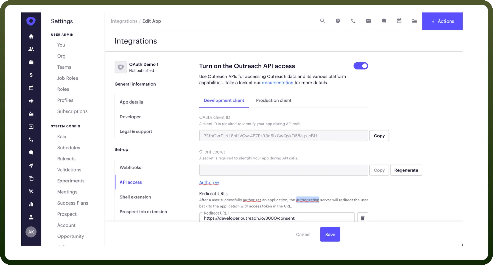

# Outreach.io connector

Source: https://www.unifyapps.com/docs/unify-integrations/outreach-io
Section: integrations

---

Outreach.io is a sales engagement platform that helps teams streamline communication, automate workflows, and manage customer interactions more effectively.

Connecting your application to the Outreach platform allows you to leverage Outreach's powerful sales engagement tools directly within your application.

## Authentication

Before you begin, make sure you have the following information:

- `Connection Name`**:** Choose a clear and descriptive name for your connection, such as "MyAppOutreachIntegration," to easily identify it within your application or integration settings.
- `Authentication Type`**:** Outreach supports OAuth 2.0 authentication for secure and user-friendly API access. This allows you to authorize your application to interact with Outreach on behalf of users.

### OAuth 2.0 Client Credentials

1. Create an app in Outreach.
2. Gather the `Client ID` and `Client Secret` provided during app setup. These credentials will be used to authenticate API requests.
3. Ensure that the required scopes for your application are selected during app creation. You may refer to the [Outreach API documentation](https://api.outreach.io/api/v2/docs) for scope details.

  

## Actions

| Action | Description |
|---|---|
| `Create new mailing` | Creates new mailing in Outreach |
| `Get a collection of prospects` | Gets a collection of prospects in Outreach |
| `Get a sequence` | Get a sequence by ID in Outreach |
| `Get a sequence template` | Get a sequence template by ID in Outreach |
| `Get collection of mailings` | Gets a collection of mailings in Outreach |
| `Get collection of sequence steps` | Get a collection of sequence steps in Outreach |
| `Get collection of sequence templates` | Get a collection of sequence templates in Outreach |
| `Get mailing` | Gets a mailing by ID in Outreach |
| `Get prospect` | Gets a prospect by ID in Outreach |
