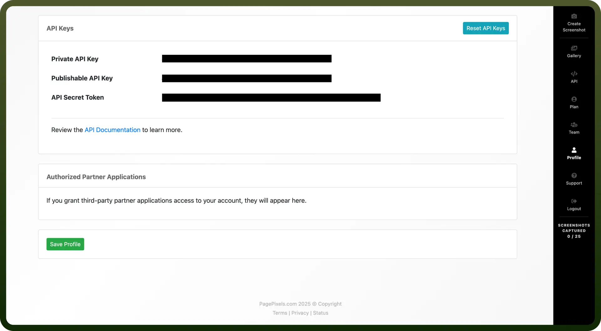

# PagePixels

Source: https://www.unifyapps.com/docs/unify-integrations/pagepixels
Section: integrations

---

PagePixels Screenshot is a versatile API that captures webpage snapshots—on demand, on a schedule or from global locations—and tracks content changes since the last shot. It also lets you fetch raw HTML, render custom HTML, and run AI-driven visual analyses on any captured image.

Integrating PagePixels Screenshot automates your monitoring and alert workflows, offloads rendering infrastructure, and delivers real-time visual insights directly into your apps.

## Authentication

Before you begin, make sure you have the following information:

- `Connection Name`: Select a descriptive name for your connection, like "MyAppPagePixelsScreenshotIntegration". This helps in easily identifying the connection within your application or integration settings.
- `Authentication Type`**:** PagePixels Screenshot supports API keys for authentication.

### API Key Based Authentication

- Navigate to the PagePixels Screenshot platform and log in to your account.
- Once logged in, go to your profile settings.
- In the profile settings, find the section labeled API Key.
- Copy the keys provided in this section and store them securely to prevent unauthorized access.

  

## Actions

| Actions | Description |
|---|---|
| `Analyze any image with AI` | Generates AI visual analysis from text prompt in PagePixels Screenshot |
| `Create recurring screenshot` | Creates a screenshot config with scheduling and change alerts |
| `Get HTML code of a website` | Downloads raw HTML of a website |
| `List all the screenshots` | Lists all captured screenshots for the account |
| `Take real geolocation screenshot of a webpage` | Captures webpage screenshot from global geolocations |
| `Take screenshot of a webpage` | Captures an instant webpage screenshot from a URL |
| `Take screenshot of a webpage and analyze the image with AI` | Captures webpage screenshot and runs AI analysis from prompt |
| `Take screenshot of custom HTML` | Creates a screenshot of custom HTML |

## Triggers

| Triggers | Description |
|---|---|
| `On new change notification` | Triggers on page content change since last screenshot |
| `On new screenshot captured` | Triggers on new screenshot capture |
| `On new screenshot configuration` | Triggers on new screenshot configuration creation |
