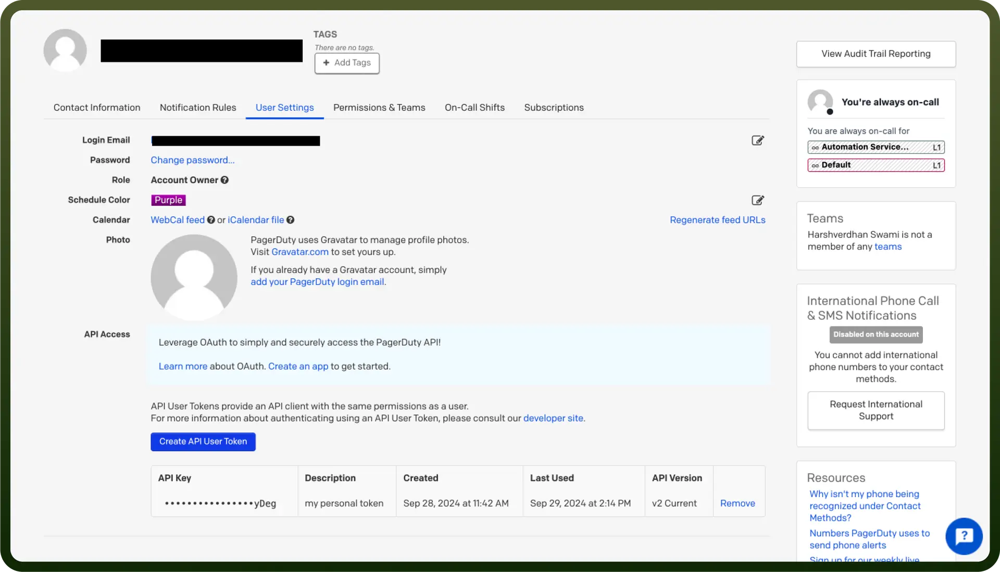

# PagerDuty connector

Source: https://www.unifyapps.com/docs/unify-integrations/pagerduty
Section: integrations

---

PagerDuty is an incident management platform that helps organizations monitor, respond to, and resolve incidents quickly to ensure service reliability and minimize downtime.

Integrating your application with PagerDuty allows you to automate workflows, manage incidents efficiently, and gain real-time visibility into your system.

## Authentication

Ensure you have the following information ready for a seamless integration process:

- `Connection Name`**:** Choose a meaningful name for your integration, such as "MyAppPagerDutyIntegration" for easy identification in your settings.
- `Authentication Type`**:** PagerDuty uses API User Tokens for secure authentication and access to its services.

### API Token Based Authentication

- **How to fetch API token:**
  - Log in to your PagerDuty account.
  - Click on your profile icon in the top-right corner and select '`My Profile`'.
  - In the my profile, navigate to the '`user settings`' section.
  - Under API access section, click on the “`Create API User Token`” button.
  - Provide a description for your token and click on '`create token button`'.
  - Copy the API user token and treat the token with high confidentiality, as it allows access to your PagerDuty account.

    

## Actions

| **Action** | **Description** |
|---|---|
| `Create an incident` | Creates an incident in PagerDuty |
| `Update an incident` | Updates an incident by ID in PagerDuty |
| `Get an incident` | Gets an incident by its ID in PagerDuty |
| `List incidents` | Lists existing incidents in PagerDuty |
| `Get an alert` | Gets an alert by its ID in PagerDuty |
| `Update an alert` | Updates an alert by its ID in PagerDuty |
| `List alerts` | Lists alerts for the specified incident in PagerDuty |
| `Create responder request` | Creates a responder request for an incident by incident ID in PagerDuty |
| `Merge incident` | Merge a list of source incidents into a specific incident in PagerDuty. |
| `Create a user` | Create a new user in PagerDuty |
| `Create note on incident` | Create a new note for the specified incident |
| `Get a user` | Get a particular user in PagerDuty |
| `List users` | List all users in PagerDuty |
| `Update user` | Update a user in PagerDuty |
| `Delete user` | Delete a user in PagerDuty |
| `Create a team` | Create a new team in PagerDuty |
| `Get a team` | Get a particular team in PagerDuty |
| `List teams` | List all teams |
| `Delete a team` | Deletes a team in PagerDuty |
| `Update a team` | Updates a team in PagerDuty |

## Triggers

| **Trigger Name** | **Description** |
|---|---|
| `Acknowledge incident` | This trigger will be invoked when an incident is acknowledged in PagerDuty |
| `Create incident` | This trigger will be invoked when a new incident is created in PagerDuty |
| `Escalate incident` | This trigger will be invoked when an high priority incident is escalated in PagerDuty |
| `Delegate incident` | This trigger will be invoked when an incident is delegated in PagerDuty |
| `Priority of incident updated` | This trigger will be invoked when the incident priority is updated in PagerDuty |
| `Reassign incident` | This trigger will be invoked when an incident is reassigned in PagerDuty |
| `Resolve incident` | This trigger will be invoked when an incident is resolved in PagerDuty |
| `Responder added to an incident` | This trigger will be invoked when a responder is added to an incident in PagerDuty |
| `Responder replied to an incident` | This trigger will be invoked when a responder replied to an incident in PagerDuty |
