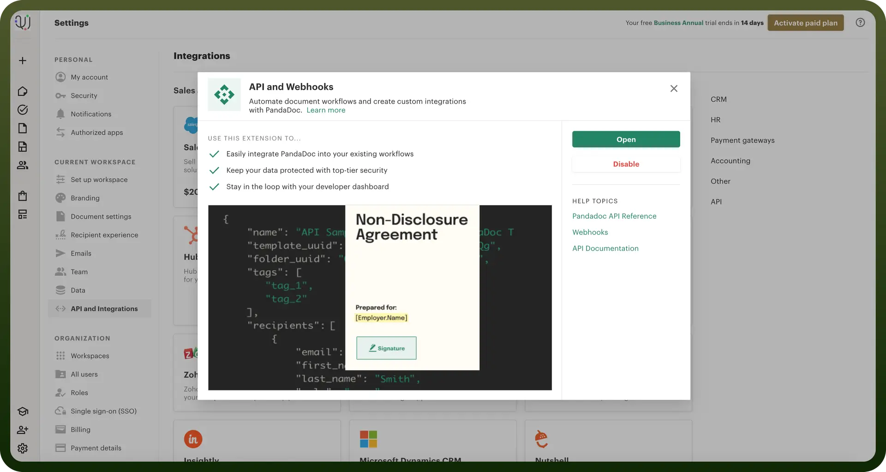
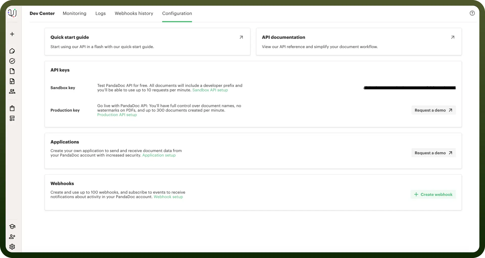

# PandaDoc connector

Source: https://www.unifyapps.com/docs/unify-integrations/pandadoc
Section: integrations

---

PandaDoc is a document automation platform that helps businesses create, send, track, and eSign proposals, quotes, contracts, and other documents. It offers customizable templates, real-time collaboration, and workflow automation to streamline document processes.

PandaDoc stands out with its all-in-one document automation, eSignature, and CRM integration capabilities, streamlining the entire sales document workflow in a single platform.

## Authentication

Before you begin, make sure you have the following information:

- `Connection Name`: Choose a meaningful name for your connection. This name helps you identify the connection within your application or integration settings. It could be something descriptive like 'MyPandaDoc'.
- `Authentication Type`: PandaDoc uses API Token for authentication.

### API Token

- Log in to your PandaDoc platform as an admin.
- Go to the `Settings and navigate to API Integrations`
- Navigate to `API and Webhooks` and Enable it.
- Open `Dev Center` and navigate to `Configuration`
- Retrieve API key from sandbox and save it securely for further use

  

  

## Actions Supported

| **Actions** | **Description** |
|---|---|
| `Create linked object` | Use the POST method to create a linked object in the document in Pandadoc |
| `Delete document` | Delete a document by ID in Pandadoc |
| `Delete linked object` | Use the DELETE method to remove a linked object for the document in Pandadoc |
| `Document details` | Return detailed data about a document in Pandadoc |
| `Document status` | Check document status to confirm it's ready before using other API methods in Pandadoc |
| `List documents` | Retrieve documents by their linked objects from external systems in Pandadoc |
| `List linked objects` | Use GET to retrieve all linked objects for the document in Pandadoc |
| `Move document to draft` | Revert the document to draft to continue editing in Pandadoc |
| `Send document` | Move the document to sent and optionally send an email in Pandadoc |
| `Update document` | Use the PATCH method to update a document in Pandadoc |
