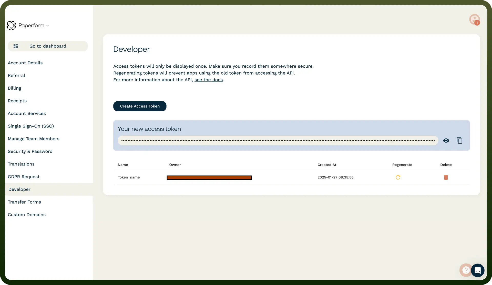

# Paperform connector

Source: https://www.unifyapps.com/docs/unify-integrations/paperform
Section: integrations

---

Paperform is a versatile online form builder that lets users create interactive forms, surveys, and landing pages with ease. It offers automation, payment integration, and customization to streamline data collection and workflows.

Integrating your application with Paperform streamlines form creation, data collection, and automation workflows.

## Authentication

Before you begin, make sure you have the following information:

- `Connection Name`**:** Choose a descriptive name for your integration, such as "MyAppPaperformIntegration".
- `Authentication Type`**:** Paperform supports the API Key authentication method.

### API Key Based

1. Log in to your Paperform account by visiting the Paperform dashboard ([https://paperform.co](https://paperform.co/)).
2. Navigate to the "`Account Settings`" by clicking on your profile icon in the top-right corner.
3. Under the "`Integrations & API`" tab, locate the "API Keys" section.
4. Click "`Generate New API Key`" and provide a meaningful label for your key (e.g., "MyApp Integration").
5. Copy the generated API key. Ensure you store this key securely, as it will grant access to your Paperform account.

  

## Actions

| Actions | Description |
|---|---|
| `Create Form Coupon` | Creates a form coupon in Paperform |
| `Delete form coupon` | Deletes a form coupon in Paperform |
| `Delete form partial submission` | Deletes a form partial submission in Paperform |
| `Delete form submission` | Deletes a form submission in Paperform |
| `Get form` | Gets a form in Paperform |
| `Get form field` | Gets a form field in Paperform |
| `Get product` | Gets a product in Paperform |
| `Update form coupon` | Updates a form coupon in Paperform |
| `Update form field` | Updates a form field in Paperform |
| `Update form product available quantity` | Updates a form product available quantity in Paperform |
| `Update form product sold` | Updates a form product sold in Paperform |

## Triggers

| Triggers | Description |
|---|---|
| `New form submission` | Triggers on new submission received in Paperform |
| `New partial form submission` | Triggers on partial submission of a form in Paperform |
