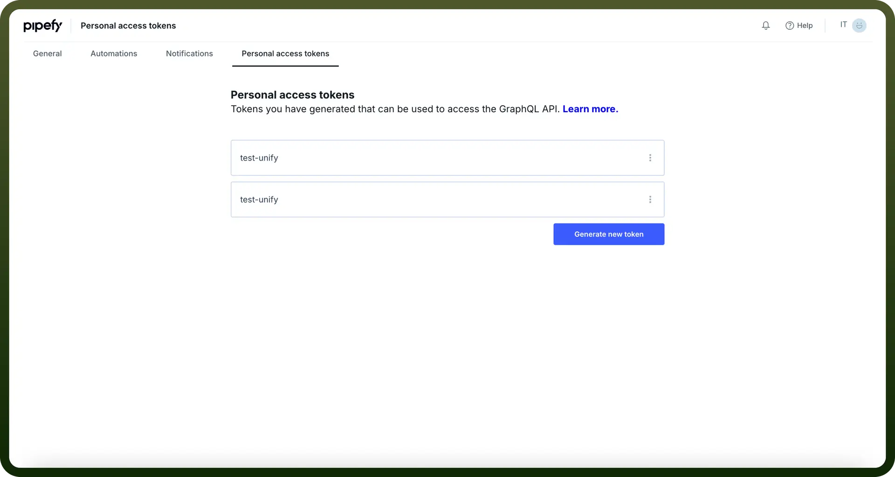

# Pipefy connector

Source: https://www.unifyapps.com/docs/unify-integrations/pipefy
Section: integrations

---

Pipefy is a no-code workflow automation platform that helps teams streamline processes and manage tasks efficiently. It offers customizable workflows, automation, and integrations for improved productivity.

Integrating your application with Pipefy empowers you to automate workflows, manage tasks efficiently, and collaborate seamlessly with your team.

## Authentication

Before you begin, make sure you have the following information:

- `Connection Name`**:** Select a descriptive name for your connection, like "MyAppPipefyIntegration". This helps in easily identifying the connection within your application or integration settings.
- `Authentication Type`**:** Pipefy supports Personal Access Token for authentication. This method ensures secure access to Pipefy’s functionalities and data.

### Personal Access Token Based Authentication

- Login to your Pipefy account.
- Navigate to Account Preferences.
- Go to the Personal Access Token window.
- Click on Generate new token and give a name to the token.
- Treat this token with high confidentiality, as it allows access to your Pipefy account.

  

## Actions

| Actions | Description |
|---|---|
| `Create database` | Create database table |
| `Delete card` | Delete card from the pipe |
| `Find card` | Find card in the pipe |
| `Get all cards` | Get all card in the pipe |
| `Get all database` | Get all database table of particular organisation |
| `Update phase` | Update phase of the card in the pipe |

## Triggers

| Triggers | Description |
|---|---|
| `Card moved` | Triggers when a card is moved |
| `Delete card` | Triggers when a card is deleted in the pipe |
| `Done card` | Triggers when a card is done |
| `Expired card` | Triggers when a card is expired |
| `Late card` | Triggers when a card is late |
| `New card` | Triggers when a new card is created |
| `New database record` | Triggers when a new record is created in a database table |
| `Overdue card` | Triggers when a card is overdue |
| `Updated card field` | Triggers when a card field is updated |
| `Updated record field` | Triggers when a record field is updated |
