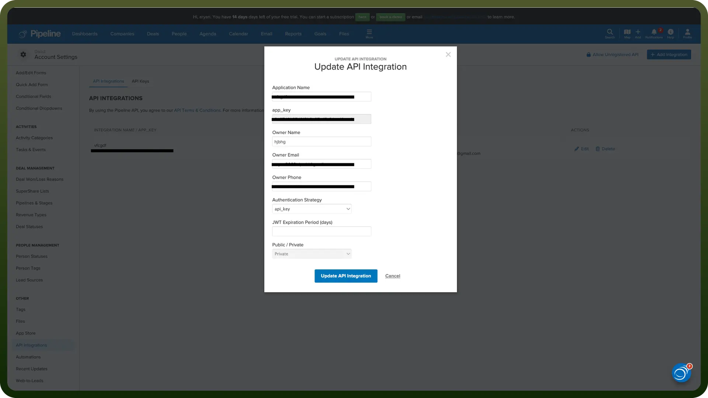
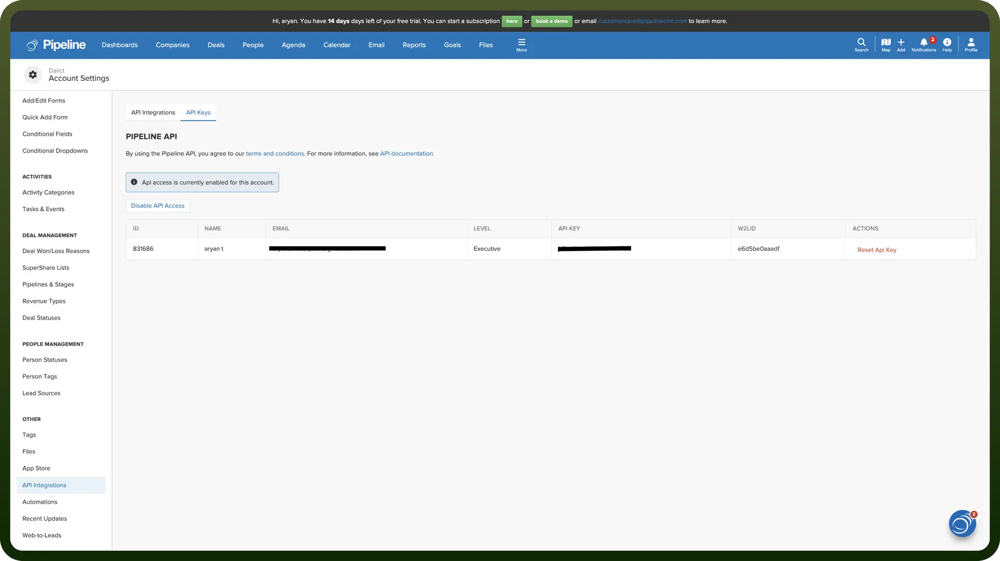

# Pipeline CRM integration

Source: https://www.unifyapps.com/docs/unify-integrations/pipeline-crm
Section: integrations

---

Pipeline CRM is a sales-focused customer relationship management (CRM) tool designed to help teams track leads, manage deals, and streamline workflows. It offers automation, reporting, and integrations to improve sales efficiency.

Connecting your application to a Pipeline CRM account allows you to interact with Pipeline CRM's contact management, deal tracking, and reporting features directly from your application.

## Authentication

Before you begin, make sure you have the following information:

- `Connection Name`**:** Choose a descriptive name for your Pipeline CRM connection to help identify it within your application or integration settings. A meaningful name, like "MyAppPipelineCRMIntegration," helps maintain organization, especially when managing multiple integrations.
- `App Key`**:** The API key is required for both JWT and API based authentication.
- `Authentication Type`**:** Select the type of authentication for connecting to your Pipeline CRM account:
  - JWT based Authentication
  - API Token based Authentication

### App key

- Log into your Pipeline account and go to settings.
- Go to API Integrations and click on Add Integration
- Enter the required details and select the required authentication type and the expiry time of JWT to create the api integration and get the app key.
- Store this key securely to prevent unauthorised access.

  

### JWT Based Authentication

- Enter your username or email that you use to login into your Pipeline CRM account.
- Enter the password that you use to login into your Pipeline CRM account.
- Enter the MFA code if your Pipeline CRM account is MFA protected.

### API Token Based Authentication

- Go to the API integrations page as before and now go to the API keys tab.
- Now enable the API access and copy the API token and store it securely, as it allows access to your Pipeline CRM account.

  

## Actions

| Actions | Description |
|---|---|
| `Create activity` | Creates a new activity associated with an existing person, company, or deal in Pipeline CRM. |
| `Create company` | Creates a new company in Pipeline CRM. |
| `Create deal` | Creates a new deal in Pipeline CRM. |
| `Create person` | Creates a new person in Pipeline CRM. |
| `Create task` | Creates a new calendar task in Pipeline CRM. |
| `Find company` | Finds an existing company in Pipeline CRM. |
| `Find deal` | Finds an existing deal in Pipeline CRM. |
| `Find person` | Finds an existing person in Pipeline CRM. |
| `Find user` | Finds an existing user in Pipeline CRM. |
| `Update company` | Updates an existing company in Pipeline CRM. |
| `Update deal` | Updates an existing deal in Pipeline CRM. |
| `Update person` | Updates an existing person in Pipeline CRM. |

## Triggers

| Triggers | Description |
|---|---|
| `Deal created` | Triggers when a deal is created on Pipeline CRM. |
| `Deal updated` | Triggers when a deal is updated on Pipeline CRM. |
| `Person created` | Triggers when a person is created on Pipeline CRM. |
