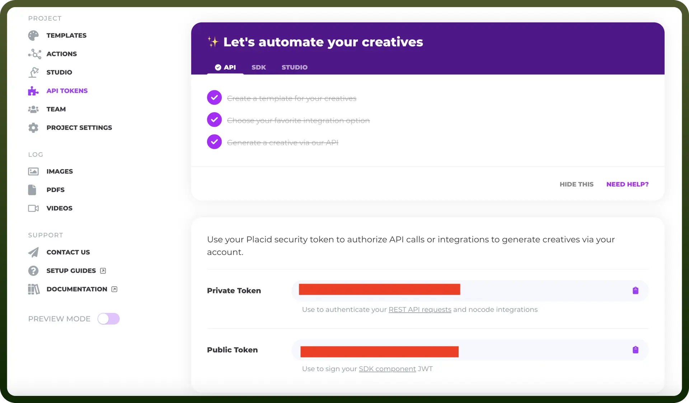

# Placid connector

Source: https://www.unifyapps.com/docs/unify-integrations/placid
Section: integrations

---

Placid is a tool that automates the creation of branded images, videos, and PDFs from templates. It helps streamline content production for marketing, social media, and e-commerce.

Integrating Placid streamlines content creation, saving time while ensuring consistent, on-brand visuals across platforms.

## Authentication

Before you begin, make sure you have the following information:

- `Connection Name`: Select a descriptive name for your connection, like "MyAppPlacidIntegration". This helps in easily identifying the connection within your application or integration settings.
- `Authentication Type`**:** Placid supports API tokens for authentication.

### API Key Based Authentication

- Log in to your Placid account.
- Navigate to the Settings page.
- Open the API Tokens section.
- The API token is sensitive information, so keep it confidential as it grants access to your Placid account.

## Actions

| Actions | Description |
|---|---|
| `Convert file into URL` | Converts file into URL and stores in Placid |
| `Create image` | Creates image in Placid |
| `Create pdf` | Creates PDF in Placid |
| `Create video` | Creates video in Placid |
| `Delete image` | Deletes image from Placid |
| `Delete pdf` | Deletes PDF from Placid |
| `Delete video` | Deletes video from Placid |
| `Get image` | Gets image from Placid |
| `Get pdf` | Gets PDF from Placid |
| `Get video` | Gets video from Placid |
