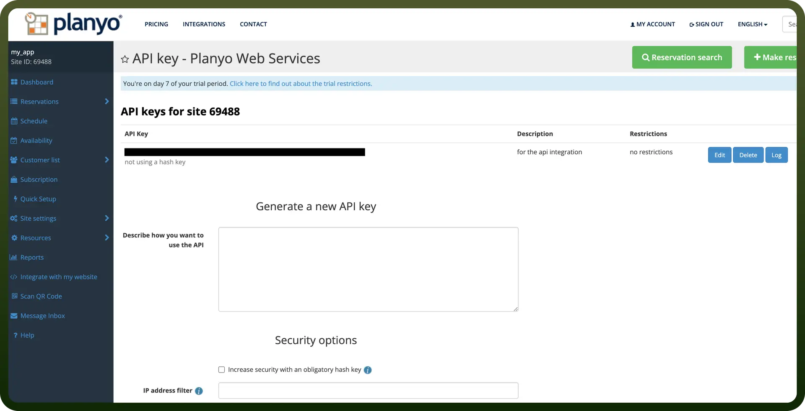

# Planyo connector

Source: https://www.unifyapps.com/docs/unify-integrations/planyo
Section: integrations

---

**Planyo** is an online reservation and scheduling system designed for businesses that manage bookings, such as rentals, tours, or appointments. It supports flexible configurations, resource availability, and multi-user access.

Integrating Planyo automates and centralizes reservation management, improving efficiency, reducing no-shows, and enhancing customer experience.

## Authentication

Before you begin, make sure you have the following information:

- `Connection Name`: Select a descriptive name for your connection, like "`MyAppPlanyoIntegration`". This helps in easily identifying the connection within your application or integration settings.
- `Authentication Type`**:** Planyo uses API Key-based authentication.

### API Key Based Authentication

1. Log in to your Planyo account.
2. Navigate to Site settings from the left sidebar. Search for "`api web service`" and go to that page. Click on the "`API Key`" button to proceed.
3. To generate an API key fill in the necessary details and click the "`Generate now`" button.
4. Copy and store it securely to prevent unauthorized access.

## **Actions Supported**

| Actions | Description |
|---|---|
| `Add user` | Adds a new user in Planyo |
| `Add vacation` | Adds a new one-time vacation for a given resource or the entire site in Planyo |
| `Create reservation` | Creates a new reservation in Planyo |
| `Delete reservation` | Deletes a reservation in Planyo |
| `Delete user` | Deletes an existing user in Planyo |
| `Get user` | Returns details of a user in Planyo |
| `List reservations` | Returns a list of reservations within a given time period in Planyo |
| `List users` | Returns a list of users with at least one reservation in Planyo |
| `List vacations` | Returns a list of vacations within a given time period in Planyo |
| `Modify reservation` | Modifies an existing reservation in Planyo |
| `Modify user` | Modifies an existing user's data in Planyo |
