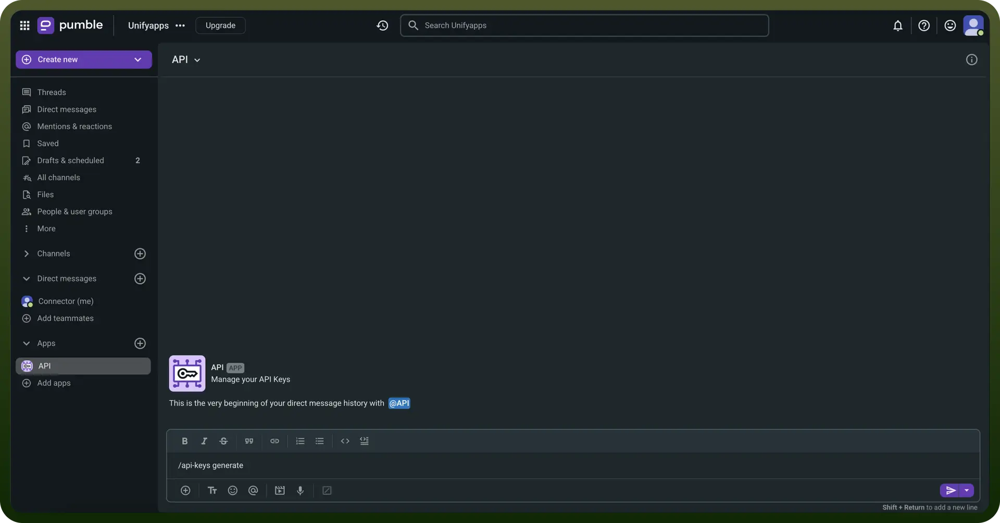

# Pumble connector

Source: https://www.unifyapps.com/docs/unify-integrations/pumble
Section: integrations

---

​Pumble is a free team communication app that offers unlimited users and message history, enabling seamless collaboration through channels, threads, direct messaging, and file sharing.

Integrating your application with Pumble enables seamless team communication, real-time messaging, file sharing, and efficient collaboration to enhance productivity.

## Authentication

Ensure you have the following information ready for a smooth integration process:

- `Connection Name`**:** Select a descriptive name for your connection, like "MyAppPumbleIntegration". This helps in easily identifying the connection within your application or integration settings.
- `Authentication Type`**:** Pumble supports API Key authentication.

### API Key Based Authentication

- Login to your Pumble account.
- Click on the "`+Add apps`" button in the left sidebar.
- Find the API app and click on the "`Install`" button.
- Select your workspace and click "`Allow`" to complete the installation.
- In any channel's message editor, type /api-keys generate and press Enter.
- You will receive a private message with your generated API key.
- Treat this key with high confidentiality, as it allows access to your Pumble workspace.

  

## Actions

| Actions | Description |
|---|---|
| `Create a channel` | Create a channel in the workspace |
| `Find channel by ID` | Finds a channel by ID in the workspace |
| `Find channel by name` | Finds a channel by name in the workspace |
| `Find user by ID` | Finds a user by ID in the workspace |
| `Find user by email ID` | Finds a user by email ID in the workspace |
| `Find user by name` | Finds a user by name in the workspace |
| `List all channels` | Lists all channels in the workspace |
| `List all users` | Lists all users in the workspace |
| `Send channel message` | Sends a message to a channel |
| `Send private channel message` | Sends message to a private channel |
