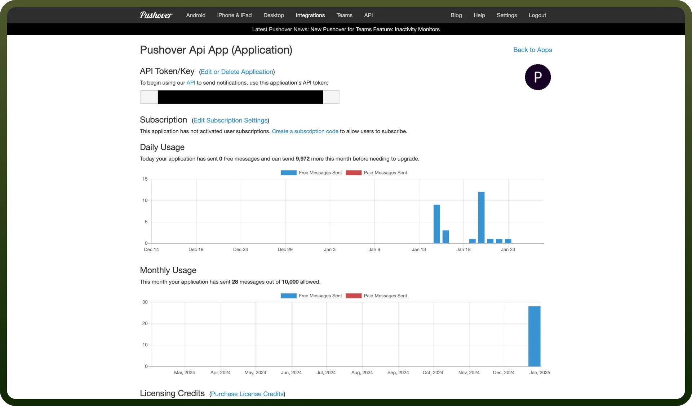

# Pushover connector

Source: https://www.unifyapps.com/docs/unify-integrations/pushover
Section: integrations

---

Pushover is a simple push notification service for sending real-time alerts to mobile and desktop devices. It integrates with various apps and scripts via an API for instant notifications.

Integrating your application with Pushover enables you to send messages and notifications directly to users' devices. Pushover provides a simple token-based authentication method, making it easy to integrate with any platform or application.

## Authentication

Before you begin, make sure you have the following information:

- `Connection Name`: Select a descriptive name for your connection, like "MyAppPushoverIntegration". This helps in easily identifying the connection within your application or integration settings.
- `Authentication Type`**:** Pushover supports API tokens for authentication.

### API Token Based Authentication

1. Sign Up on Pushover.
2. Log in to your Pushover account and navigate to the [Application Registration page](https://pushover.net/apps/build).
3. Submit the form to register the application.
4. After registering your application, Pushover will generate a unique API Key.
5. This key acts as a token for authenticating your application.

  

## **Actions**

| Actions | Description |
|---|---|
| `Add user to group` | Adds a user to a specified group in the Pushover |
| `Create group` | Creates a new group in the Pushover |
| `Push messages` | Sends notifications to users through Pushover |
| `Reenable user` | Reenables a previously disabled user from a specified group in the Pushover |
| `Remove user from group` | Removes a user from a specified group in the Pushover |
| `Rename group` | Renames an existing group within the Pushover |
| `Retrieve group information` | Retrieves information about a specified group within the Pushover |
| `Retrieve groups` | Retrieves a list of all groups in the Pushover |
| `Temporary disable user` | Temporarily disables a user within the Pushover |
