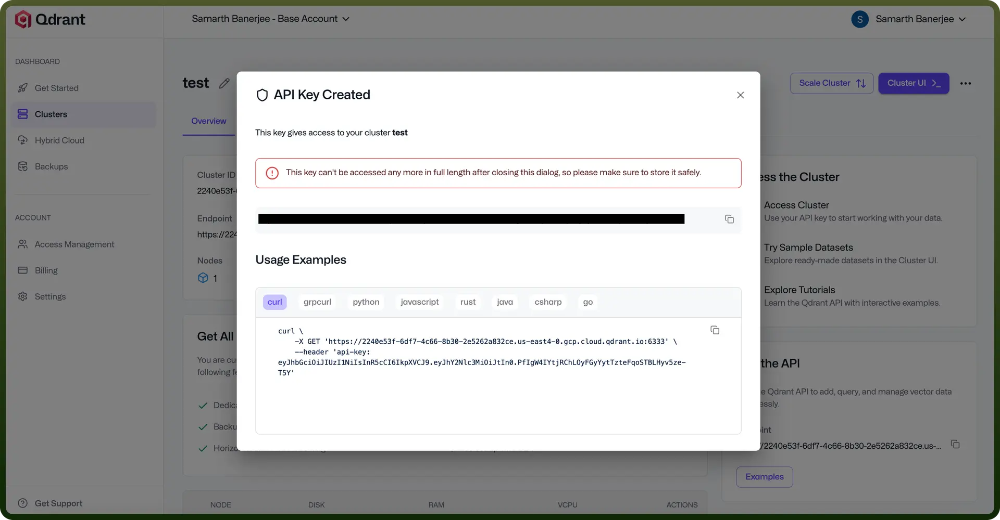
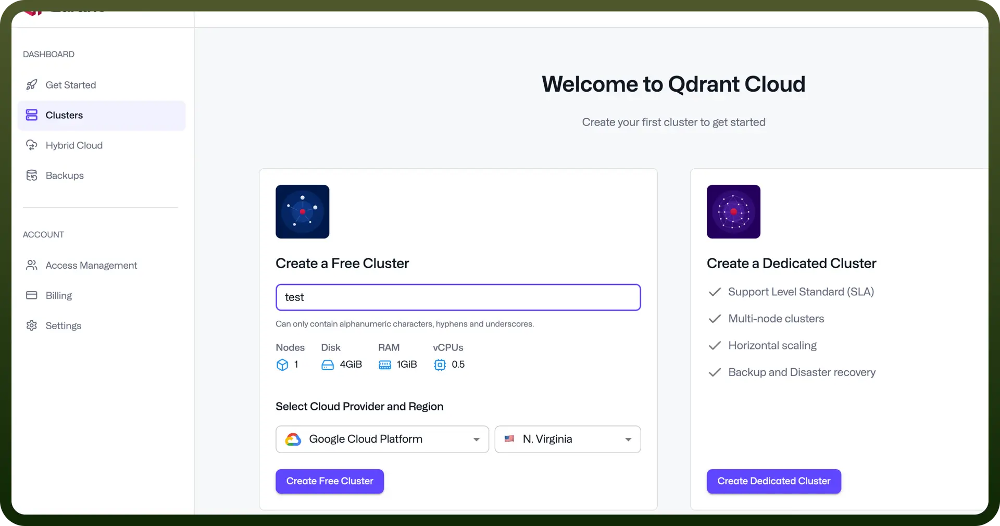

# Qdrant connector

Source: https://www.unifyapps.com/docs/unify-integrations/qdrant
Section: integrations

---

Qdrant is an open-source vector database designed for high-performance similarity search and machine learning applications. It efficiently stores and retrieves high-dimensional vectors, making it ideal for powering AI features like semantic search, recommendation systems, and image/text embeddings.

Qdrant offers native support for hybrid search (vector + metadata filtering), enabling more precise and context-aware results compared to many other vector databases.

### Authentication

Before you begin, make sure you have the following information:

- `Connection Name`: Choose a meaningful name for your connection. This name helps you identify the connection within your application or integration settings. It could be something descriptive like 'MyQdrant’ .
- `Authentication Type`: Qdrat uses API Key authentication type.

### API Key

- Log in to the Qdrant Console.
- Navigate to the `Clusters` section via the left-hand sidebar.
- Provision a new cluster; upon creation, an `API Key Generated` modal will be displayed.
- Copy and securely store the generated `API Key` for subsequent authenticated API access.

  

  

## Actions Supported

| **Actions** | **Description** |
|---|---|
| `Batch update points` | Batches update points in Qdrant |
| `Check collection existence` | Checks a collection existence in Qdrant |
| `Count points` | Counts a points in Qdrant |
| `Create a collection` | Creates a collection in Qdrant |
| `Create payload index` | Creates a payload index in Qdrant |
| `Create a snapshot` | Creates a snapshot in Qdrant |
| `Delete collection` | Deletes a collection in Qdrant |
| `Delete payload index` | Deletes a payload index in Qdrant |
| `Delete points` | Deletes points in Qdrant |
| `Delete snapshot` | Deletes snapshot in Qdrant |
| `Delete vectors` | Deletes vectors in Qdrant |
| `Distance matrix pairs` | Distance matrix pairs in Qdrant |
| `Download snapshot` | Downloads a snapshot in Qdrant |
| `Get cluster details` | Gets cluster details from Qdrant |
| `Get collection info` | Gets collection info from Qdrant |
| `Get points in batch` | Gets points in batch from Qdrant |
| `List collections` | Lists collections from Qdrant |
| `List snapshot` | Lists snapshots from Qdrant |
| `List snapshots storage` | Lists snapshots storage from Qdrant |
| `Query points` | Query's points from Qdrant |
| `Retrieve point` | Retrieves point from Qdrant |
| `Retrieve points` | Retrieves points from Qdrant |
| `Set payload` | Sets payload in Qdrant |
| `Update vectors` | Updates vectors in Qdrant |
| `Upsert points` | Upserts points in Qdrant |
