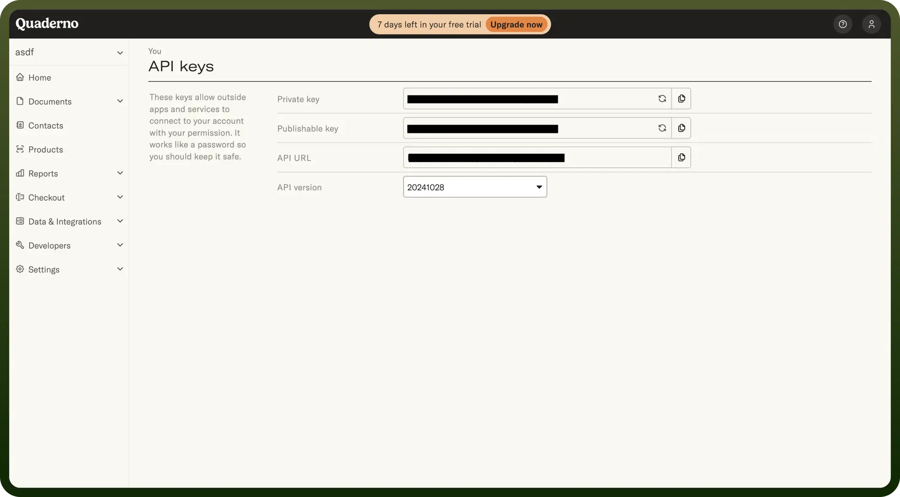

# Quaderno connector

Source: https://www.unifyapps.com/docs/unify-integrations/quaderno
Section: integrations

---

Quaderno is an automated tax compliance platform for businesses selling globally. It handles VAT, GST, and sales tax calculations, invoicing, and reporting in real time.

Integrating your application with Quaderno allows you to automate tax compliance, manage invoices, and track payments efficiently.

## Authentication

Before you begin, make sure you have the following information:

- `Connection Name`: Choose a descriptive name for your connection, such as "MyAppQuadernoIntegration". This helps in easily identifying the connection in your application or integration settings.
- `Authentication Type`: Quaderno supports API Key authentication. This method ensures secure access to Quaderno's functionalities and data.

### API Key Based Authentication

- Log into your Quaderno account and navigate to the "`Settings`" section from the menu.
- In the "`API Keys`" tab, you will find your unique API Key and if it is not yet generated, click on "`Generate New API Key`" to create one.
- Copy the API Key and keep it secure, as it grants access to your Quaderno account.
- Quaderno provides both Sandbox and Production environments.
  - Use the Sandbox environment for testing purposes without affecting real data.
  - Select the Production environment when you are ready to process real transactions.

    

## Actions

| Actions | Description |
|---|---|
| `Create contact` | Creates a new contact in Quaderno |
| `Create expense` | Creates a new expense in Quaderno |
| `Create invoice` | Creates a new invoice in Quaderno |
| `Create sale` | Creates a new sale in Quaderno |
| `Find contact` | Finds an existing contact in Quaderno |

## Triggers

| Triggers | Description |
|---|---|
| `Checkout abandoned` | Triggers when a checkout has been abandoned in Quaderno |
| `Checkout failed` | Triggers when a checkout fails in Quaderno |
| `Checkout succeeded` | Triggers when a checkout flow has finished successfully in Quaderno |
| `Estimate updated` | Triggers when an estimate is updated in Quaderno |
| `New contact` | Triggers when a contact is created in Quaderno |
| `New estimate` | Triggers when an estimate is created in Quaderno |
| `New invoice` | Triggers when an invoice is created in Quaderno |
| `New refund` | Triggers when a credit note is created in Quaderno |
| `New sale` | Triggers when a new sale (invoice or receipt) is created in Quaderno |
