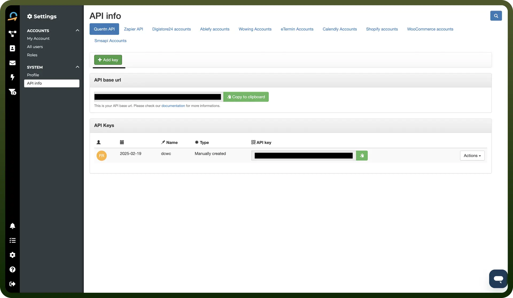

# Quentn connector

Source: https://www.unifyapps.com/docs/unify-integrations/quentn
Section: integrations

---

Quentn is a marketing automation platform that helps businesses streamline email campaigns, build sales funnels, and manage customer journeys with precision. It combines CRM, email marketing and behavior tracking in one user-friendly interface.

Integrating your application with Quentn streamlines contact management, automates workflows, and enables efficient, data-driven marketing and customer engagement.

## Authentication

Before you begin, make sure you have the following information:

- `Connection Name`: Select a descriptive name for your connection, like "MyAppQuentnIntegration". This helps in easily identifying the connection within your application or integration settings.
- `Authentication Type`**:** Quentn supports API Key authentication.

### API Key Based Authentication

1. Login into Quentn and go to Settings.
2. Click on `API info`.
3. Select API base URL as your API URL.
4. Click on `Add key`, then create an API key.
5. Keep the API key and API URL secure as they provide access to your Quentn account.

  

## Actions

| Actions | Description |
|---|---|
| `Create or update contact` | Creates a new contact, or updates an existing contact in Quentn |
| `Find contact` | Finds a contact by email address in Quentn |
| `Run campaign for contact` | Runs a campaign workflow for a contact in Quentn |

## Triggers

| Triggers | Description |
|---|---|
| `On campaign contact sent` | Triggers when a contact is sent via campaign in Quentn |
