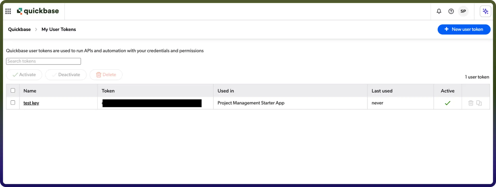

# Quickbase connector

Source: https://www.unifyapps.com/docs/unify-integrations/quickbase
Section: integrations

---

Quickbase enables applications to build custom workflows, manage structured data, and automate business processes. It allows businesses to create scalable applications for project management, CRM, and operational tracking. By integrating the Quickbase connector, applications can manage records, tables, and data while streamlining workflows and improving productivity.

## Authentication

Integrating your application with Quickbase enables seamless data management and workflow automation. Before starting, ensure you have the following information ready:

- `Connection Name`**:** Choose a descriptive name for your connection. This helps you easily identify the connection within your application or integration settings, such as "MyAppQuickbaseIntegration."
- `Sub-domain`**:** Enter your Quickbase site subdomain . Example: If your site URL is https://example.quickbase.com, then enter example.
- `User Token`**:** Enter the generated user token from your Quickbase account.
- `Authentication Type` **:** Quickbase supports the following authentication method:

## API Token Authentication:

1. Log in to your Quickbase account.
2. Click on your profile icon in the top-right corner.
3. Navigate to My Preferences or My User Information.
4. Go to the User Tokens section.
5. Click Manage User Tokens.
6. Generate a new token.
7. Copy your User Token .

## Actions :

| **Action Name** | **Description** |
|---|---|
| `Create record` | Create record in a table in Quickbase |
| `Delete record` | Delete a record from a table in Quickbase by record ID |
| `Download attachment` | Download attachment from a record in Quickbase |
| `Search records` | Search records in a table in Quickbase |
| `Update record` | Update record in a table in Quickbase |

## Triggers **:**

| **Trigger Name** | **Description** |
|---|---|
| `New/Updated record` | Triggers when a record is created or updated in Quickbase |
| `New/Updated record` | Triggers when a record is created or updated in Quickbase |
| `New record` | Triggers when a new record is created in Quickbase |
| `New record` | Triggers when a new record is created in Quickbase |
