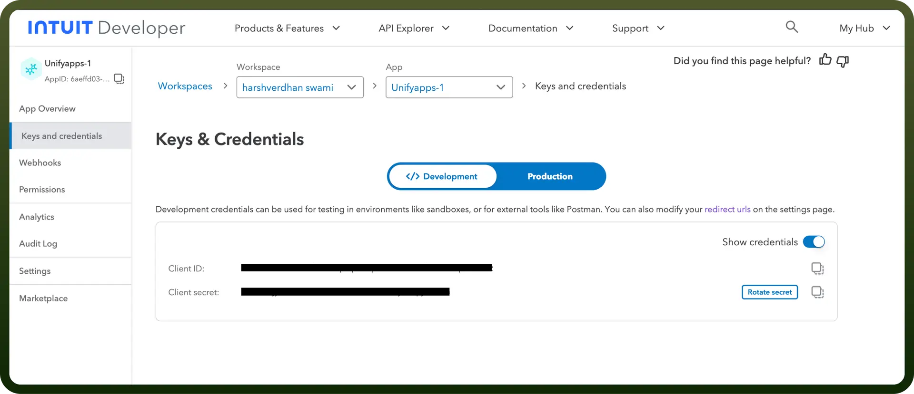

# QuickBooks connector

Source: https://www.unifyapps.com/docs/unify-integrations/quickbooks
Section: integrations

---

QuickBooks is a popular accounting software designed to help businesses manage finances, including invoicing, payroll, and expense tracking. It offers automation, cloud accessibility, and integration with other tools to streamline financial operations.

Integrating QuickBooks streamlines financial management by automating tasks like invoicing, expense tracking, and reporting, saving time and reducing errors.

## Authentication

Before you begin, make sure you have the following information:

- `Connection Name`: Select a descriptive name for your connection, like "MyAppQuickBooksIntegration". This helps in easily identifying the connection within your application or integration settings.
- `Client ID`**:** Enter the Client ID provided by the service you are connecting to.
- `Client Secret`**:** Enter the Client Secret associated with your Client ID.

### How to obtain Client ID and Client Secret?

Follow these steps to obtain them:

- Go to the [Intuit Developer Dashboard](https://developer.intuit.com/dashboard) and sign in.
- From the Dashboard, click '`Create an App`' or select an existing app.
- In the app menu, select '`Keys & Credentials`'. Here, you will find your `Client ID` and `Client Secret` under either Development or Production.
- After obtaining your Client ID and Secret, follow these steps to set the Redirect URI:
  - Go to the '`Settings`' tab in the left-hand menu.
  - Select '`Redirect URIs`'.
  - Add your Redirect URI (e.g., the URL where OAuth 2.0 will send the authorization code) and click '`Save`'.

    

## Actions

| Actions | Description |
|---|---|
| `Create a Bill` | Creates a bill in QuickBooks. |
| `Create a Bill Payment` | Creates a bill payment in QuickBooks. |
| `Create a Customer` | Creates a customer record in QuickBooks. |
| `Create a Payment` | Creates a payment in QuickBooks. |
| `Create a Purchase` | Creates a purchase transaction in QuickBooks. |
| `Create an Employee` | Creates an employee record in QuickBooks. |
| `Create an Estimate` | Creates an estimate in QuickBooks. |
| `Create an Invoice` | Creates an invoice in QuickBooks. |
| `Delete a Bill` | Deletes a bill by its ID in QuickBooks. |
| `Delete a Bill Payment` | Deletes a bill payment by its ID in QuickBooks. |
| `Delete a Payment` | Deletes a payment by its ID in QuickBooks. |
| `Delete a Purchase` | Deletes a purchase by its ID in QuickBooks. |
| `Delete an Invoice` | Deletes an invoice by its ID in QuickBooks. |
| `Get a Customer` | Retrieves customer details by ID in QuickBooks. |
| `Get a Payment` | Retrieves payment details by ID in QuickBooks. |
| `Get a Payment as PDF` | Retrieves a payment as a PDF by its ID in QuickBooks. |
| `Get an Employee` | Retrieves an employee by its ID in QuickBooks. |
| `Get an Estimate Details` | Retrieves the details of an estimate by its ID in QuickBooks. |
| `Get an Invoice as PDF` | Retrieves an invoice as a PDF by its ID in QuickBooks. |
| `Get an Invoice Details` | Retrieves the details of an invoice by its ID in QuickBooks. |
| `Query a Bill` | Queries a bill by its ID in QuickBooks. |
| `Read a Bill` | Reads the details of a bill by its ID in QuickBooks. |
| `Read a Bill Payment` | Reads the details of a bill payment by its ID in QuickBooks. |
| `Read a Purchase` | Reads the details of a purchase by its ID in QuickBooks. |
| `Update a Bill` | Updates the details of a bill by its ID in QuickBooks. |
| `Update a Bill Payment` | Updates the details of a bill payment by its ID in QuickBooks. |
| `Update a Customer` | Updates the details of a customer by its ID in QuickBooks. |
| `Update a Payment` | Updates the details of a payment by its ID in QuickBooks. |
| `Update a Purchase` | Updates the details of a purchase by its ID in QuickBooks. |
| `Update an Employee` | Updates the details of an employee by its ID in QuickBooks. |
| `Update an Estimate` | Updates an estimate by its ID in QuickBooks. |
| `Update an Invoice` | Updates an invoice by its ID in QuickBooks. |

## Triggers

| Triggers | Description |
|---|---|
| `New Record` | Triggers when a create, update, delete, or email operation is performed on entities such as estimates, vendors, invoices, bills, and more in QuickBooks. |
